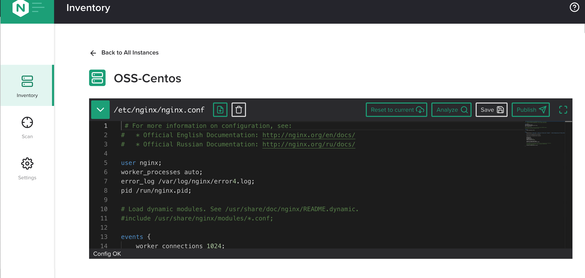

.. _2.2-conf-editor:

Exercise 2.1: Using the Configuration Editor
############################################

Guide
=====

Use the NGINX Instance Manager User Interface for this exercise and explore how to edit and configuration files for NGINX Instances.

Step 1: Open the editor
-----------------------

Navigate to the Inventory page and find the ``OSS-Centos`` instance.  Click the pencil and paper icon under the actions column.

The editor should look familiar if you are a Visual Studio Code (``vscode``) user.

Note the right side shows a birds-eye view of the entire conf file.  This is very helpful for very large conf files.

Step 2: Try a shortcut
----------------------

NGINX Instance Manager uses the monaco-editor project, which is also the editor Visual Studio Code uses.
This allows many similar functions to work.  Let's try the search and replace function.

Click in the editor window and press the key combination for ``find``.

.. note::

    For Mac users, this is the ``Command-F` key, for Windows users, the ``CTRL-F`` key.

Click the down arrow and notice the ``replace`` function is there.

Note the options include searching with Regular Expressesions (``regex``) if desired.  The editor has powerful features already included.
Click the X to close the Search and Replace function box.

Step 3: Handle conf file includes
---------------------------------

NGINX Configuration files are best constructed using `includes <https://docs.nginx.com/nginx/admin-guide/basic-functionality/managing-configuration-files/#feature-specific-configuration-files>`__. 
NGINX Instance Manager agrees and uses a menu to keep track of the includes in the user interface.
Open the includes drop down by selecting the green downward arrow to show the includes menu.

Step 4: Make a mistake
----------------------

A major feature of NGINX Instance Manager is the ability to find errors and promote best practices.

You have finished this exercise. `Click here to return to the lab
guide <..>`__
