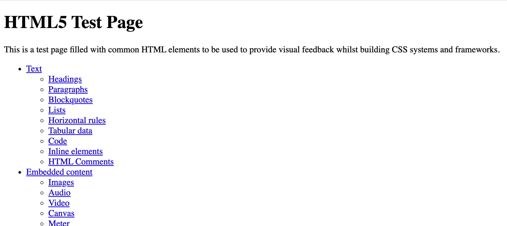
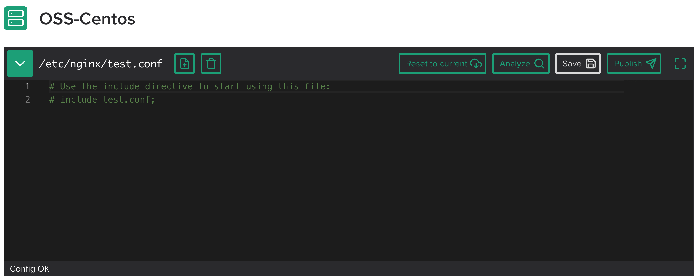
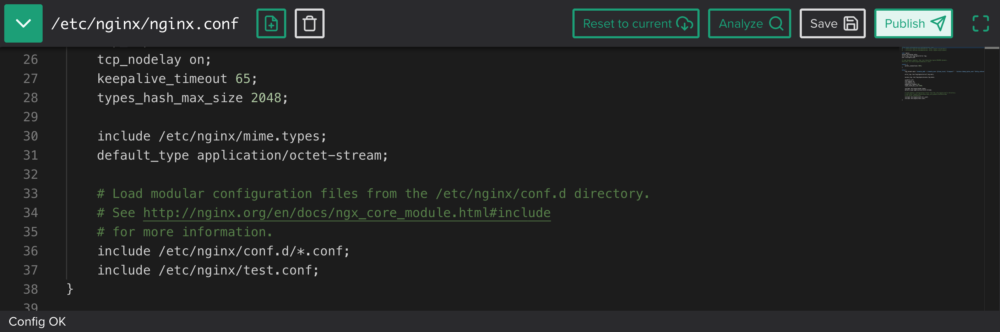
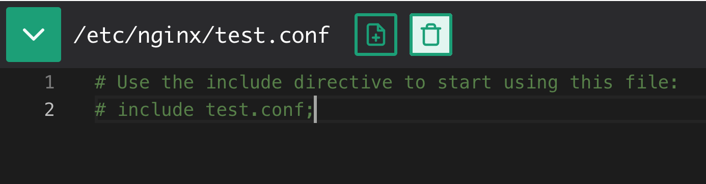

.. _2.2-change-conf:

Exercise 2.2: Pushing changes to NGINX Instances
################################################

Objective
=========

Demonstrate the configuration management features of NGINX 
Instance Manager using the user interface. Push changes to 
an NGINX instance. Show how NGINX Instance Manager handles 
file conflicts.

Guide
=====

Step 1: Preparations
--------------------

To follow this Exercise we need to open a few windows in the browser and terminal.

Navigate to the UDF Instances and look for ``NGINX OSS - website-02``.  Select 
the ``ACCESS`` dropdown and open the ``WEBSITE - HTTP`` selection.

A web page that shows NGINX Stats should appear.

Leave this webpage open in a tab and navigate back to the UDF environment.

Finally, make sure you have the NGINX Instance Manager user interface open. 

.. image:: ./UI-home.png

Click under modules, then instances and click under actions edit config on ``website-02`.

You should see an editor pane and an ``nginx.conf`` file displayed.

Step 2: Change the default website
----------------------------------

We want to change the default website for the Sample web page shown above.
Using the editor in the user interface navigate to ``conf.d/default.conf``.

Scroll to the default location block and look for
the ``demo_index.html index.htm index.html;`` line.

.. code-block:: nginx
    :emphasize-lines: 8,9

    location / {
        root   /usr/share/nginx/html;
        index  demo_index.html index.html index.htm;
    }

You need to change this to serve the Lab web page.
Edit the file, and change the location / block to

    location / {
        root   /usr/share/nginx/html;
        index  lab.html demo_index.html index.html index.htm;
    }

Click the ``Save as`` button at the top and use website-02-lab as the name then click save.

Step 3: Publish the new website
-------------------------------

Now switch tabs to the ``Sample Web Page`` and refresh the page.

It should not have changed because we did not publish the change yet.
This is because we just stored the change in the database and didn't push 
it to the isntance yet.  The agent server connection uses bidirectional gRPC 
to enable ways to publish changes, but we only publish the change from the 
editor when the publish button is selected.

Go back to the editor and click the ``Publish`` button.

Now quickly switch to the tab for the ``Sample Web Page`` and hit refresh.
The page should now look like the picture below.

When you published the changes, the NGINX Instance Manager server pushed the 
saved configuration (from the database) to the instance to load and triggered
an NGINX reload.

The editing actions are designed to mimic what NGINX does by saving files and 
then publishing them in two different actions.

.. note::

    Try to revert and redo the change and see if you can refresh the page before 
    the change is made.  With the default polling at 1s, you need to be very quick.
    NGINX Instance Manager will likely be much faster at making changes than 
    existing automation tools but you do not have to use NGINX Instance Manager to 
    make changes, you can use your own tooling or a combination of the two.

Step 4: Adding files
--------------------

For this step, we are going to use the editor and the Web Shell for ``NGINX Plus - 3``.

In the editor click the icon ``Add File``.

Add a new file called ``test.conf`` in the window and click ``Create``.

.. image:: ./UI-nginx5-add-test.png

Notice we have a new editor window that has our new file ``test.conf`` shown.

You must add the include directive to start using this file.
Let's select the ``nginx.conf`` file from the includes dropdown menu and add this.

.. code-block:: nginx
    :emphasize-lines: 37

    # For more information on configuration, see:
    #   * Official English Documentation: http://nginx.org/en/docs/
    #   * Official Russian Documentation: http://nginx.org/ru/docs/

    user nginx;
    worker_processes auto;
    error_log /var/log/nginx/error.log;
    pid /run/nginx.pid;

    # Load dynamic modules. See /usr/share/doc/nginx/README.dynamic.
    #include /usr/share/nginx/modules/*.conf;

    events {
        worker_connections 1024;
    }

    http {
        log_format main '$remote_addr - $remote_user [$time_local] "$request" ' '$status $body_bytes_sent "$http_referer" ' '"$http_user_agent" "$http_x_forwarded_for"';

        error_log /var/log/nginx/error3.log warn;

        access_log /var/log/nginx/access.log main;

        sendfile off;
        tcp_nopush on;
        tcp_nodelay on;
        keepalive_timeout 65;
        types_hash_max_size 2048;

        include /etc/nginx/mime.types;
        default_type application/octet-stream;

        # Load modular configuration files from the /etc/nginx/conf.d directory.
        # See http://nginx.org/en/docs/ngx_core_module.html#include
        # for more information.
        include /etc/nginx/conf.d/*.conf;
        include /etc/nginx/test.conf;
    }

Click Save as and notice how the editor is also running the analyzer before it let's you Publish.

Click Publish.

You can also see it's in the dropdown for inclues if you want.

Navigate to the NGINX Plus - 3 instance using the Web Shell and see if the file is present.

.. code-block:: shell-session
    :emphasize-lines: 1

    ls /etc/nginx
    # conf.d  fastcgi_params  mime.types  modules  nginx.conf  scgi_params  test.conf  uwsgi_params

You can see we have successfully added a file.

Step 5: Remove a file
---------------------

Since this file is useless, let's remove it. 

Navigate to the editor for ``ubuntu`` in the user interface 
and use the drop-down menu to select ``test.conf``.
Now select the delete icon which resembles a trash can.

Confirm the selection.

Now select ``nginx.conf`` in the include dropdown menu for ``NGINX Plus - 3`` and remove the line we just added for including test.conf.
``nginx.conf`` should look like the ``conf`` below.

.. code-block:: nginx

    # For more information on configuration, see:
    #   * Official English Documentation: http://nginx.org/en/docs/
    #   * Official Russian Documentation: http://nginx.org/ru/docs/

    user nginx;
    worker_processes auto;
    error_log /var/log/nginx/error.log;
    pid /run/nginx.pid;

    # Load dynamic modules. See /usr/share/doc/nginx/README.dynamic.
    #include /usr/share/nginx/modules/*.conf;

    events {
        worker_connections 1024;
    }

    http {
        log_format main '$remote_addr - $remote_user [$time_local] "$request" ' '$status $body_bytes_sent "$http_referer" ' '"$http_user_agent" "$http_x_forwarded_for"';

        error_log /var/log/nginx/error3.log warn;

        access_log /var/log/nginx/access.log main;

        sendfile off;
        tcp_nopush on;
        tcp_nodelay on;
        keepalive_timeout 65;
        types_hash_max_size 2048;

        include /etc/nginx/mime.types;
        default_type application/octet-stream;

        # Load modular configuration files from the /etc/nginx/conf.d directory.
        # See http://nginx.org/en/docs/ngx_core_module.html#include
        # for more information.
        include /etc/nginx/conf.d/*.conf;
    }

Click ``Save as`` and use ubuntu as the name then click ``Publish``. This should remove the include file.

.. note::

    You need to follow this workflow to delete the files through the editor. 
    If you have existing automation tools, the removal of files is usually 
    easy to incorporate already.

Navigate to the NGINX Plus - 3 instance using the Web Shell and see if the files is still present.

.. code-block:: shell-session
    :emphasize-lines: 1

    ls /etc/nginx/test.conf
    ls: cannot access /etc/nginx/test.conf: No such file or directory

Step 6: Change files outside nginx-manager
------------------------------------------

We build NGINX Instance Manager with the belief that you will use other tools and 
already have something that defines the ``single source of truth`` for your NGINX 
conf files. This means NGINX Instance Manager must respond to changes that occur 
outside of it.

This step tests this assumption by changing a file in the web shell and in the 
editor at the same time to see what happens if we have multiple edits occur.

Let's use a simple example and focus on the ``nginx.conf`` file and ``NGINX Plus - 3``. 

We can simply change the error.log name by inserting a value.

Click the ``Revert`` button in the editor.

Change the ``error_log`` line to a new name ``error2.log``.

.. note::

    If you want to show off, use the search and replace function in the editor!
    Note there are two error_log locations in nginx.conf.  We are using the first 
    one but feel free to change both to different numbers.

.. code-block:: nginx
    :emphasize-lines: 7

    # For more information on configuration, see:
    #   * Official English Documentation: http://nginx.org/en/docs/
    #   * Official Russian Documentation: http://nginx.org/ru/docs/

    user nginx;
    worker_processes auto;
    error_log /var/log/nginx/error2.log;
    pid /run/nginx.pid;

    # Load dynamic modules. See /usr/share/doc/nginx/README.dynamic.
    #include /usr/share/nginx/modules/*.conf;

    events {
        worker_connections 1024;
    }

    http {
        log_format main '$remote_addr - $remote_user [$time_local] "$request" ' '$status $body_bytes_sent "$http_referer" ' '"$http_user_agent" "$http_x_forwarded_for"';

        error_log /var/log/nginx/error3.log warn;

        access_log /var/log/nginx/access.log main;

        sendfile off;
        tcp_nopush on;
        tcp_nodelay on;
        keepalive_timeout 65;
        types_hash_max_size 2048;

        include /etc/nginx/mime.types;
        default_type application/octet-stream;

        # Load modular configuration files from the /etc/nginx/conf.d directory.
        # See http://nginx.org/en/docs/ngx_core_module.html#include
        # for more information.
        include /etc/nginx/conf.d/*.conf;

Go ahead and click the ``Save as`` button but do NOT click ``Publish`` yet.

.. note::

    If you did, simply change the line back to ``error.log`` and Save and Publish.
    Then change it to ``error2.log`` and click ``Save``.

Use the Web Shell for ``NGINX Plus-3`` and run the following command to see what changed.

.. code-block:: shell-session
    :emphasize-lines: 1,4

    cat /etc/nginx/nginx.conf | grep error_log
    error_log /var/log/nginx/error.log;
        error_log /var/log/nginx/error3.log warn;
    sudo nginx -T | grep error_log
    nginx: the configuration file /etc/nginx/nginx.conf syntax is ok
    nginx: configuration file /etc/nginx/nginx.conf test is successful
    error_log /var/log/nginx/error.log;
        error_log /var/log/nginx/error3.log warn;
        error_log /var/log/nginx/app-server-error.log notice;

Notice we didn't change anything because we didn't publish yet.  
Also notice there is another line with an ``error3.log`` in the nginx.conf that 
we can ignore for now.  Just focus on the first ``error_log`` mention.

Let's add some chaos now!  Open up nginx.conf and change the ``error_log`` filename to ``error5.log``

.. note::

    Don't forget to use ``sudo vim /etc/nginx/nginx.conf``.  If you did forget 
    you can use the magical vim command ``:w !sudo tee %`` to save as ``root``.

.. code-block:: nginx
    :emphasize-lines: 7

    # For more information on configuration, see:
    #   * Official English Documentation: http://nginx.org/en/docs/
    #   * Official Russian Documentation: http://nginx.org/ru/docs/

    user nginx;
    worker_processes auto;
    error_log /var/log/nginx/error5.log;
    pid /run/nginx.pid;

    # Load dynamic modules. See /usr/share/doc/nginx/README.dynamic.
    #include /usr/share/nginx/modules/*.conf;

    events {
        worker_connections 1024;
    }

    http {
        log_format main '$remote_addr - $remote_user [$time_local] "$request" ' '$status $body_bytes_sent "$http_referer" ' '"$http_user_agent" "$http_x_forwarded_for"';

        error_log /var/log/nginx/error3.log warn;

        access_log /var/log/nginx/access.log main;

        sendfile off;
        tcp_nopush on;
        tcp_nodelay on;
        keepalive_timeout 65;
        types_hash_max_size 2048;

        include /etc/nginx/mime.types;
        default_type application/octet-stream;

        # Load modular configuration files from the /etc/nginx/conf.d directory.
        # See http://nginx.org/en/docs/ngx_core_module.html#include
        # for more information.
        include /etc/nginx/conf.d/*.conf;

Save the file and issue a reload to nginx so it loads the new configuration.

.. code-block:: shell-session
    :emphasize-lines: 1,2

    sudo systemctl reload nginx
    sudo nginx -T | grep error_log
    nginx: the configuration file /etc/nginx/nginx.conf syntax is ok
    nginx: configuration file /etc/nginx/nginx.conf test is successful
    error_log /var/log/nginx/error5.log;
        error_log /var/log/nginx/error3.log warn;
        error_log /var/log/nginx/app-server-error.log notice;

.. note::

    We use ``systemctl reload nginx`` to make the change as opposed to
    ``nginx -s reload``.  This is because systemd handles our ``pid`` for 
    us and running the ``nginx -s reload`` command does not.  Now you know 
    and knowledge is half the battle.

To state where we are in this step.  We have changed the ``error_log`` name 
in the editor to ``error2.log`` but while we did this, we changed the ``error_log`` 
on the nginx instance to ``error5.log`` and reloaded.

Let's now publish our change in the editor and see what happens.  The nginx 
instance is running a configuration that the editor does not know about yet.

NGINX Instance Manager detects changes made while editing and asks if you want to 
cancel the publish or overwrite what is there.  Since we know what is there, select 
overwrite.  You should see the ``error2.log`` entry in the editor.

.. image:: ./UI-nginx5-overwrite2.png

Let's look the Web Shell and see what the nginx instance is running now.

.. code-block:: shell-session
    :emphasize-lines: 1

    sudo nginx -T | grep error_log
    nginx: the configuration file /etc/nginx/nginx.conf syntax is ok
    nginx: configuration file /etc/nginx/nginx.conf test is successful
    error_log /var/log/nginx/error2.log;
        error_log /var/log/nginx/error3.log warn;
        error_log /var/log/nginx/app-server-error.log notice;

We have published our change successfully.  This step demonstarted how we 
can detect changes made outside of NGINX Instance Manager.

.. image:: ./UI-nginx5-overwrite3.png
