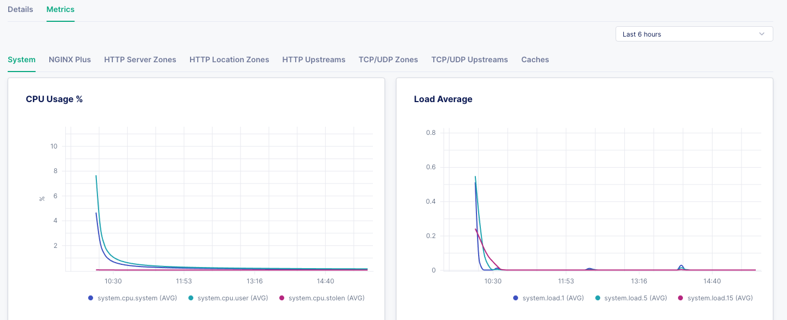

.. _2.3-show-metrics:

Exercise 2.3: Show metrics for NGINX instances
##############################################

Objective
=========

Gather metrics from NGINX Instances.

NGINX Instance Manager collects metrics from NGINX 
instances and stores entries in the nginx-manager database.
These metrics can be accessed externally by a grafana 
dashboard or other systems since they are exposed as a 
prometheus endpoint.  Further customization can be done 
using PromQL to form queries.

Guide
=====

Step 1: View metrics in the UI
------------------------------

For this step, open the user interface for ``nginx-manager`` in 
the UDF dashboard.  You can select the ``ACCESS`` menu under 
``NGINX Manager Server`` and the ``INSTANCE MANAGER UI`` selection.
This will open the user interface in a new browser tab.

From the Launchpad page, select Instance Manager and click on the ``Ubuntu`` hostname instance.  The user 
interface should open a page with details of the instance. Select the  ``Metrics`` tab.

This page has some useful system information, such as CPU/Memory utilization.
On the upper right, you can change the time duration from last 5 mins to last 90 days.

You can see operating system metrics and CPU and memory usage. 

