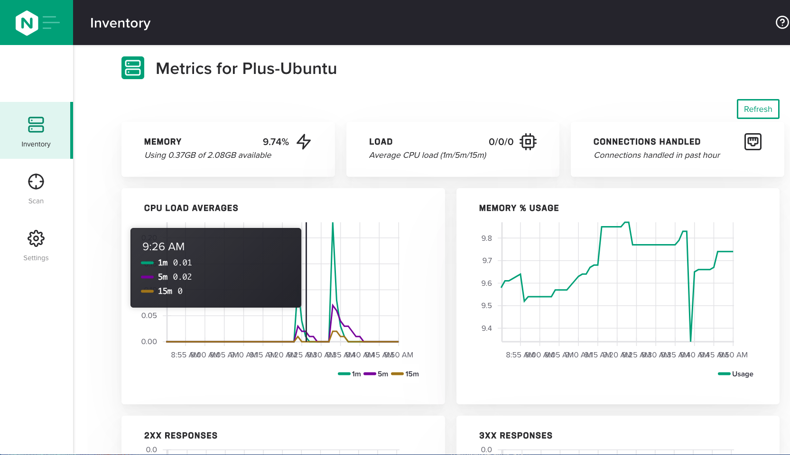
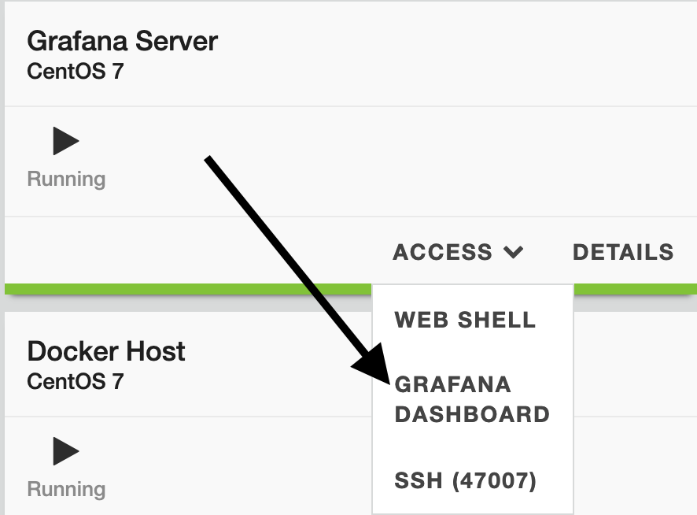
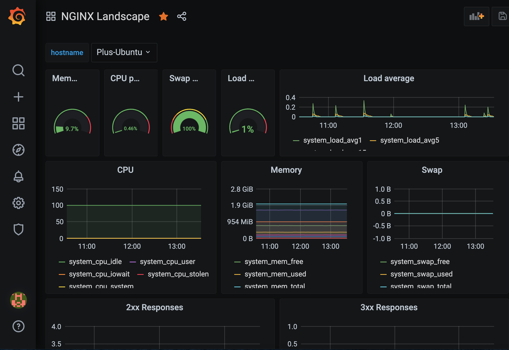
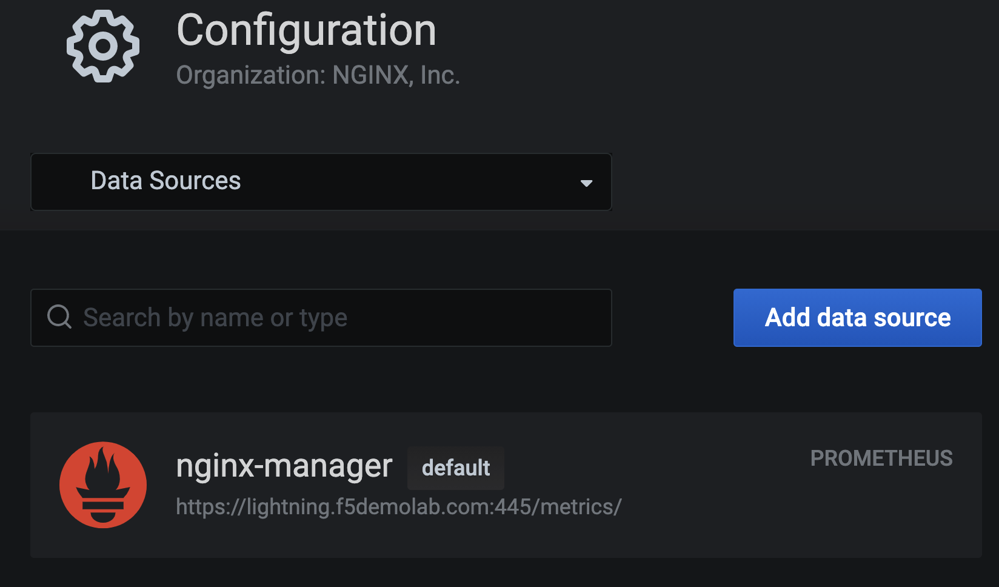
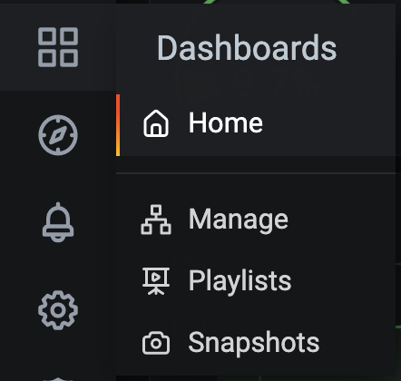

.. _2.3-show-metrics:

Exercise 2.3: Show metrics for NGINX instances
##############################################

Objective
=========

Gather metrics for NGINX Instances and utilize
an external grafana system to customize them.

NGINX Instance Manager collects metrics from NGINX 
instances and stores entries in the nginx-manager database.
These metrics can be accessed externally by a grafana 
dashboard or other systems since they are exposed as a 
prometheus endpoint.  Further customization can be done 
using PromQL to form queries.

Guide
=====

Step 1: View metrics in the UI
------------------------------

For this step, open the user interface for ``nginx-manager`` in 
the UDF dashboard.  You can select the ``ACCESS`` menu under 
``NGINX Manager Server`` and the ``INSTANCE MANAGER UI`` selection.
This will open the user interface in a new browser tab.

Navigate to the Inventory section and select the metrics icon 
on the far right for the ``Plus-Ubuntu`` instance.  The user 
interface should open a page with graphs similar to the one below.

This page has some useful information but not much to customize.

You can see operating system metrics and CPU and memory usage. 
There are also graphs to show 2xx,3xx,4xx and 5xx responses.

There is no option for time range or customization on the built-in 
page.  We use other systems to handle that.

Step 2: Open grafana
--------------------

On the UDF dashboard, navigate to the ``Grafana Server`` instance 
and select ``ACCESS`` and ``GRAFANA DASHBOARD``.

Grafana will load and prompt for a username and password.  These 
credentials are located on the ``Details`` section of the 
``Grafana Server`` instance in UDF and also are listed below.

- username: ``admin``
- password: ``P@ssw0rd20``

.. image:: ./GRAFANA-login.png

You should be directed to an existing dashboard by default.

Step 3: Create the datasource
-----------------------------

We have already created the data source in grafana. 
To understand how this was done, open the datasource menu on 
the left side grafana menu. 

.. image:: ./GRAFANA-datasource-menu.png

You should see a data source called ``nginx-manager`` already created.
If you were creating this new, you would click ``Add data source`` and 
select ``Prometheus`` as the type.

NGINX Instance Manager functions as a pure replacement for Prometheus in 
regards to metrics.  To see the details of the configuration click on 
the existing data source and look though the settings.

Close the datasource and navigate back to the Dashbaoard by 
navigating to ``Dashboards`` and ``Home``.

Step 4: Interact with the grafana dashboard
-------------------------------------------

You may want to generate some 400 and 200 hits by using the UDF 
dashboard and opening the websites the instance has.  This is optional 
but if there was no activity, there won't be on the graph either.

Let's use the drop down to select the Plus-Ubuntu instance.

.. image:: ./GRAFANA-plus-ubuntu.png

This dashboard is available during install and a sample file is placed 
in the ``/usr/share/doc/nginx-manager/grafana/`` directory on ``nginx-manager``.

.. code-block:: shell-session

    [centos@nginx-manager ~]$ ls -la /usr/share/doc/nginx-manager/grafana/
    total 28
    drwxr-xr-x. 2 root root    32 Mar 22 13:02 .
    drwxr-xr-x. 5 root root   149 Mar 22 13:02 ..
    -rw-r--r--. 1 root root 25919 Mar 19 19:51 nginx-manager.json

If you select the gear icon on top, you can see some of the properties we use.

Select Annotations and click ``Annotations & Alerts`` to see where we set the data source.

.. image:: ./GRAFANA-annotations.png

Selecting ``Variables`` from the menu also shows the selection dropdown we use.

.. image:: ./GRAFANA-variables.png

Click the ``Go Back`` button to return to the dashboard.
Try changing the time series and hostname.

Step 5: Explore the PromQL behind the graph
-------------------------------------------

Select the ``2xx Responses`` graph and open the editor for it.

.. image:: ./GRAFANA-edit-graph.png

Look at the Queries used for the graph.
Query A is for the Open Source NGINX instances and also adjusts the counts so they are formatted as per hour.
Query B is the for NGINX Plus instances and pulls from the API without using the ``increase`` function.

We are using the metrics without conversion so we do not affect performance.

Click on the ``Metrics`` dropdown on query A to see other metrics.
You can select additional metrics and create your own graphs as you desire.

.. image:: ./GRAFANA-other-metrics.png

