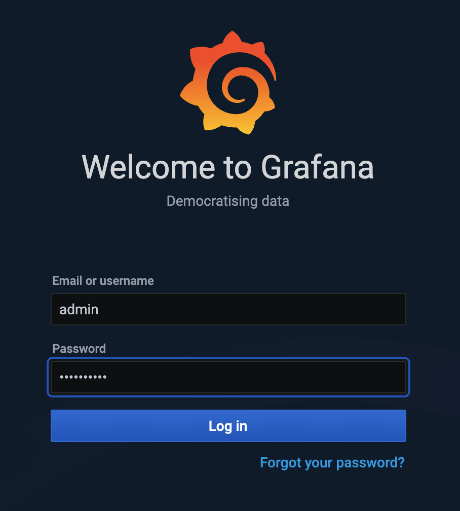
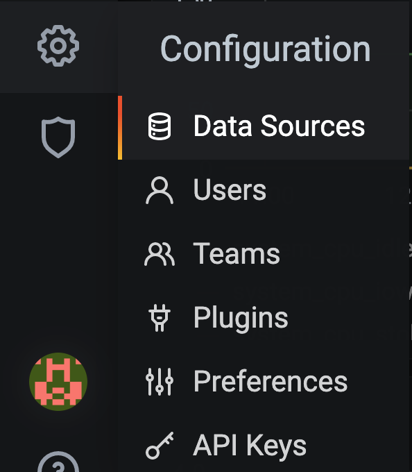

.. _2.3-show-metrics:

Exercise 2.3: Show metrics for NGINX instances
##############################################

Objective
=========

Gather metrics for NGINX Instances and utilize
an external grafana system to customize them.

NGINX Instance Manager collects metrics from NGINX 
instances and stores entries in the nginx-manager database.
These metrics can be accessed externally by a grafana 
dashboard or other systems since they are exposed as a 
prometheus endpoint.  Further customization can be done 
using PromQL to form queries.

Guide
=====

Step 1: View metrics in the UI
------------------------------

For this step, open the user interface for ``nginx-manager`` in 
the UDF dashboard.  You can select the ``ACCESS`` menu under 
``NGINX Manager Server`` and the ``INSTANCE MANAGER UI`` selection.
This will open the user interface in a new browser tab.

Navigate to the Inventory section and select the metrics icon 
on the far right for the ``Plus-Ubuntu`` instance.  The user 
interface should open a page with graphs similar to the one below.

.. image:: ./UI-nginx7-metrics.png

This page has some useful information but not much to customize.

You can see operating system metrics and CPU and memory usage. 
There are also graphs to show 2xx,3xx,4xx and 5xx responses.

There is no option for time range or customization on the built-in 
page.  We use other systems to handle that.

Step 2: Open grafana
--------------------

On the UDF dashboard, navigate to the ``Grafana Server`` instance 
and select ``ACCESS`` and ``GRAFANA DASHBOARD``.

.. image:: ./UDF-grafana-access.png

Grafana will load and prompt for a username and password.  These 
credentials are located on the ``Details`` section of the 
``Grafana Server`` instance in UDF and also are listed below.

- username: ``admin``
- password: ``P@ssw0rd20``

You should be directed to an existing dashboard by default.

.. image:: ./GRAFANA-dashboard.png

Step 3: Create the datasource
-----------------------------

We have already created the data source in grafana. 
To understand how this was done, open the datasource menu on 
the left side grafana menu. 

You should see a data source called ``nginx-manager`` already created.
If you were creating this new, you would click ``Add data source`` and 
select ``Prometheus`` as the type.

.. image:: ./GRAFANA-add-datasource.png

NGINX Instance Manager functions as a pure replacement for Prometheus in 
regards to metrics.  To see the details of the configuration click on 
the existing data source and look though the settings.

.. image:: ./GRAFANA-datasource-settings.png

Close the datasource and navigate back to the Dashbaoard by 
navigating to ``Dashboards`` and ``Home``.

.. image:: ./GRAFANA-dashboard-home.png

Step 4: Interact with the grafana dashboard
-------------------------------------------

You have finished this exercise. `Click here to return to the lab
guide <..>`__
