.. _2.4-swagger-api:

Exercise 2.4: Exploring the API
###############################

Objective
=========

Understand the API behind NGINX Instance Manager.

NGINX Instance Manager uses a simple API for almost all 
functions it provides.  We look to provide an API first 
in existing and new features.  This Exercise explores the 
provided API but does not exhaust options for the API.

You are highly encouraged to explore the API further and 
adapt the use of it for your own needs.

Guide
=====

Step 1: Explore the Swagger UI API Page
---------------------------------------

For this step, open the user interface for ``nginx-manager`` in 
the UDF dashboard.  You can select the ``ACCESS`` menu under 
``NGINX Manager Server`` and the ``NGINX INSTANCE MANAGER UI`` selection.
This will open the user interface in a new browser tab.

Navigate to the Docs module under the drop down menu.  Your window 
should look similar to the one below.

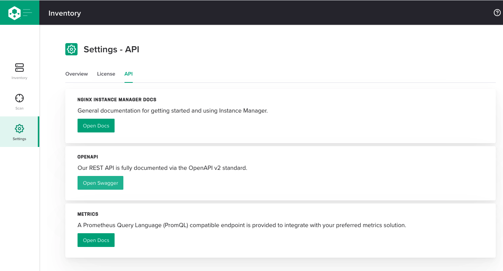

We will use this page for the majority of the lesson.

Step 2: Get information on the system
-------------------------------------

The swagger-ui page is an easy way to test the API on your ``nginx-manager`` 
instance.  Let's explore the ``Catalogs`` section first.

Click on the ``GET`` button for ``/analytics/catalogs/metrics``

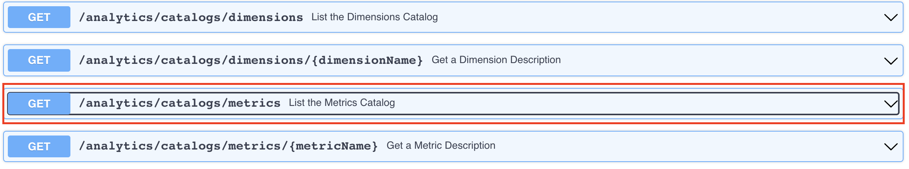

This action just explains the API that is there and the sample information 
it provides.  We can also use this page to make real API calls.

Click on the try it button then click the ``Execute`` button and scroll down to see if we captured some results.

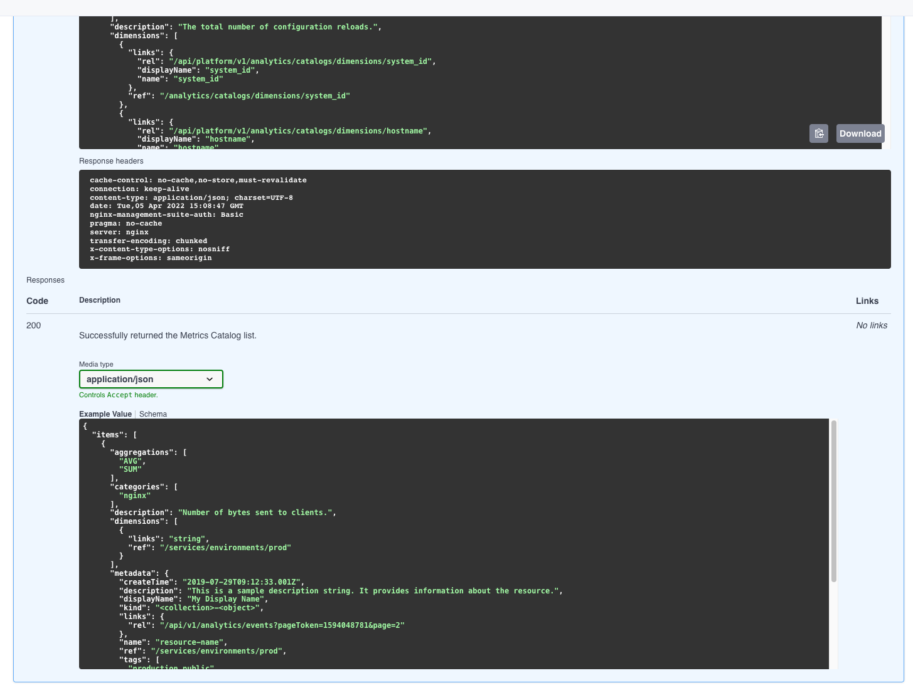

Notice we have a curl command example.  You can copy and paste that line 
into an instance with ``curl`` installed and try it yourself.  The page 
allows us to try it also.

Notice how we now see information in the details pane.  If you look closely 
you can see this is actual data from our installed instance.

.. note::

    The UDF environment is proxying traffic through a strange long URL. 
    In your environment, this URL won't be present in the same way 
    and should come across as ``nginx-manager.f5demolab.com`` or similar.

    If you want, try copying the curl command and replacing the URL with 
    ``nginx-manager.f5demolab.com:443`` on the command line to verify.

Step 3: Get a list of instances
-------------------------------

Let's move on to something more useful. Every instance has a ``systemUid`` assigned by ``nginx-manager`` when 
first contact is made between the agent and the server. The ``systemUid`` 
is unique for each instance managed.  We are going to find the ``systemUid`` ``uid``
for the ``Ubuntu`` server using the API.

.. note::

    You can write your own methods to use the hostname to extract the ``systemUid`` 
    but for this exercise we will use the actual value for ``systemUid``

Scroll to the ``NGINX Instances`` section and find the API call for 
``GET /instances``.  Expand that call and click the ``Try it out`` 
button.

Click ``Execute`` and examine the results for the ``ubuntu`` instance.
When you find it, copy the ``systemUid`` and ``uid`` value down and we will use it 
for the Step 4.

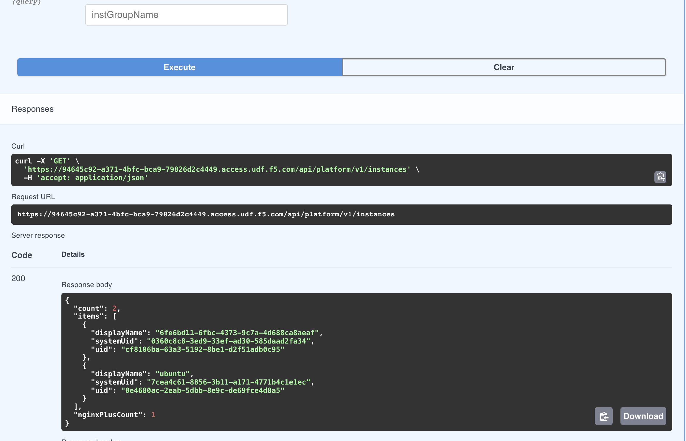

.. note::

    Use notepad or some place to copy and paste this value.  It will be 
    helpful in case you click off the screen or overwrite the copy buffer.

Step 4: Get the configuration of an instance
--------------------------------------------

Make sure you have the ``systemUid`` and ``uid`` from Step 3 for ``ubuntu``.

Scroll down on the Swagger-UI page in the ``NGINX Instances`` section 
to ``GET /systems/{systemUid}/instances/{nginxUid}/config``. Expand that API 
and push the ``Try it out`` button.

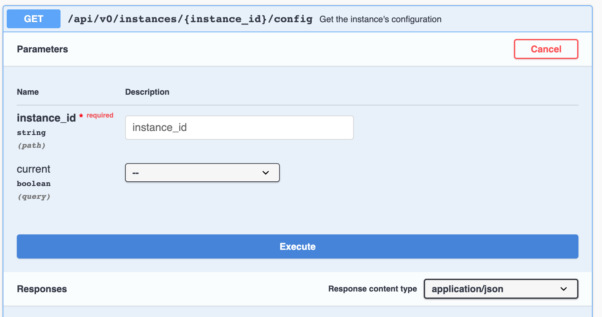

In the parameters section, the field ``systemUid`` and ``uid`` are in bold and 
have a red ``*`` indicating it is required.  The GET command requires 
we enter the ``systemUid`` and ``uid``.

Paste or type in the ``systemUid`` and ``uid`` from Step 3 and select ``Execute``

.. note::

    If you can't type or paste it in, be sure you clicked ``Try it out`` 
    first.

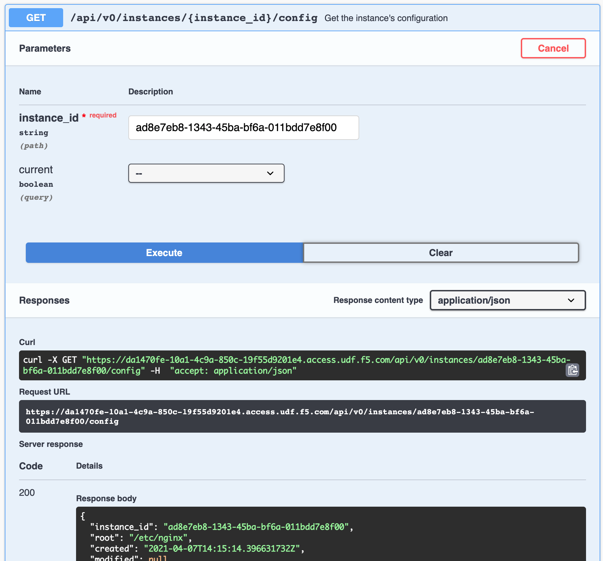

Scroll down to the Response body and scroll down to see the different 
includes listed.  For each section there is a ``name`` field which tells 
us the location and name of the ``.conf`` file; and there is a ``contents`` 
field that contains a ``base64`` value representing the contents.

When we use APIs to handle text files (such as nginx.conf) we often will 
encode them to avoid copy/paste errors.  If you notice, the structure of 
the response is in ``application/json`` format.  The usual nginx.conf format 
contains characters that would have to encoded very carefully so as not to 
conflict with the ``json`` payload.  Instead of doing this, we convert the 
contents to base64 (a long string of characters) that is easily used with 
API calls and the ``application/json`` format.

In the response body section, find the ``name:`` that says 
``"/etc/nginx/conf.d/default.conf`` and copy the value in the 
``contents:`` section. 

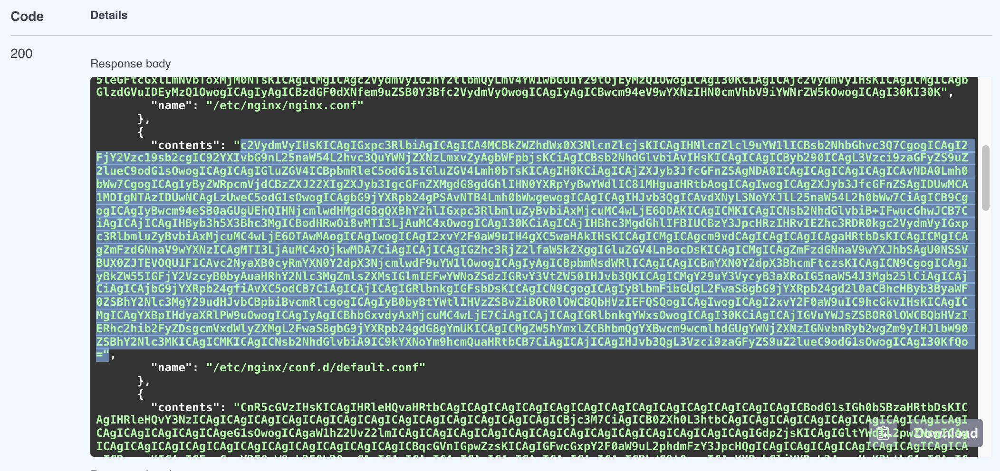

Let's use the contents to see if the base64 string makes sense. We can use a 
website or go on the ``nginx-manager`` Web Shell CLI to do this.

Option 1: Use website
=================

Open a new window 
and navigate to https://www.base64decode.org/

Paste the value of the contents into the window and select the ``< DECODE >`` button. 
The results in the bottom panel should show the default.conf we worked with earlier.

.. image:: ./API-base64-decode.png

Option 2: Use Web Shell CLI
===============

As the ``ubuntu`` user on ``nginx-manager`` run the following command. Put in the 
value you copied from the response instead of using the one below (which may or may 
not match your default.conf contents).

.. code-block:: shell-session
    :emphasize-lines: 1,2

    contents="c2VydmVyIHsKICAgIGxpc3RlbiAwLjAuMC4wOjgwODE7CiAgICBzZXJ2ZXJfbmFtZSBkZWZhdWx0X3NlcnZlcjsKCiAgICAjQCBhcGkKICAgIGxvY2F0aW9uIC9hcGkvdjEgewogICAgICAgIHJldHVybiAyMDAgInt9XG4iOwogICAgfQoKICAgICNAIGNvcnAKICAgIGxvY2F0aW9uIC9jb3JwL21lZGlhIHsKICAgICAgICByZXR1cm4gNDAzICJUTEEgRlRXXG4iOwogICAgfQoKICAgICNAIHVuaW1wbGVtZW50ZWQKICAgIGxvY2F0aW9uIC91bmltcGxlbWVudGVkIHsKICAgICAgICByZXR1cm4gNTAwICJub3QgaW1wbGVtZW50ZWRcbiI7CiAgICB9CiAjQCBkZWZhdWx0CiAgICBsb2NhdGlvbiAvIHsKICAgICAgICByb290IC91c3Ivc2hhcmUvbmdpbngvaHRtbDsKICAgICAgICAjIGluZGV4IGluZGV4Lmh0bWw7CiAgICAgICAgaW5kZXggc2FtcGxlLmh0bWw7ICMgIFBhZ2Ugd2l0aCBsb3RzIG9mIGluZm8KICAgIH0KCn0K"
    echo $contents | base64 --decode
    server {
        listen 0.0.0.0:8081;
        server_name default_server;

        location / {
            root /usr/share/nginx/html;
            # index index.html;
            index sample.html; #  Page with lots of info
        }

    }

Step 5: Push a change to the configuration
------------------------------------------

Using notepad or some editor, copy the decoded values of the 
``default.conf`` file and make an edit, something you might notice.  

The index lines under the  default location ``/`` can be used. 
If the ``sample.html`` is uncommented, a sample web page will be on the ``ubuntu`` instance. 
If it is commented but the ``index.html`` is uncommented, the sample web page will 
have a default ``Welcome to CentOS`` page instead.

You can check which page is there by going to the UDF Dashboard and 
opening the ``Sample Web Page`` and looking at the result.

.. image:: ./UDF-nginx5-sample.png

The custom page using ``sample.html`` looks like this:

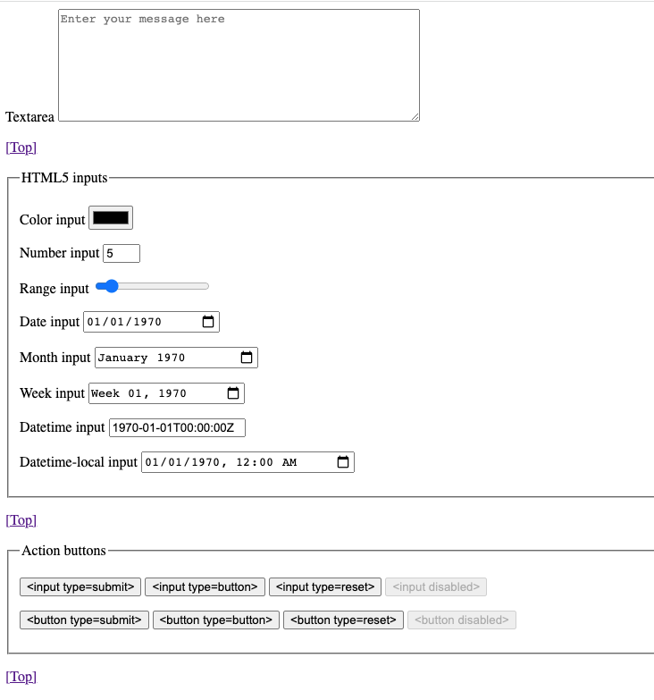

The ``Welcome to CentOS page looks`` like this:

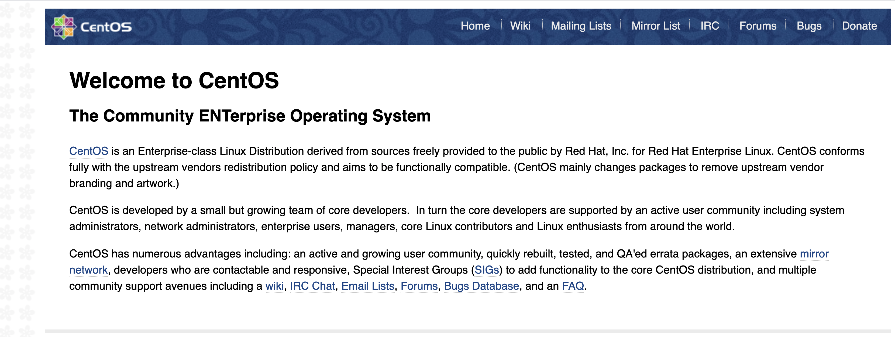

Now in the editor, change the line so that ``index.html`` is now 
uncommented and ``sample.html`` is commented.  Copy the contents of 
the file so we can encode the results.

Option 1: Use website
=====================

You can open https://www.base64encode.org/ and paste the contents 
into the form.  Hit ``> ENCODE <`` and copy the results to use in the 
API call.

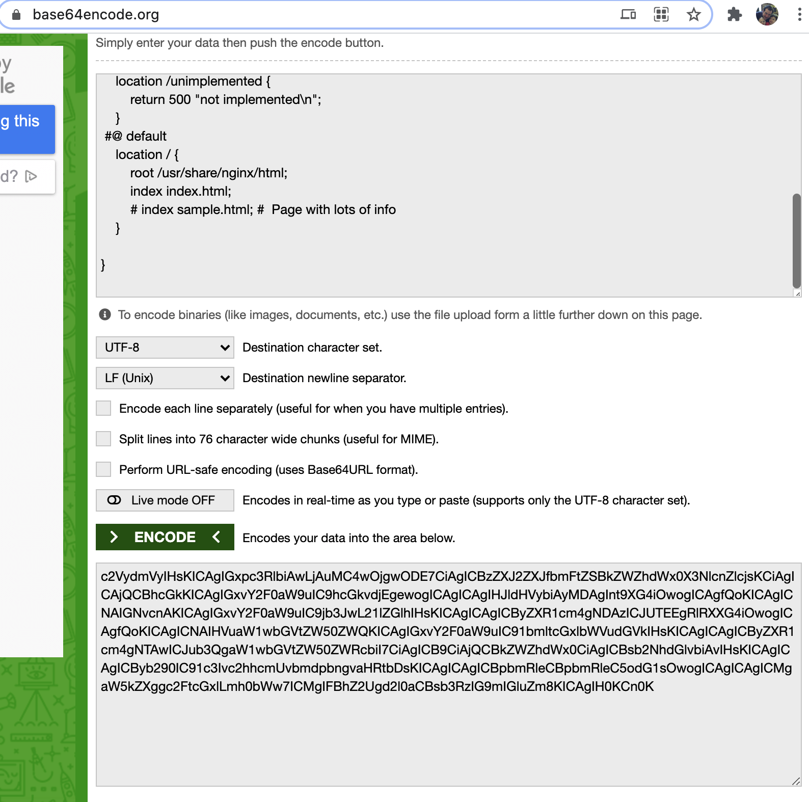

Option 2: Use Web Shell CLI
=================

Open a new file called ``encode.txt`` on the ``nginx-manager`` command line.
Paste in or make the changes and save the file as ``encode.txt``.  Then
copy the output to use in the API call.

.. code-block:: nginx
    :caption: encode.txt
    :name: encode.txt

    server {
        listen 0.0.0.0:8081;
        server_name default_server;

        location / {
            root /usr/share/nginx/html;
            index index.html;
            # index sample.html; #  Page with lots of info
        }
 
        error_page   500 502 503 504  /50x.html;
        location = /50x.html {
            root   /usr/share/nginx/html;
        }
  
        

    }

.. code-block:: shell-session
    :emphasize-lines: 1

    base64 encode.txt 
    c2VydmVyIHsKICAgIGxpc3RlbiAgICAgICAwLjAuMC4wOjgwODE7CiAgICBzZXJ2ZX
    JfbmFtZSAgZGVmYXVsdF9zZXJ2ZXI7CgogICAgI2FjY2Vzc19sb2cgIC92YXIvbG9n
    L25naW54L2hvc3QuYWNjZXNzLmxvZyAgbWFpbjsKCiAgICBsb2NhdGlvbiAvIHsKIC
    AgICAgICByb290ICAgL3Vzci9zaGFyZS9uZ2lueC9odG1sOyAKCSAgICBpbmRleCBp
    bmRleC5odG1sOyAKCSAgICAjaW5kZXggc2FtcGxlLmh0bWw7ICAjICBQYWdlIHdpdG
    ggbG90cyBvZiBpbmZvCiAgICB9CgogICAgI2Vycm9yX3BhZ2UgIDQwNCAgICAgICAg
    ICAgICAgLzQwNC5odG1sOwoKICAgICMgcmVkaXJlY3Qgc2VydmVyIGVycm9yIHBhZ2
    VzIHRvIHRoZSBzdGF0aWMgcGFnZSAvNTB4Lmh0bWwKICAgICMKICAgIGVycm9yX3Bh
    Z2UgICA1MDAgNTAyIDUwMyA1MDQgIC81MHguaHRtbDsKICAgIGxvY2F0aW9uID0gLz
    UweC5odG1sIHsKICAgICAgICByb290ICAgL3Vzci9zaGFyZS9uZ2lueC9odG1sOwog
    ICAgfQoKICAgICMgcHJveHkgdGhlIFBIUCBzY3JpcHRzIHRvIEFwYWNoZSBsaXN0ZW
    5pbmcgb24gMTI3LjAuMC4xOjgwCiAgICAjCiAgICAjbG9jYXRpb24gfiBcLnBocCQg
    ewogICAgIyAgICBwcm94eV9wYXNzICAgaHR0cDovLzEyNy4wLjAuMTsKICAgICN9Cg
    ogICAgIyBwYXNzIHRoZSBQSFAgc2NyaXB0cyB0byBGYXN0Q0dJIHNlcnZlciBsaXN0
    ZW5pbmcgb24gMTI3LjAuMC4xOjkwMDAKICAgICMKICAgICNsb2NhdGlvbiB+IFwucG
    hwJCB7CiAgICAjICAgIHJvb3QgICAgICAgICAgIGh0bWw7CiAgICAjICAgIGZhc3Rj
    Z2lfcGFzcyAgIDEyNy4wLjAuMTo5MDAwOwogICAgIyAgICBmYXN0Y2dpX2luZGV4IC
    BpbmRleC5waHA7CiAgICAjICAgIGZhc3RjZ2lfcGFyYW0gIFNDUklQVF9GSUxFTkFN
    RSAgL3NjcmlwdHMkZmFzdGNnaV9zY3JpcHRfbmFtZTsKICAgICMgICAgaW5jbHVkZS
    AgICAgICAgZmFzdGNnaV9wYXJhbXM7CiAgICAjfQoKICAgICMgZGVueSBhY2Nlc3Mg
    dG8gLmh0YWNjZXNzIGZpbGVzLCBpZiBBcGFjaGUncyBkb2N1bWVudCByb290CiAgIC
    AjIGNvbmN1cnMgd2l0aCBuZ2lueCdzIG9uZQogICAgIwogICAgI2xvY2F0aW9uIH4g
    L1wuaHQgewogICAgIyAgICBkZW55ICBhbGw7CiAgICAjfQoKICAgICMgZW5hYmxlIC
    9hcGkvIGxvY2F0aW9uIHdpdGggYXBwcm9wcmlhdGUgYWNjZXNzIGNvbnRyb2wgaW4g
    b3JkZXIKICAgICMgdG8gbWFrZSB1c2Ugb2YgTkdJTlggUGx1cyBBUEkKICAgICMKIC
    AgICNsb2NhdGlvbiAvYXBpLyB7CiAgICAjICAgIGFwaSB3cml0ZT1vbjsKICAgICMg
    ICAgYWxsb3cgMTI3LjAuMC4xOwogICAgIyAgICBkZW55IGFsbDsKICAgICN9CgogIC
    AgIyBlbmFibGUgTkdJTlggUGx1cyBEYXNoYm9hcmQ7IHJlcXVpcmVzIC9hcGkvIGxv
    Y2F0aW9uIHRvIGJlCiAgICAjIGVuYWJsZWQgYW5kIGFwcHJvcHJpYXRlIGFjY2Vzcy
    Bjb250cm9sIGZvciByZW1vdGUgYWNjZXNzCiAgICAjCiAgICAjbG9jYXRpb24gPSAv
    ZGFzaGJvYXJkLmh0bWwgewogICAgIyAgICByb290IC91c3Ivc2hhcmUvbmdpbngvaH
    RtbDsKICAgICN9Cn0K

Keep the encoded base64 in a notepad or a way to copy and paste.  Click the copy button 
on the results in the API call to copy the entire response for now.

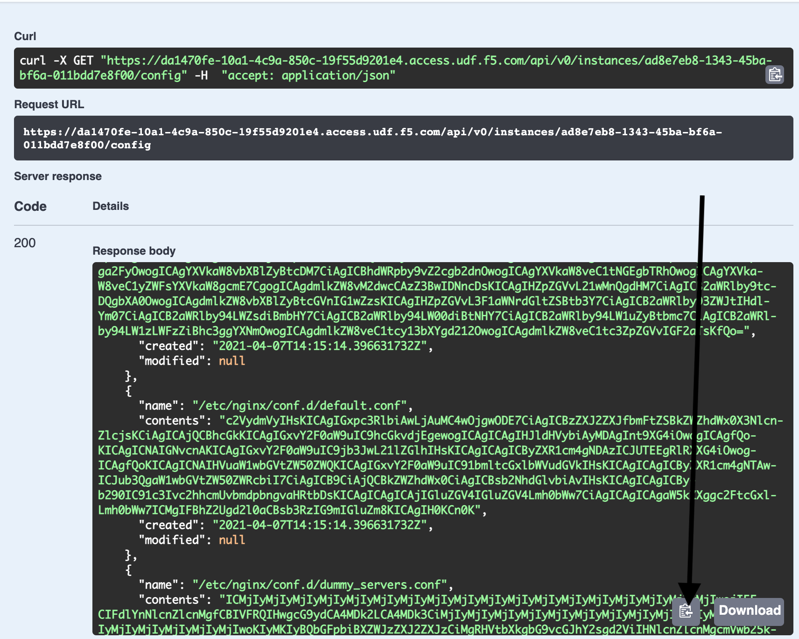

Navigate to the ``POST /systems/{systemUid}/instances/{nginxUid}/config`` API call and expand it. 
Click the ``Try it out`` button and paste in the ``systemUid`` and ``uid`` from before and also 
the entire contents of the ``GET`` command.

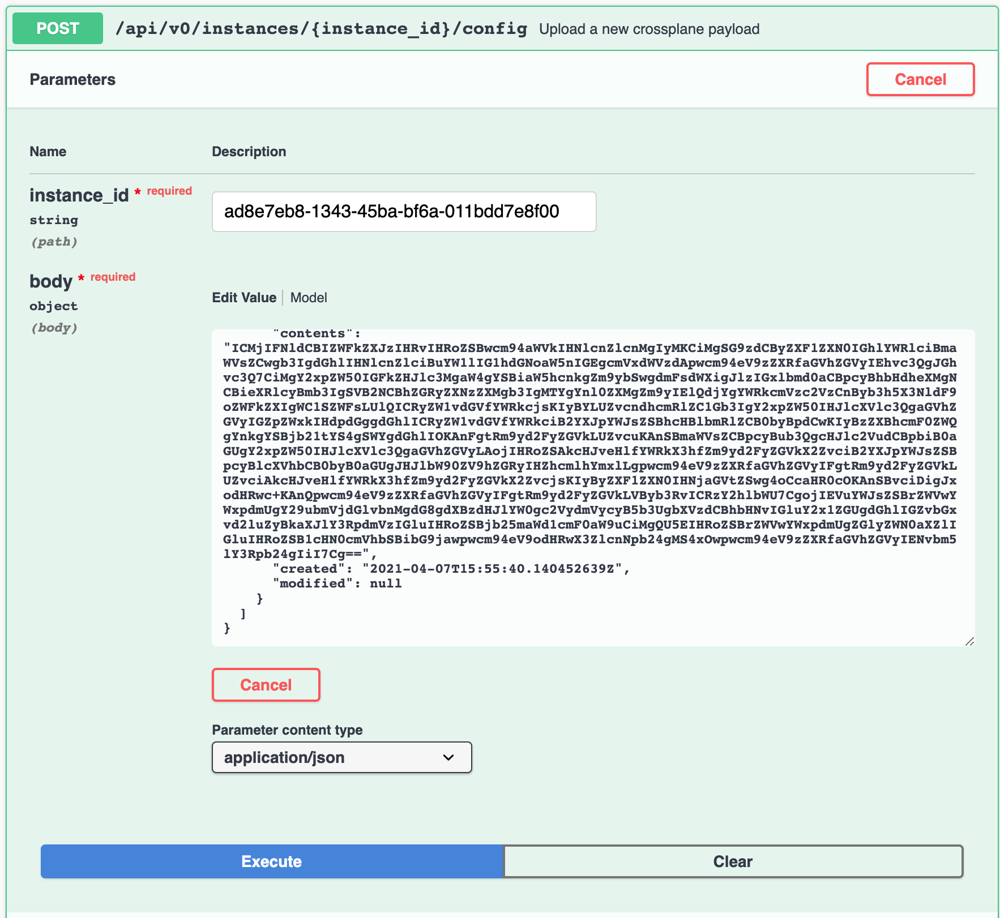

Now go into the ``body`` parameter and change the value for ``contents:`` under 
``default.conf`` with the value we encoded.

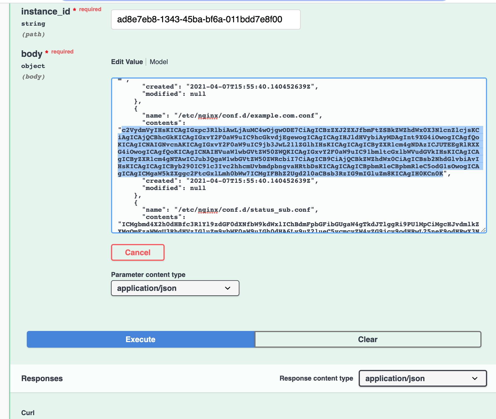

Hit ``Execute`` and check there is no ``error``.

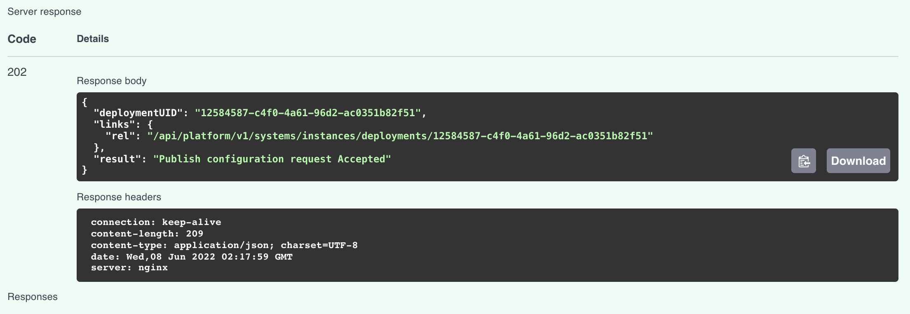

Now the new configuration is deployed, let's make sure it was applied successfully. Lets copy the deploymentUID and paste into the /systems/instances/deployments/{deploymentsUid}
endpoint and hit ``Execute``

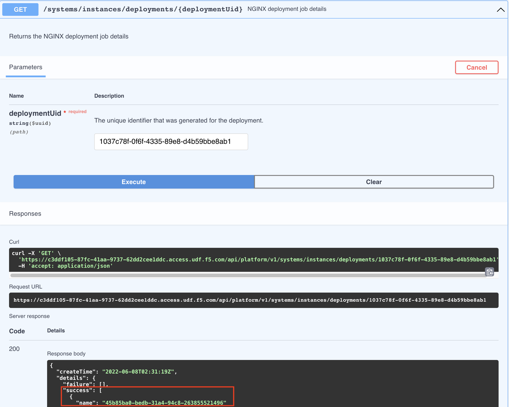

Now the new configuration is successfully deployed.

Hit refresh on the sample web page  we opened earlier (likely in another tab) 
and notice the page should now display the ``Welcome to CentOS`` page.

The ``Welcome to CentOS`` page looks like this:

Step 6: Go play with other API calls
------------------------------------

Feel free to explore other API calls.

