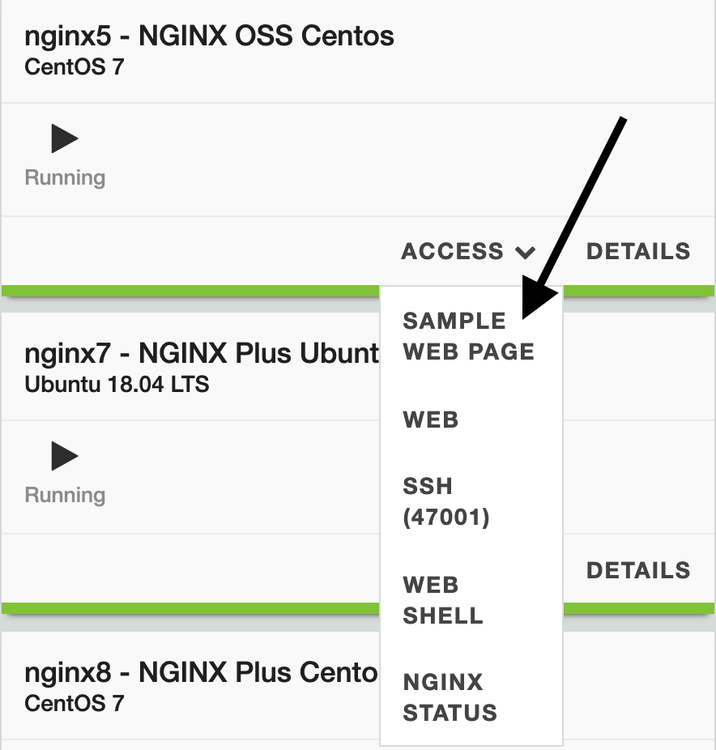

.. _2.4-swagger-api:

Exercise 2.4: Exploring the API
###############################

Objective
=========

Understand the API behind NGINX Instance Manager.

NGINX Instance Manager uses a simple API for almost all 
functions it provides.  We look to provide an API first 
in existing and new features.  This Exercise explores the 
provided API but does not exhaust options for the API.

You are highly encouraged to explore the API further and 
adapt the use of it for your own needs.

Guide
=====

Step 1: Explore the Swagger UI API Page
---------------------------------------

For this step, open the user interface for ``nginx-manager`` in 
the UDF dashboard.  You can select the ``ACCESS`` menu under 
``NGINX Manager Server`` and the ``INSTANCE MANAGER UI`` selection.
This will open the user interface in a new browser tab.

Navigate to the Settings section and select the API top-level 
selection to navigate to the ``Settings - API`` page.  Your window 
should look similar to the one below.

.. image:: ./UI-settings-API.png

On this page select the ``Open Swagger`` button and you should 
see a page similar to one below display.  We will use this page 
for the majority of the lesson.

.. image:: ./UI-swagger-ui.png

Step 2: Get information on the system
-------------------------------------

The swagger-ui page is an easy way to test the API on your ``nginx-manager`` 
instance.  Let's explore the ``AboutService`` section first.

Click on the ``GET`` button for ``/api/v0/about/system``

.. image:: ./API-try.png

This action just explains the API that is there and the sample information 
it provides.  We can also use this page to make real API calls.

Click on ``Try it out`` at the top right part of the API section.

.. image:: ./API-execute.png

Notice we have a curl command example.  You can copy and paste that line 
into an instance with ``curl`` installed and try it yourself.  The page 
allows us to try it also.

Click on ``execute`` and scroll down to see if we captured some results.

.. image:: ./API-about-results.png

Notice how we now see information in the details pane.  If you look closely 
you can see this is actual data from our installed instance.

.. note::

    The UDF environment is proxying traffic through a strange long URL. 
    In your environment, this should URL won't be present in the same way 
    and should come across as ``nginx-manager.f5demolab.com`` or similar.

    If you want, try copying the curl command and replacing the URL with 
    ``nginx-manager.f5demolab.com:443`` on the command line to verify.

Step 3: Get a list of instances
-------------------------------

Let's move on to something more useful.  In the current version we need 
to call every instance using an ``instance_id``.  

Every instance has an ``instance_id`` assigned by ``nginx-manager`` when 
first contact is made between the agent and the server.  The ``instance_id`` 
is unique for each instance managed.  We are going to find the ``instance_id`` 
for the ``Centos-OSS`` server using the API.

.. note::

    You can write your own methods to use the hostname to extract the ``instance_id`` 
    but for this exercise we will use the actual value for ``instance_id``

Scroll to the ``InventoryService`` section and find the API call for 
``GET /api/v0/instances``.  Expand that call and push the ``Try it out`` 
button.

.. image:: ./API-instances-get.png

We can leave the fields ``limit`` and ``offset`` blank for now.  They can be 
used to limit the amount of data returned in case you manage thousands of 
instances (which you can do).

Click ``Execute`` and examine the results for the ``OSS-Centos`` instance.
When you find it, copy the ``instance_id`` value down and we will use it 
for the Step 4.

.. image:: ./API-instances-id.png

.. note::

    Use notepad or some place to copy and paste this value.  It will be 
    helpful in case you click off the screen or overwrite the copy buffer.

Step 4: Get the configuration of an instance
--------------------------------------------

Make sure you have the ``instance_id`` from Step 3 for ``OSS-Centos``.

Scroll down on the Swagger-UI page in the ``InventoryService`` section 
to ``GET /api/v0/instances/{instance_id}/config``.  Expand that API 
and push the ``Try it out`` button.

.. image:: ./API-config-try.png

In the parameters section, the field ``instance_id`` is in bold and 
has a red ``*`` indicating it is required.  The GET command requires 
we enter the ``instance_id``.

Paste or type in the ``instance_id`` from Step 3 and select ``Execute``

.. note::

    If you can't type or paste it in, be sure you clicked ``Try it out`` 
    first.

.. image:: ./API-config-instanceid-paste.png

Scroll down to the Response body and scroll down to see the different 
includes listed.  For each section there is a ``name`` field which tells 
us the location and name of the ``.conf`` file; and there is a ``contents`` 
field that contains a ``base64`` value representing the contents.

When we use APIs to handle text files (such as nginx.conf) we often will 
encode them to avoid copy/paste errors.  If you notice, the structure of 
the response is in ``application/json`` format.  The usual nginx.conf format 
contains characters that would have to encoded very carefully so as not to 
conflict with the ``json`` payload.  Instead of doing this, we convert the 
contents to base64 (a long string of characters) that is easily used with 
API calls and the ``application/json`` format.

In the response body section, find the ``name:`` that says 
``"/etc/nginx/conf.d/default.conf`` and copy the value in the 
``contents:`` section. 

.. image:: ./API-config-default-copy.png

Let's use the contents to see if the base64 string makes sense. We can use a 
website or go on the ``nginx-manager`` shell CLI to do this.

Option 1: website
=================

Open a new window 
and navigate to https://www.base64decode.org/

Paste the value of the contents into the window and slect the ``< DEVODE >`` button. 
The results in the bottom panel should show the default.conf we worked with earlier.

.. image:: ./API-base64-decode.png

Option 2: shell
===============

As the ``centos`` user on ``nginx-manager`` run the following command.  Put in the 
value you copied from the response instead of using the one below (which may or may 
not match your default.conf contents).

.. code-block:: shell-session

    [centos@nginx-manager ~]$ contents="c2VydmVyIHsKICAgIGxpc3RlbiAwLjAuMC4wOjgwODE7CiAgICBzZXJ2ZXJfbmFtZSBkZWZhdWx0X3NlcnZlcjsKCiAgICAjQCBhcGkKICAgIGxvY2F0aW9uIC9hcGkvdjEgewogICAgICAgIHJldHVybiAyMDAgInt9XG4iOwogICAgfQoKICAgICNAIGNvcnAKICAgIGxvY2F0aW9uIC9jb3JwL21lZGlhIHsKICAgICAgICByZXR1cm4gNDAzICJUTEEgRlRXXG4iOwogICAgfQoKICAgICNAIHVuaW1wbGVtZW50ZWQKICAgIGxvY2F0aW9uIC91bmltcGxlbWVudGVkIHsKICAgICAgICByZXR1cm4gNTAwICJub3QgaW1wbGVtZW50ZWRcbiI7CiAgICB9CiAjQCBkZWZhdWx0CiAgICBsb2NhdGlvbiAvIHsKICAgICAgICByb290IC91c3Ivc2hhcmUvbmdpbngvaHRtbDsKICAgICAgICAjIGluZGV4IGluZGV4Lmh0bWw7CiAgICAgICAgaW5kZXggc2FtcGxlLmh0bWw7ICMgIFBhZ2Ugd2l0aCBsb3RzIG9mIGluZm8KICAgIH0KCn0K"
    [centos@nginx-manager ~]$ echo $contents | base64 --decode
    server {
        listen 0.0.0.0:8081;
        server_name default_server;

        #@ api
        location /api/v1 {
            return 200 "{}\n";
        }

        #@ corp
        location /corp/media {
            return 403 "TLA FTW\n";
        }

        #@ unimplemented
        location /unimplemented {
            return 500 "not implemented\n";
        }
    #@ default
        location / {
            root /usr/share/nginx/html;
            # index index.html;
            index sample.html; #  Page with lots of info
        }

    }
    [centos@nginx-manager ~]$ 

Step 5: Push a change to the configuration
------------------------------------------

Using notepad or some editor, copy the decoded values of the 
``default.conf`` file and make an edit. Something you might notice.  

The index lines under the  default location ``/`` can be used. 
If the ``sample.html`` is uncommented, a sample web page will have 
some garbage data on the ``OSS-Centos`` instance.  If it is commented 
but the ``index.html`` is uncommented, the sample web page will 
have a default ``Welcome to CentOS`` page instead.

You can check which page is there by going to the UDF Dashboard and 
opening the ``Sample Web Page`` and looking at the result.

The custom page using ``sample.html`` looks like this:

.. image:: ./UDF-nginx5-custom.png

The ``Welcome to CentOS`` page looks like this:

.. image:: ./UDF-nginx5-welcome.png

Now in the editor, change the line so that ``index.html`` is now 
uncommented and ``sample.html`` is commented.  Copy the contents of 
the file so we can encode the results.

Option 1: Use website
=====================

You can open https://www.base64encode.org/ and paste the contents 
into the form.  Hit ``> ENCODE <`` and copy the results to use in the 
API call.

.. image:: ./API-base64-encode.png

Option 2: Use CLI
=================

Open a new file called ``encode.txt`` on the ``nginx-manager`` command line.
Paste in or make the changes and save the file as ``encode.txt``.  Then
copy the output to use in the API call.

.. code-block:: shell-session

    [centos@nginx-manager ~]$ vim encode.txt
    [centos@nginx-manager ~]$ cat encode.txt 
    server {
        listen 0.0.0.0:8081;
        server_name default_server;

        #@ api
        location /api/v1 {
            return 200 "{}\n";
        }

        #@ corp
        location /corp/media {
            return 403 "TLA FTW\n";
        }

        #@ unimplemented
        location /unimplemented {
            return 500 "not implemented\n";
        }
    #@ default
        location / {
            root /usr/share/nginx/html;
            index index.html;
            # index sample.html; #  Page with lots of info
        }

    }

    [centos@nginx-manager ~]$ base64 encode.txt 
    c2VydmVyIHsKICAgIGxpc3RlbiAwLjAuMC4wOjgwODE7CiAgICBzZXJ2ZXJfbmFtZSBkZWZhdWx0
    X3NlcnZlcjsKCiAgICAjQCBhcGkKICAgIGxvY2F0aW9uIC9hcGkvdjEgewogICAgICAgIHJldHVy
    biAyMDAgInt9XG4iOwogICAgfQoKICAgICNAIGNvcnAKICAgIGxvY2F0aW9uIC9jb3JwL21lZGlh
    IHsKICAgICAgICByZXR1cm4gNDAzICJUTEEgRlRXXG4iOwogICAgfQoKICAgICNAIHVuaW1wbGVt
    ZW50ZWQKICAgIGxvY2F0aW9uIC91bmltcGxlbWVudGVkIHsKICAgICAgICByZXR1cm4gNTAwICJu
    b3QgaW1wbGVtZW50ZWRcbiI7CiAgICB9CiAjQCBkZWZhdWx0CiAgICBsb2NhdGlvbiAvIHsKICAg
    ICAgICByb290IC91c3Ivc2hhcmUvbmdpbngvaHRtbDsKICAgICAgICBpbmRleCBpbmRleC5odG1s
    OwogICAgICAgICMgaW5kZXggc2FtcGxlLmh0bWw7ICMgIFBhZ2Ugd2l0aCBsb3RzIG9mIGluZm8K
    ICAgIH0KCn0KCg==
    [centos@nginx-manager ~]$

Keep the encoded base64 in a notepad or a way to copy and paste.  Click the copy button 
on the results in the API call to copy the entire response for now.

.. image:: ./API-base64-copyall.png

Navigate to the ``POST /api/v0/isntances/{instance_id}/config`` API call and expand it. 
Click the ``Try it out`` button and paste in the ``instance_id`` from before and also 
the entire contents of the ``GET`` command.

.. image:: ./API-post-paste.png

Scroll down and notice the results are simple a blank ``err:`` if it succeeded.  All 
we did was push the same config to the instance.

.. image:: ./API-post-err.png

Now go into the ``body`` parameter and change the value for ``contents:`` under 
``default.conf`` with the value we encoded.

.. image:: ./API-post-update.png

Hit ``Execute`` and check there is no ``error``.

This saves the new configuration in the database but it isn't published yet. To 
publish the new configuration we will use the publish API.

Scroll down to the API ``POST /api/v0/instances/{instance_id}/config/publish`` and 
click ``Try it out``.
Paste in the ``instance_id`` and hit ``Execute``.

.. image:: ./API-publish.png

Now the new configuration is published.

Hit refresh on the sample web page  we opened earlier (likely in another tab) 
and notice the page should now display the ``Welcome to CentOS`` page.

The ``Welcome to CentOS`` page looks like this:

.. image:: ./UDF-nginx5-welcome.png

Step 6: Go play with other API calls
------------------------------------

Feel free to explore other API calls.

