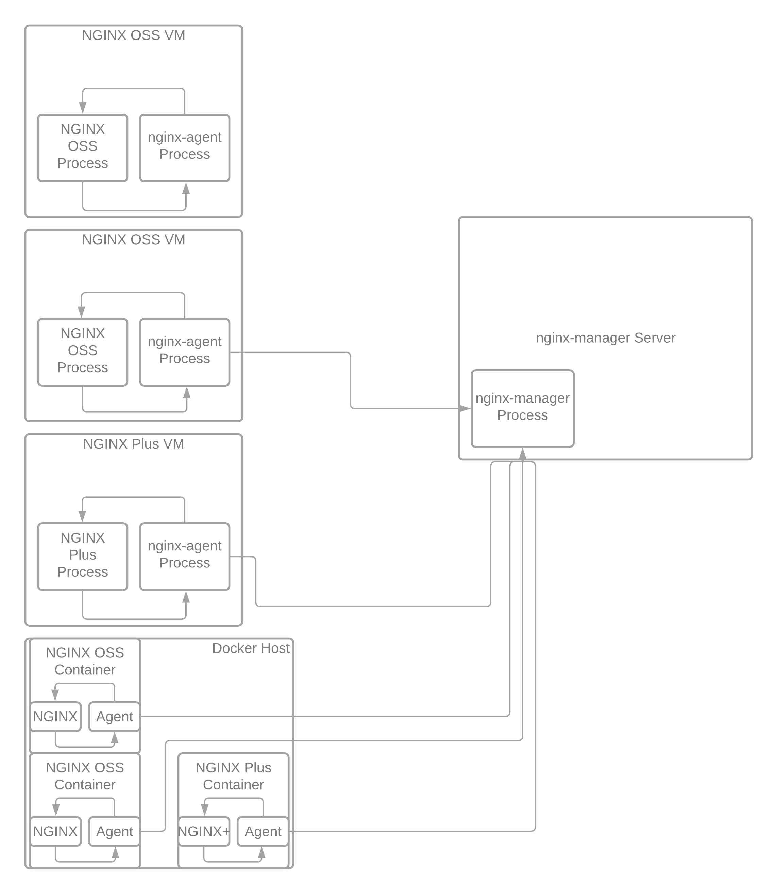

.. _3.0-architecture:

Exercise 3.0: NGINX Instance Manager Architecture
#################################################

Objective
=========

Understand how NGINX Instance Manager handles network traffic 
and communications. Learn different options for securing traffic 
externally and for agent and server communication.

Guide
=====

NGINX Instance Manager uses an agent and server communiction path for 
managing NGINX Instances.  The ``nginx-agent`` communicates with the 
``nginx-manager`` over gRPC.

Step 1
------

Navigate to the ``nginx-manager`` instance as ``centos`` and use the home directory.

Use the SSH menu option to beceome the centos user.  If you use the web-shell it 
defaults to the root user.  To follow best practice, please use the centos user.

.. image:: ../module1/UDF-select-ssh.png

If prompted, select yes for trusting the ssh connection in your terminal.

.. image:: ../module1/UDF-ssh.png

.. code-block:: shell-session

   [centos@nginx-manager ~]$ pwd
   /home/centos

Step 2: Review the ports used
-----------------------------

Let's use netstat (you may need to install this on your own system) on the ``nginx-manager`` 
instance.  We will list all ports and the processes, then use grep to filter the list.

.. code-block:: shell-session

   [centos@nginx-manager ~]$ sudo netstat -tulpn
   Active Internet connections (only servers)
   Proto Recv-Q Send-Q Local Address           Foreign Address         State       PID/Program name    
   tcp        0      0 0.0.0.0:22              0.0.0.0:*               LISTEN      1124/sshd           
   tcp        0      0 127.0.0.1:11000         0.0.0.0:*               LISTEN      1641/nginx-manager  
   tcp        0      0 127.0.0.1:25            0.0.0.0:*               LISTEN      1123/master         
   tcp        0      0 0.0.0.0:443             0.0.0.0:*               LISTEN      1328/nginx: master  
   tcp        0      0 0.0.0.0:444             0.0.0.0:*               LISTEN      1328/nginx: master  
   tcp        0      0 0.0.0.0:445             0.0.0.0:*               LISTEN      1328/nginx: master  
   tcp        0      0 0.0.0.0:446             0.0.0.0:*               LISTEN      1328/nginx: master  
   tcp        0      0 0.0.0.0:10080           0.0.0.0:*               LISTEN      1328/nginx: master  
   tcp        0      0 0.0.0.0:10443           0.0.0.0:*               LISTEN      1328/nginx: master  
   tcp        0      0 127.0.0.1:10000         0.0.0.0:*               LISTEN      1641/nginx-manager  
   tcp        0      0 0.0.0.0:8080            0.0.0.0:*               LISTEN      1328/nginx: master  
   tcp6       0      0 :::22                   :::*                    LISTEN      1124/sshd           
   tcp6       0      0 ::1:25                  :::*                    LISTEN      1123/master         
   tcp6       0      0 :::47100                :::*                    LISTEN      1295/udf-shell      
   udp        0      0 0.0.0.0:68              0.0.0.0:*                           906/dhclient        
   udp        0      0 127.0.0.1:323           0.0.0.0:*                           553/chronyd         
   udp6       0      0 ::1:323                 :::*                                553/chronyd         
   [centos@nginx-manager ~]$ sudo netstat -tulpn | grep nginx-manager
   tcp        0      0 127.0.0.1:11000         0.0.0.0:*               LISTEN      1641/nginx-manager  
   tcp        0      0 127.0.0.1:10000         0.0.0.0:*               LISTEN      1641/nginx-manager 

In the list above, we can see ``nginx-manager`` is listening on ports 10000 and 11000.  11000 is 
used by the API, UI, and metrics listener externally.  10000 is used by the agent and server to 
communicate over gRPC.

Note that the server is listening to 127.0.0.1 only.  This is because we do not authenticate traffic 
natively (not yet anyway). NGINX is a great solution for web applications and we are using NGINX for 
this purpose with NGINX Instance Manager.

Since we have NGINX already running on ``nginx-manager`` let's look at the ports it is using also.

.. code-block:: shell-session

   [centos@nginx-manager ~]$ sudo netstat -tulpn | grep nginx:
   tcp        0      0 0.0.0.0:443             0.0.0.0:*               LISTEN      1328/nginx: master  
   tcp        0      0 0.0.0.0:444             0.0.0.0:*               LISTEN      1328/nginx: master  
   tcp        0      0 0.0.0.0:445             0.0.0.0:*               LISTEN      1328/nginx: master  
   tcp        0      0 0.0.0.0:446             0.0.0.0:*               LISTEN      1328/nginx: master  
   tcp        0      0 0.0.0.0:10080           0.0.0.0:*               LISTEN      1328/nginx: master  
   tcp        0      0 0.0.0.0:10443           0.0.0.0:*               LISTEN      1328/nginx: master  
   tcp        0      0 0.0.0.0:8080            0.0.0.0:*               LISTEN      1328/nginx: master  

The ports above are from NGINX and are briefly described in the table below.  We will use them for the 
examples in the Exercises in Module 3.

+-------+----------------------------+-----------------+-----+------+
|  Port |           Purpose          |     Upstream    | SSL | Auth |
+=======+============================+=================+=====+======+
| 443   | UI and API with http2      | 127.0.0.1:11000 | Yes | No   |
+-------+----------------------------+-----------------+-----+------+
| 444   | UI and API with basic auth | 127.0.0.1:11000 | Yes | Yes  |
+-------+----------------------------+-----------------+-----+------+
| 445   | UI and API with JWT        | 127.0.0.1:11000 | Yes | Yes  |
+-------+----------------------------+-----------------+-----+------+
| 446   | swaggerui rewrite for UDF  | 127.0.0.1:11000 | Yes | No   |
+-------+----------------------------+-----------------+-----+------+
| 10080 | gRPC listener for agent    | 127.0.0.1:10000 | No  | No   |
+-------+----------------------------+-----------------+-----+------+
| 10443 | gRPC listener for agent    | 127.0.0.1:10000 | Yes | No   |
+-------+----------------------------+-----------------+-----+------+
| 8080  | Plus API                   | -               | No  | No   |
+-------+----------------------------+-----------------+-----+------+

You have finished this exercise. `Click here to return to the lab
guide <..>`__
