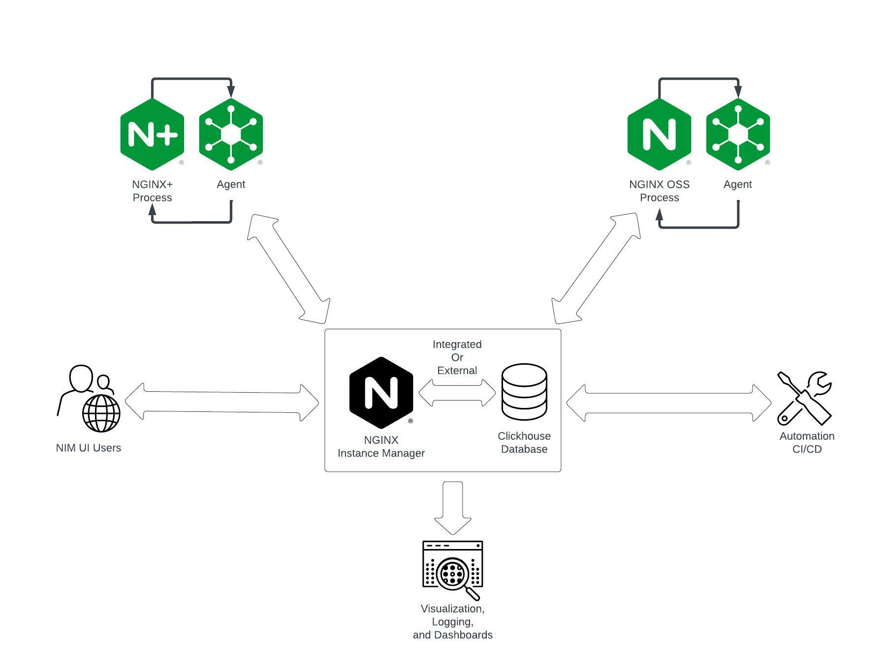
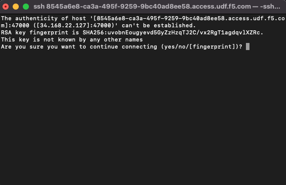
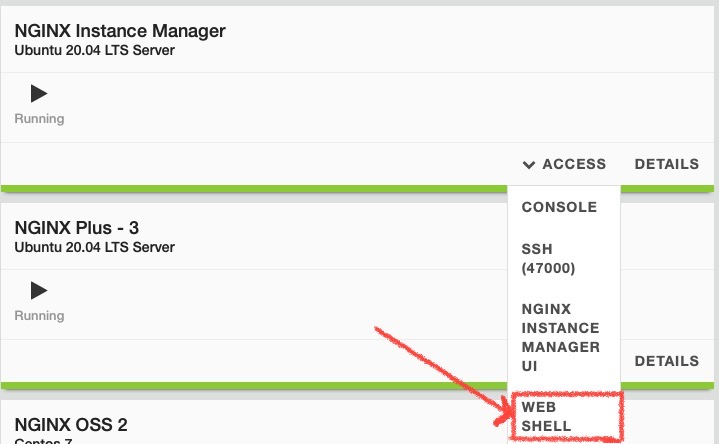

.. _3.0-architecture:

Exercise 3.0: NGINX Instance Manager Architecture
#################################################

Objective
=========

Understand how NGINX Instance Manager handles network traffic 
and communications. Learn different options for securing traffic 
externally and for agent and server communication.

Guide
=====

NGINX Instance Manager (NIM) uses an agent and server communication path for 
managing NGINX Instances.  The ``nginx-agent`` communicates with the 
``nginx-manager`` over gRPC (TCP 443).

NIM uses ClickHouse as an analytics time-series database.
ClicHouse can be installed with NIM in the same server, or can be accessed in an external installation.

Various Automation and CI/CD pipelines can use the NIM API to perform various actions.

NIM offers options to feed data and metrics to external platforms like Prometheus and visualization tools like Grafana.

Step 1
------

Navigate to the ``nginx-manager`` instance as ``ubuntu`` and use the home directory.

Use the SSH menu option to beceome the ubuntu user.  If you use the web-shell it 
defaults to the root user.  To follow best practice, please use the ubuntu user.

.. image:: ./Access-SSH.jpg

If prompted, select yes for trusting the ssh connection in your terminal.

``NOTE: If you haven't added SSH keys to UDF - Use the WebShell``

Step 2: Review the ports used
-----------------------------

Let's use netstat (you may need to install this on your own system) on the ``nginx-manager`` 
instance.  We will list all ports and the processes, then use grep to filter the list.

  sudo netstat -tulpn | grep nginx

  tcp        0      0 0.0.0.0:443             0.0.0.0:*               LISTEN      726/nginx: master p::

Nginx Instance Manager ingests data from the agents and exposes the UI via TCP 443.

For documentation see: https://docs.nginx.com/nginx-instance-manager/about/technical-specifications/

Nginx Instance Manager also uses ClickHouse as an analytics time-series database. 

For documentation on ClickHouse see here: https://docs.nginx.com/nginx-instance-manager/admin-guide/configure-clickhouse/

