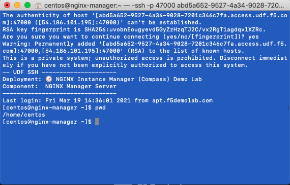

.. _3.1-encryption:

Exercise 3.1: NGINX Instance Manager Encryption
###############################################

Objective
=========

Learn how to use TLS and mTLS with NGINX Instance 
Manager to encrypt traffic.

Guide
=====

NGINX Instance Manager can encrypt traffic using server-side 
TLS without a proxy and mTLS for use with a proxy.  Investigate 
the encryption used for NGINX Instance Manager.

Step 1
------

In the UI for NGINX Instance Manager, go to ``Inventory`` and select 
the edit config action for ``nginx-manager.f5demolab.com``.

.. image:: ./UDF-nginx-manager-edit.png

In the drop down include menu, select ``conf.d/nim_gui.conf``

Step 2
------

Navigate to the ``nginx-manager`` instance as ``centos`` and use the home directory.

Use the SSH menu option to beceome the centos user.  If you use the web-shell it 
defaults to the root user.  To follow best practice, please use the centos user.

.. image:: ../module1/UDF-select-ssh.png

If prompted, select yes for trusting the ssh connection in your terminal.

.. code-block:: shell-session

   [centos@nginx-manager ~]$ pwd
   /home/centos

You have finished this exercise. `Click here to return to the lab
guide <..>`__
