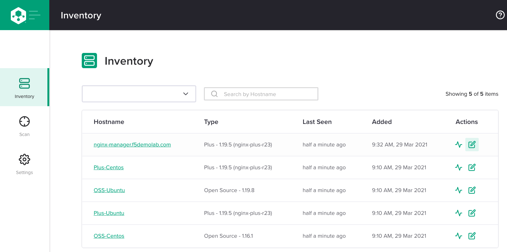

.. _3.2-authentication:

Exercise 3.2: NGINX Instance Manager Authentication
###################################################

Objective
=========

Learn how to use authentication with NGINX Instance 
Manager.

Guide
=====

NGINX Instance Manager leverages the NGINX proxy for any 
authentication schemes.  Authentication can be setup using the 
`NGINX Instance Manager documentation on authentication <https://docs.nginx.com/nginx-instance-manager/getting-started/auth/>`__.

Step 1
------

In the UI for NGINX Instance Manager, go to ``Inventory`` and select 
the edit config action for ``nginx-manager.f5demolab.com``.

In the drop down include menu, select ``conf.d/nim_basic.conf``

In the configuration editor, you should be able to see the following.
Ignore the swagger-ui redirect for now, this is used for the UDF environment.

.. code-block:: nginx

   server {
      # listen  80;
      listen  444 ssl;

      status_zone nginx-manager_basicauth_https;
      server_name nginx-manager.example.com;

      # Optional log locations
      # access_log /var/log/nginx/nginx-manager-basic-access.log info;
      # error_log /var/log/nginx/nginx-manager-basic-error.log;

      # SSL certificates must be valid for the FQDN and placed in the correct directories
      ssl_certificate         /etc/ssl/nginx-manager/nginx-manager.crt;
      ssl_certificate_key     /etc/ssl/nginx-manager/nginx-manager.key;

      ssl_session_cache shared:SSL:10m;
      ssl_session_timeout 24h;
      ssl_session_tickets off;

      ssl_protocols   TLSv1.2 TLSv1.3;
      ssl_ciphers EECDH+CHACHA20:EECDH+AES128:RSA+AES128:EECDH+AES256:RSA+AES256:EECDH+3DES:RSA+3DES:!MD5;
      ssl_prefer_server_ciphers   off;
      
      location / {
         proxy_pass https://nginx-manager_servers;
         health_check uri=/swagger-ui/;

         ## Use htpasswd basic auth
         auth_basic "nginx-manager API";
         auth_basic_user_file /etc/nginx/.htpasswd;

      proxy_set_header Authorization "";
      proxy_set_header username 	$remote_user;
      proxy_set_header role 		$remote_user;
      }

   }

NGINX is using basic authentication in the location context. The 
``.htpasswd`` file is specified in the ``auth_basic_user_file`` directive 
in this example.

Step 2
------

Navigate to the ``nginx-manager`` instance as ``centos`` and use the home directory.

Use the SSH menu option to beceome the centos user.  If you use the web-shell it 
defaults to the root user.  To follow best practice, please use the centos user.

.. image:: ../module1/UDF-select-ssh.png

If prompted, select yes for trusting the ssh connection in your terminal.

.. image:: ../module1/UDF-ssh.png

.. code-block:: shell-session

   [centos@nginx-manager ~]$ pwd
   /home/centos

Step 3: Add users
-----------------

We will use the same proceedure listed in the `NGINX public documentation  
<https://docs.nginx.com/nginx/admin-guide/security-controls/configuring-http-basic-authentication/#creating-a-password-file>`__

Using the SSH session, create an ``.htpasswd`` file for use with the proxy.
This file should be located in ``/etc/nginx/.htpasswd``.
Create a new user with the password ``P@ssw0rd20`` or use your own password.

.. code-block:: shell-session

   [centos@nginx-manager ~]$ sudo htpasswd -c /etc/nginx/.htpasswd user1
   New password: 
   Re-type new password: 
   Adding password for user user1
   [centos@nginx-manager ~]$ sudo htpasswd /etc/nginx/.htpasswd user2
   New password: 
   Re-type new password: 
   Adding password for user user2

The ``.htpasswd`` file should contain two entries for those users.

Step 4: Test basic auth
-----------------------

On the UDF dashboard, select ``Instances`` and the ``ACCESS`` menu drop-down.
Select ``BASIC AUTH`` and enter ``user1`` and the password from above to access 
NGINX Instance Manager.

Then you will be prompted to enter the credentials given.

Step 5: Extra credit
--------------------

See if you can restrict API calls based on the user names.

Step 6: Auditing
----------------

To enable auditing, we simply add the option to the ``nginx-manager.conf`` file.

.. code-block:: conf

   #
   # /etc/nginx-manager/nginx-manager.conf
   #

   # Configuration file for NGINX Compass Server

   # bind address for all service ports (default "localhost")
   bind-address: 127.0.0.1
   # gRPC service port for agent communication (default "10000")
   grpc-port: 10000
   # gRPC-gateway service port for API and UI (default "11000")
   gateway-port: 11000

   # SSL CN or servername for certs
   server-name: nginx-manager.example.com
   # path to x.509 certificate file (optional)
   cert: /etc/ssl/nginx-manager/nginx-manager.crt
   # path to x.509 certificate key file (optional)
   key: /etc/ssl/nginx-manager/nginx-manager.key

   # set log level (panic, fatal, error, info, debug, trace; default: info) (default "info")
   log:
      level: info
      path: /var/log/nginx-manager/
   # Metrics default storage path (default "/tmp/metrics") (directory must be already present)
   metrics:
      storage-path: /var/nginx-manager/
   # Path to license file
   license: /etc/nginx-manager/nginx-manager.lic
   # Audit Log
   audit-log: /var/log/nginx-manager/audit.log

The last line will enable audit logging.
Add the line and restart the service.

.. code-block:: shell-session

   [centos@nginx-manager ~]$ echo 'audit-log: /var/log/nginx-manager/audit.log' | sudo tee -a /etc/nginx-manager/nginx-manager.conf
   audit-log: /var/log/nginx-manager/audit.log
   [centos@nginx-manager ~]$ sudo cat /etc/nginx-manager/nginx-manager.conf
   #
   # /etc/nginx-manager/nginx-manager.conf
   #

   # Configuration file for NGINX Compass Server

   # bind address for all service ports (default "localhost")
   bind-address: 127.0.0.1
   # gRPC service port for agent communication (default "10000")
   grpc-port: 10000
   # gRPC-gateway service port for API and UI (default "11000")
   gateway-port: 11000

   # SSL CN or servername for certs
   server-name: nginx-manager.f5demolab.com
   # path to x.509 certificate file (optional)
   cert: /etc/ssl/nginx-manager/nginx-manager.crt
   # path to x.509 certificate key file (optional)
   key: /etc/ssl/nginx-manager/nginx-manager.key

   # set log level (panic, fatal, error, info, debug, trace; default: info) (default "info")
   log:
      level: info
      path: /var/log/nginx-manager/
   # Metrics default storage path (default "/tmp/metrics") (directory must be already present)
   metrics:
      storage-path: /var/nginx-manager/
   # Path to license file
   license: /etc/nginx-manager/nginx-manager.lic

   audit-log: /var/log/nginx-manager/audit.log
   [centos@nginx-manager ~]$ sudo systemctl restart nginx-manager.service 

Open the basic auth website and login. Run a change or two and look at the audit log.

.. code-block:: shell-session

   [centos@nginx-manager ~]$ sudo cat /var/log/nginx-manager/audit.log
   2021-03-29T16:35:28.722585023Z	user1	user1	GET	/api/v0/instances
   2021-03-29T16:35:28.805667148Z	user1	user1	GET	/api/v0/instances

Currently the audit log will record ALL API calls no matter what.  To use with 
other authentication forms, just pass the headers as username and role to the 
upstream.

