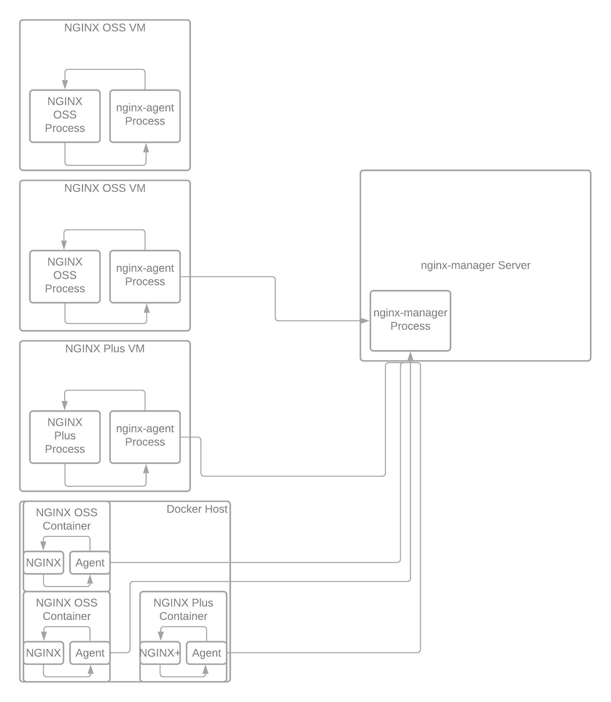

.. _3.2-authentication:

Exercise 3.2: NGINX Instance Manager Authentication
###################################################

Objective
=========

Learn how to use authentication with NGINX Instance 
Manager.

Guide
=====

NGINX Instance Manager uses an agent and server communiction path for 
managing NGINX Instances.  The ``nginx-agent`` communicates with the 
``nginx-manager`` over gRPC.

Step 1
------

Navigate to the ``nginx-manager`` instance as ``centos`` and use the home directory.

Use the SSH menu option to beceome the centos user.  If you use the web-shell it 
defaults to the root user.  To follow best practice, please use the centos user.

.. image:: ./UDF-select-ssh.png

If prompted, select yes for trusting the ssh connection in your terminal.

.. image:: ./UDF-ssh.png

.. code-block:: shell-session

   [centos@nginx-manager ~]$ pwd
   /home/centos

You have finished this exercise. `Click here to return to the lab
guide <..>`__
