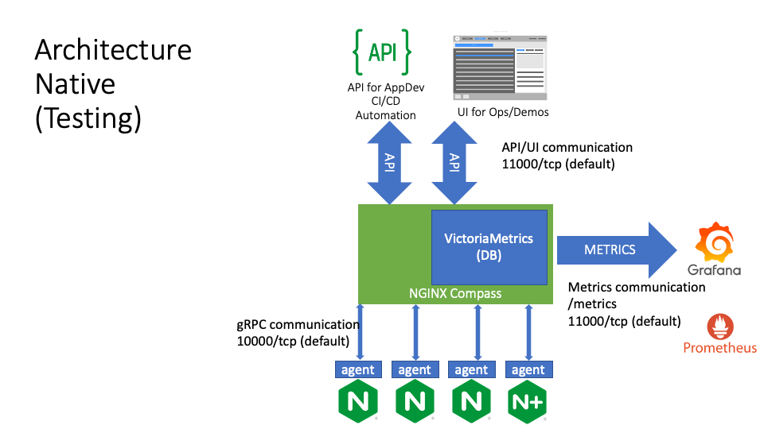
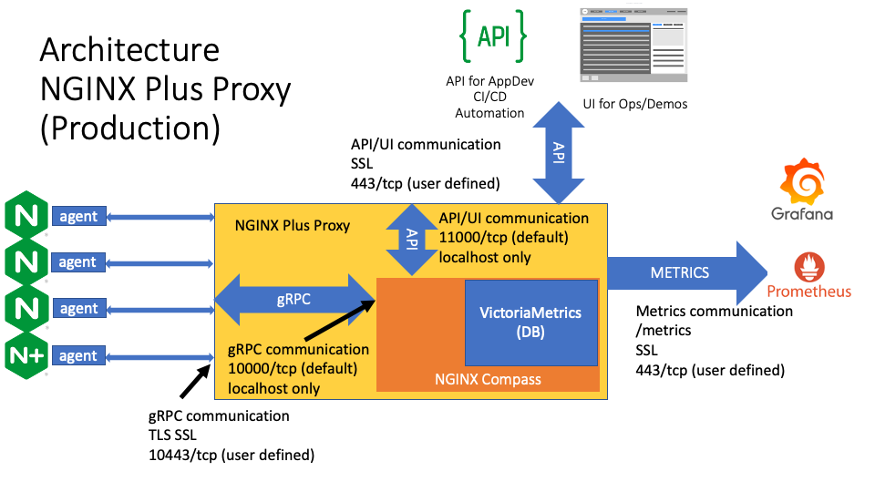
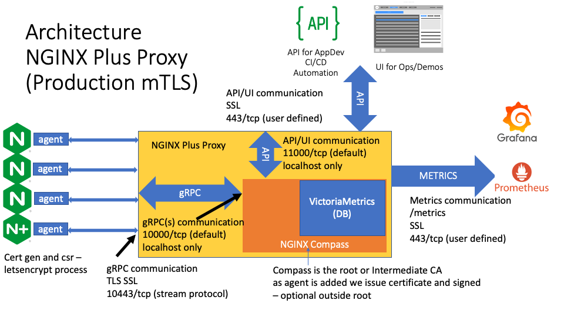
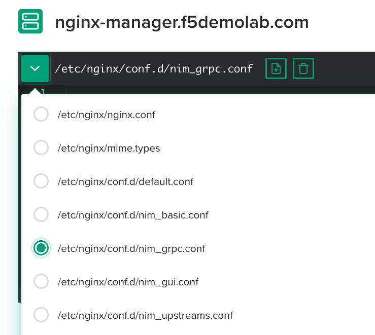

.. _3.1-encryption:

Exercise 3.1: NGINX Instance Manager Encryption
###############################################

Objective
=========

Learn how to use TLS and mTLS with NGINX Instance 
Manager to encrypt traffic.

Guide
=====

NGINX Instance Manager can encrypt traffic using server-side 
TLS without a proxy and mTLS for use with a proxy.  Investigate 
the encryption used for NGINX Instance Manager.

Step 1
------

Without a proxy, we generally do not have any encryption.

We can add TLS certificates on the server or a proxy if desired.
We use TLS for encrypting traffic on the UI and API in our UDF.

In the UI for NGINX Instance Manager, go to ``Inventory`` and select 
the edit config action for ``nginx-manager.f5.local``.

.. image:: ./UDF-nginx-manager-edit.png

In the drop down include menu, select ``conf.d/nim_gui.conf``

.. image:: ./UDF-nim-gui-include.png

In the configuration editor, you should be able to see the following.
Ignore the swagger-ui redirect for now, this is used for the UDF environment.

.. code-block:: nginx

   server {
      listen      443 http2 ssl;

      access_log      /var/log/nginx/noauth-access.log;
      # error_log     /var/log/nginx/noauth-error.log;

      status_zone	    nginx-manager.f5.local_https;
      server_name	    nginx-manager.f5.local;

      ssl_certificate 		/etc/ssl/nginx-manager/nginx-manager.crt;
      ssl_certificate_key		/etc/ssl/nginx-manager/nginx-manager.key;
      ssl_ciphers EECDH+CHACHA20:EECDH+AES128:RSA+AES128:EECDH+AES256:RSA+AES256:EECDH+3DES:RSA+3DES:!MD5;

      ssl_session_cache shared:SSL:10m;
      ssl_session_timeout 24h;
      ssl_session_tickets off;

      location / {
         proxy_pass https://nginx-manager_servers/;
         health_check uri=/swagger-ui/;
         proxy_set_header Connection ""; 
         proxy_http_version 1.1; 
      }

   }

NGINX is using ``/etc/ssl/nginx-manager/nginx-manager.crt`` and ``key`` to 
encrypt traffic externally.  Internally, the ``proxy_pass https://nginx-manager_servers/;`` 
uses TLS to communicate internally.

Step 2
------

Look at the gRPC communication and the use of mTLS.  Each agent has a certificate 
that was signed by a CA and unique to each instance.  This client certificate is 
verified by the server using NGINX.  The certificates must be trusted between the 
server and agent.  Without the proxy, we can only use a server-side TLS setup for 
the agents.

Since the agents register with the server by default, a secure environment should 
use the mTLS between the agent and ``nginx-manager``.  NGINX supports encrypting 
and proxying gRPC connections.

Select ``nim-grpc.conf`` in the includes drop-down menu in the editor.

Much of the setup is the same as the 
`NGINX Blog on grpc and setting up an API gateway 
<https://www.nginx.com/blog/deploying-nginx-plus-as-an-api-gateway-part-3-publishing-grpc-services/#Defining-the-gRPC-Gateway>`__.

Note we specify the certificate and key pair for the proxy and also use the 
``grpcs`` proxy command for secure gRPC communication internally.  The external proxy 
is listening on port 10443 and the internal upstream points to ``127.0.0.1:10000``.

.. code-block:: nginx

   server {
      status_zone nginx-manager.f5.local_grpcs;
      listen 10443 http2 ssl;
      server_name nginx-manager.f5.local;

      access_log /var/log/nginx/grpc-access.log grpc_json;
      # error_log /var/log/nginx/grpc-debug.log debug;

      ssl_certificate		/etc/ssl/nginx-manager/nginx-manager.crt;
      ssl_certificate_key	/etc/ssl/nginx-manager/nginx-manager.key;

      ssl_verify_client	on;
      # ssl_verify_depth 2;
      ssl_client_certificate	/etc/ssl/nginx-manager/ca.crt;

      ssl_session_timeout 24h;
      ssl_session_cache shared:GRPC:10m;
      ssl_session_tickets off;
      # ssl_dhparam /etc/ssl/nginx-manager/ca.pem;

      ssl_protocols	TLSv1.2 TLSv1.3;
      # ssl_ciphers	ECDHE-ECDSA-AES128-GCM-SHA256:ECDHE-RSA-AES128-GCM-SHA256:ECDHE-ECDSA-AES256-GCM-SHA384:ECDHE-RSA-AES256-GCM-SHA384:ECDHE-ECDSA-CHACHA20-POLY1305:ECDHE-RSA-CHACHA20-POLY1305:DHE-RSA-AES128-GCM-SHA256:DHE-RSA-AES256-GCM-SHA384;
      # ssl_prefer_server_ciphers on;

      # add_header Strict-Transport-Security "max-age=63072000" always;

      # ssl_stapling on;
      # ssl_stapling_verify on;

      # ssl_trusted_certificate  /etc/ssl/nginx-manager/ca.crt;

      location / {
         grpc_pass grpcs://nginx-manager_grpc_servers;
         # grpc_bind $remote_addr transparent;
         health_check type=grpc grpc_status=12; # 12=unimplemented
         client_max_body_size 10m;
         client_body_timeout 3000s;
      }

      # Error responses
      include conf.d/errors.grpc_conf; # gRPC-compliant error responses
      default_type application/grpc;   # Ensure gRPC for all error responses

   }

   upstream nginx-manager_grpc_servers {
         zone nginx-manager_grpc 64k;
         server 127.0.0.1:10000;
   }

Note the ``nim-grpc.conf`` specifies a certificate authority and to verify 
client certificates with the option ``ssl_verify_client	on;``.

If you SSH to any of the instances and look at the ``nginx-agent.conf`` file 
you will see we point to ``/etc/ssl/nginx-manager/agent.crt`` and ``key``.  In 
the UDF environment, we copy the specific certificate and key for the instance 
to those locations.  These certificates are verified as being issued by the same 
certificate authority as the server before communication is allowed.

.. code-block:: shell-session
   :emphasize-lines: 1

   ssh nginx5 cat /etc/nginx-agent/nginx-agent.conf
   Warning: Permanently added 'nginx5.f5.local,10.1.1.5' (ECDSA) to the list of known hosts.
   server: nginx-manager.f5.local:10443
   tls:
   enable: true
   cert: /etc/ssl/nginx-manager/agent.crt
   key: /etc/ssl/nginx-manager/agent.key
   ca: /etc/ssl/nginx-manager/ca.crt
   log:
   level: info
   path: /var/log/nginx-agent/
   tags:
   location: unspecified
   nginx:
   bin_path: /usr/sbin/nginx
   basic_status_url: "http://127.0.0.1:80/nginx_status"

Step 3
------

Navigate to the ``nginx-manager`` instance as ``centos`` and use the home directory.

Use the SSH menu option to beceome the centos user.  If you use the web-shell it 
defaults to the root user.  To follow best practice, please use the centos user.

.. image:: ../module1/UDF-select-ssh.png

If prompted, select yes for trusting the ssh connection in your terminal.

.. image:: ../module1/UDF-ssh.png

.. code-block:: shell-session
   :emphasize-lines: 1

   pwd
   /home/centos

Step 4
------

For extra credit, use the certificates in ``/etc/ssl/nginx-manager`` to 
enable mTLS and verify locally.

.. code-block:: shell-session
   :emphasize-lines: 1

   sudo ls -lah /etc/ssl/nginx-manager/
   total 140K
   drwxr-xr-x. 2 root   root   4.0K Mar 18 18:56 .
   drwxr-xr-x. 6 root   root     82 Feb 27 11:13 ..
   -rw-r--r--. 1 root   root    715 Mar  3 13:08 agent.cnf
   -rw-r--r--. 1 centos centos 1.8K Mar 18 18:56 agent.crt
   -rw-r-----. 1 centos centos 1.7K Mar 18 18:56 agent.key
   -rw-r--r--. 1 root   root    580 Feb 26 13:19 ca.cnf
   -rw-r--r--. 1 centos centos 2.1K Mar 18 18:56 ca.crt
   -rw-r-----. 1 root   root   3.2K Mar  3 13:10 ca.key
   -rw-r--r--. 1 root   root     17 Mar  3 13:10 ca.srl
   -rw-r--r--. 1 root   root   2.1K Feb 26 13:19 compass.crt
   -rw-r--r--. 1 root   root   2.0K Feb 26 13:19 compass.csr
   -rw-r-----. 1 root   root   3.2K Feb 26 13:19 compass.key
   -rw-r--r--. 1 root   root    678 Mar  3 13:07 dns.cnf
   -rw-r--r--. 1 root   root   2.1K Mar  3 13:10 dns.crt
   -rw-r--r--. 1 root   root   2.0K Mar  3 13:10 dns.csr
   -rw-r-----. 1 root   root   3.2K Mar  3 13:10 dns.key
   -rw-r--r--. 1 centos centos 1.8K Feb  2 18:36 docker.crt
   -rw-r--r--. 1 centos centos 1.3K Feb  2 18:35 docker.csr
   -rw-r-----. 1 centos centos 1.7K Feb  2 18:35 docker.key
   -rwxr-xr-x. 1 root   root   2.2K Mar  3 13:10 make_certs.sh
   -rw-r--r--. 1 centos centos 1.8K Mar  3 13:10 nginx5.crt
   -rw-r--r--. 1 centos centos 1.3K Mar  3 13:10 nginx5.csr
   -rw-r-----. 1 centos centos 1.7K Mar  3 13:10 nginx5.key
   -rw-r--r--. 1 centos centos 1.8K Mar  3 13:10 nginx6.crt
   -rw-r--r--. 1 centos centos 1.3K Mar  3 13:10 nginx6.csr
   -rw-r-----. 1 centos centos 1.7K Mar  3 13:10 nginx6.key
   -rw-r--r--. 1 centos centos 1.8K Mar  3 13:10 nginx7.crt
   -rw-r--r--. 1 centos centos 1.3K Mar  3 13:10 nginx7.csr
   -rw-r-----. 1 centos centos 1.7K Mar  3 13:10 nginx7.key
   -rw-r--r--. 1 centos centos 1.8K Mar  3 13:10 nginx8.crt
   -rw-r--r--. 1 centos centos 1.3K Mar  3 13:10 nginx8.csr
   -rw-r-----. 1 centos centos 1.7K Mar  3 13:10 nginx8.key
   -rw-r--r--. 1 centos centos 2.1K Mar  3 13:10 nginx-manager.crt
   -rw-r--r--. 1 centos centos 2.0K Mar  3 13:10 nginx-manager.csr
   -rw-r-----. 1 centos centos 3.2K Mar  3 13:10 nginx-manager.key
   -rw-r--r--. 1 root   root    668 Mar  3 13:07 server.cnf

