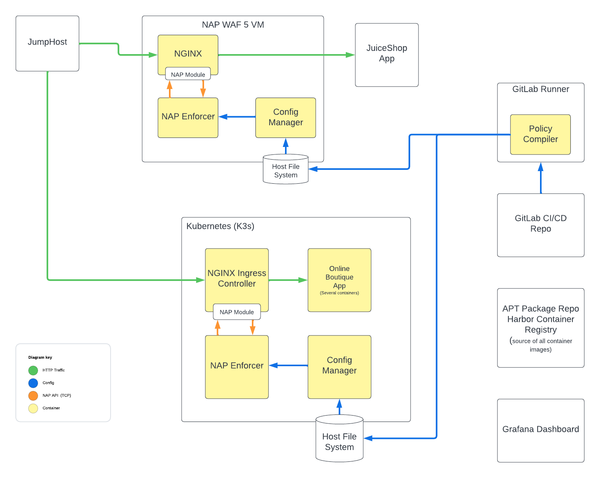
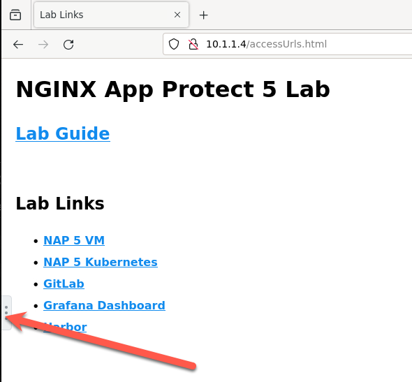
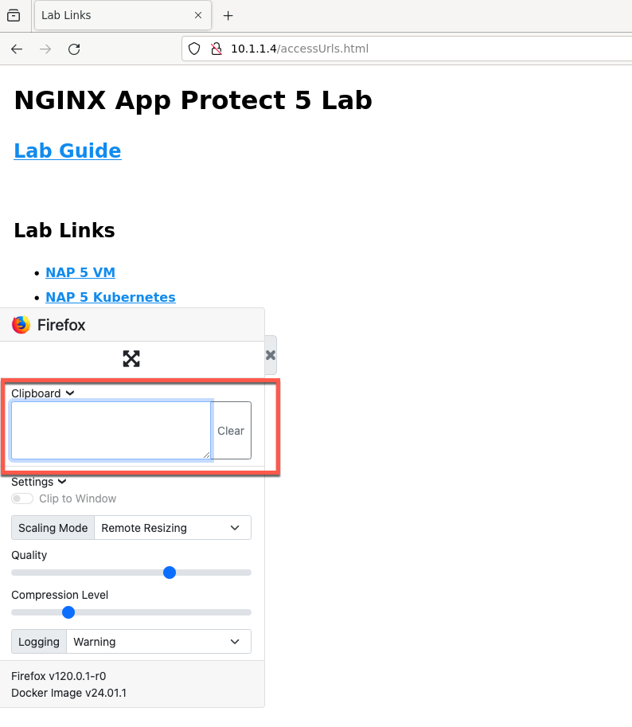

Introduction
=======================

This lab provides an introductory look into the next generation
architecture of the NGINX App Protect WAF.

*Approximate lab duration: 60 minutes*

Objectives
----------

In this lab you will:

-  Obtain an overview of the components in the updated architecture
-  Be introduced to the components present in this lab
-  Install NGINX App Protect 5 with NGINX Open Source edition on a VM to
   protect the `JuiceShop <https://github.com/juice-shop/juice-shop>`__
   application
-  Install NGINX App Protect 5 with NGINX Ingress Controller in a
   Kubernetes cluster to protect the `Online
   Boutique <https://github.com/GoogleCloudPlatform/microservices-demo/>`__
   application

Overview
--------

NGINX App Protect WAF 5, designed for NGINX Open Source and NGINX Plus
environments, offers advanced Web Application Firewall (WAF)
capabilities, supporting all features of NGINX App Protect WAF 4.x
release. This solution, available at an additional cost, consists of a
dynamic NGINX module and containerized WAF services, providing robust
security and scalability.

Lab Architecture
----------------

The components in the lab are pictured below. You will first deploy
NGINX App Protect WAF 5 in a VM deployment. You will then install NGINX
Ingress Controller including NGINX App Protect WAF 5 in a Kubernetes
cluster. Here is a look at all the components combined in this lab:

   All lab components

Lab Access and Usage
--------------------

1. In UDF, click the **Firefox** access method of the **JumpHost** UDF
   component.

   .. figure:: images/jumphost-firefox-access.png
      :alt: JumpHost Firefox access method

      JumpHost Firefox access method

   ..

      Note: Most of the browser activity in this lab will be in the
      **Firefox** access method of the **JumpHost** component. This
      access method connects you to a containerized version of Firefox
      running in the UDF deployment, via VNC. As a result, clipboard
      operations to and from this Firefox instance require the use of
      the pullout toolbar on the left side of the screen:

   Firefox clipboard button

   Firefox clipboard toolbar

Modules
--------

There are two pathways you can take for this lab, and you can complete
only one of them or both if you so choose:

-  `NGINX App Protect 5 in a Virtual Machine <module1/module1.html>`__

-  `NGINX App Protect 5 in a Kubernetes Cluster <module2/module2.html>`__
