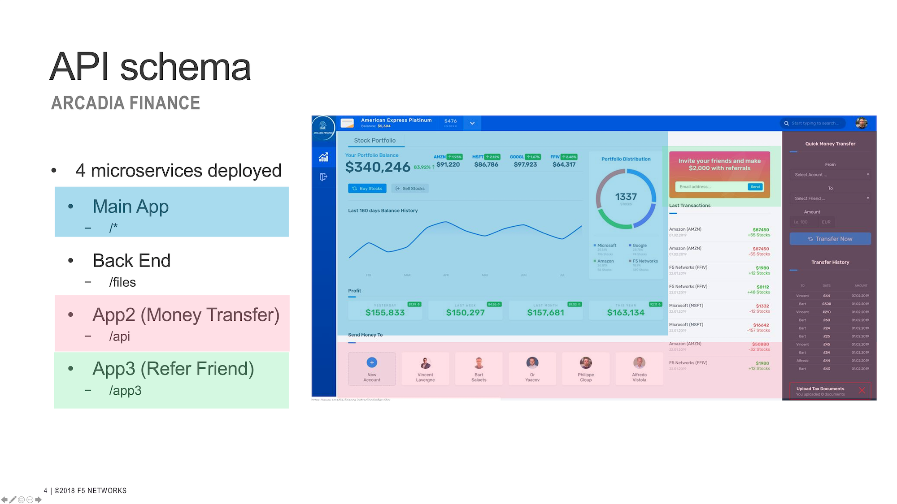
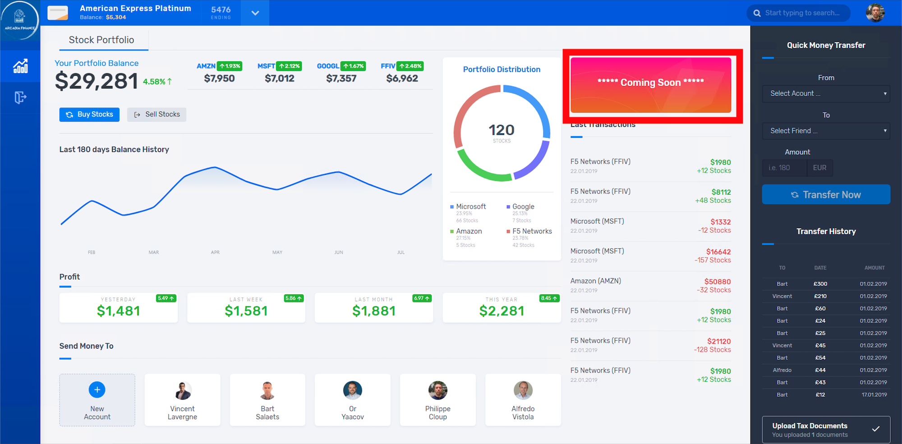

Architecture of the Arcadia Application
#######################################

.. note:: This application is publicly available in GitLab if you want to build your own lab: https://gitlab.com/arcadia-application

The goal of this section is to understand the structure of the Arcadia Application, the commands needed to deploy it are on the next page.

The Arcadia app is a micro-services based application. There are 4 services that comprise the application.

**This is what Arcadia App looks like when the 4 microservices are up and running, and you can see how traffic is routed based on URI**

**You can deploy Arcadia one microservice at a time. There will be a placeholder for that microservice until that service is available**

If you deploy only ``Main App`` and ``Back End`` services.

.. image:: ../pictures/lab1/MainApp.png
   :align: center
   :scale: 50%

.. note:: You can see App2 (Money Transfer) and App3 (Refer Friend) are not available. There is dynamic content showing a placeholder instead of a 404 or blank frame.

|

And below if you deploy following three services: ``Main App``, ``Back End`` and ``Money Transfer``

|

If you deploy ``Main App``, ``Back End``, ``Money Transfer`` and ``Refer Friend`` services.

.. image:: ../pictures/lab1/app3.png
   :align: center
   :scale: 50%
