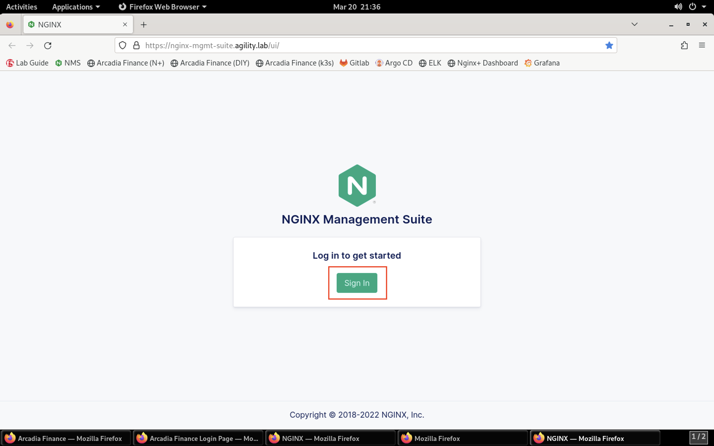

View the NGINX Plus Instance in NMS
===================================

1. Navigate to **Applications** on the menu bar and launch **Firefox**.

.. caution:: It may take several seconds for Firefox to launch the first time.

1. In Firefox, click on the **Acardia Finance (N+)** bookmark or navigate to **https://nginx-plus.arcadia-finance.io/**. You should see the application page load as shown below.

.. image:: images/diy_pageload.png

<<<<<<< HEAD
3. This web application is being proxied by an NGINX Plus instance running NGINX App Protect WAF. This instance is being managed by NGINX Instance Manager. Take a look at NIM to view the configuration and instance/application metrics. Click on the **NIM** bookmark in Firefox or navigate to **https://nginx-instance-manager.appworld.lab/ui/**. You'll be presented with the NIM login page. Click ***Sign In***.
=======
3. This web application is being proxied by an NGINX Plus instance running NGINX App Protect WAF. This instance is being managed by NGINX Management Suite. Take a look at NMS to view the configuration and instance/application metrics. Click on the **NMS** bookmark in Firefox or navigate to **https://nginx-mgmt-suite.agility.lab/ui/**. You'll be presented with the NMS login page. Click ***Sign In***.
>>>>>>> origin/master

4. You'll see the login prompt. Log in using the **lab** / **Agility2023!** credentials.

.. image:: images/login_prompt.png

5. You will see the NGINX Management Suite Launchpad. Click on the **Instance Manager** button.

.. image:: images/launchpad.png

6. You are presented with the **Overview** dashboard. This page shows the overall health of the manages instances.

.. image:: images/nim_overview.png

7. Click the **Instances** button in the left navigation.

.. image:: images/nim_instances_button.png

8. You will now see the the **Instance Manager** **Instances Overview** page.

.. image:: images/nim_instances_overview.png

9. Each instance of this lab runs in a virtual environment. Since new VMs are deployed for each instance, the operating system identifiers change, so each NGINX Plus instance is treated as a new instance. Thus, you may see previous instances listed. **Delete only the Offline instances by clicking the three dot icon under the Actions column and selecting Delete**, as shown in the image below.

.. warning:: Do not delete the active instance at the top of the list!

.. image:: images/nim_instances_delete_offline.png

.. image:: images/nim_instances_delete_offline_confirm.png

10. Click on the **nginx-plus-1.appworld.lab** instance in the list that shows **Online** under the **Status** column. The **Instance Detail** screen loads.

.. image:: images/nim_instance_detail.png

11. Notice that the **Details** tab is loaded by default in this screen. Scroll through the contents of the **Details** tab. In the first section titled **Instance Details**, notice that you can see details about the NGINX Instance itself, including version, status, configuration path, and more. 

.. image:: images/nim_instance_details.png

12. In the **App Protect Details** section, you can clearly see that NGINX App Protect has been installed and is active.

.. image:: images/nim_app_protect_details.png

13. Scroll down to **Certificates** to view the state of any certificates that this instance references.

.. image:: images/nim_instance_certificates.png

14. Next, click on the **Metrics Summary** tab. In this tab, you can see visualized metrics around instance resource utilization, including CPU, memory, overall connection counts, HTTP connection counts and more.  

.. image:: images/nim_metrics_summary.png

15. Click on the **Metrics** tab to drill-down into the component-level, real-time values of all metrics available for the instance. Click through the sub-tabs, such as **System**, **HTTP Server Zones** and **HTTP Upstreams**. These graphs provide a quick way to identify anomalies in load and performance.

.. image:: images/nim_metrics.png

<<<<<<< HEAD
16. Finally, click on the **Host** tab to display detailed host information about the instance. Values such as hostname, file system info and network interfaces will be displayed here.

.. image:: images/nim_host.png

Now that you are familiar with viewing metrics of the NGINX Plus instance in NIM, we'll continue to the next lab.
=======
Now that you are familiar with viewing metrics of the NGINX Plus instance in NMS, we'll continue to the next lab.
>>>>>>> origin/master
