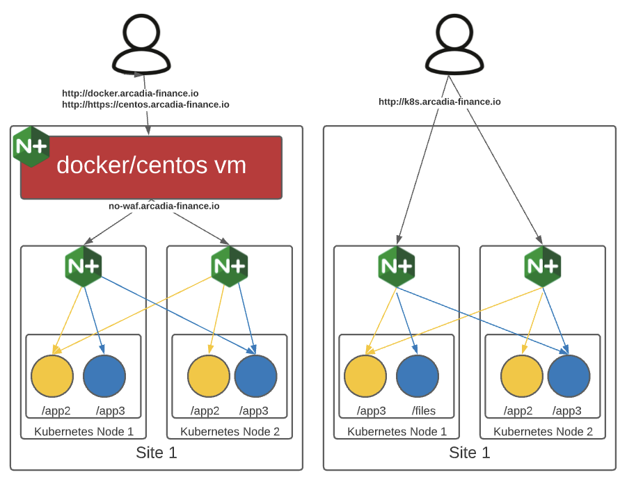

Topology of the Arcadia Application
###################################

This is a diagram of the topologies we will be deploying as part of this lab. 

We will first deploy the Arcadia application with a NodePort service and use a Centos VM to provide a WAF and load balance against the nodes in our cluster. Then we will create a docker conainer to do the same- just an alternative to using a full VM. 

In lab 4 we will instead use the NGINX Ingress Controller and will provide more details then.

