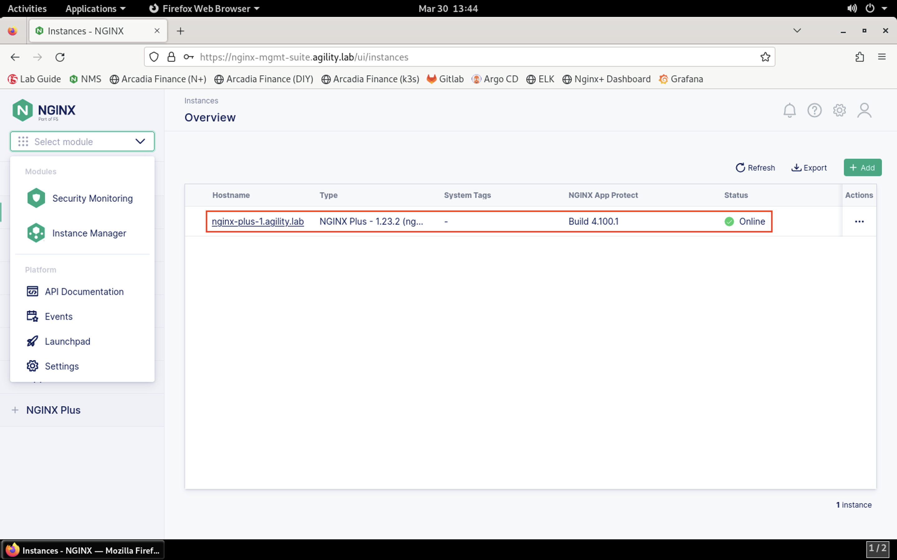

Review the NGINX Plus Configuration
===================================

In this section of the lab, we'll review the NGINX Plus configuration for the instance front-ending the application and providing the NGINX App Protect service.

1. In the NMS Dashboard, click the **Select Module** drop-down on the top of the left menu bar.

.. image:: images/nms_instance_manager_dropdown.png

2. Select **Instance Manager**.

3. Click the first NGINX instance in the list that shows **Active** in the **Status** column. 

4. You will see the **Instance Detail** screen.

.. image:: images/nms_instance_details.png

3. Let's review the configuration of this instance. Click on the **Edit Config** button on the **Instance Detail** page.

.. image:: images/nms_instance_detail_edit_config.png

4. The **Instance Config** page will be presented. Notice that all of the relevant NGINX configuration files are present in the navigation pane, and the contents of the selected file are shown in the visual editor pane on the right.

.. image:: images/nms_instance_config.png

5. Click on the configuration file for the application that we're testing, **arcadia-finance.conf**, in the navigation pane. The file's contents will be presented in the editor.

.. image:: images/nms_arcadia_config.png

6. Notice the configuration stanzas present. We have an upstream zone with application servers defined, an HTTPS server stanza specifying the application's location, SSL certificate and key, App Protect WAF configuration and finally a HTTP server block that redirects browsers to HTTPS. 

.. image:: images/arcadia_config_file.png
.. note:: Several lab resources also run through this NGINX Plus instance, such as ELK, Grafana, etc. We'll focus on the Arcadia Finance application for this portion of the lab.

Now that we've viewed the NGINX Plus configuration, let's continue to the next section of the lab.