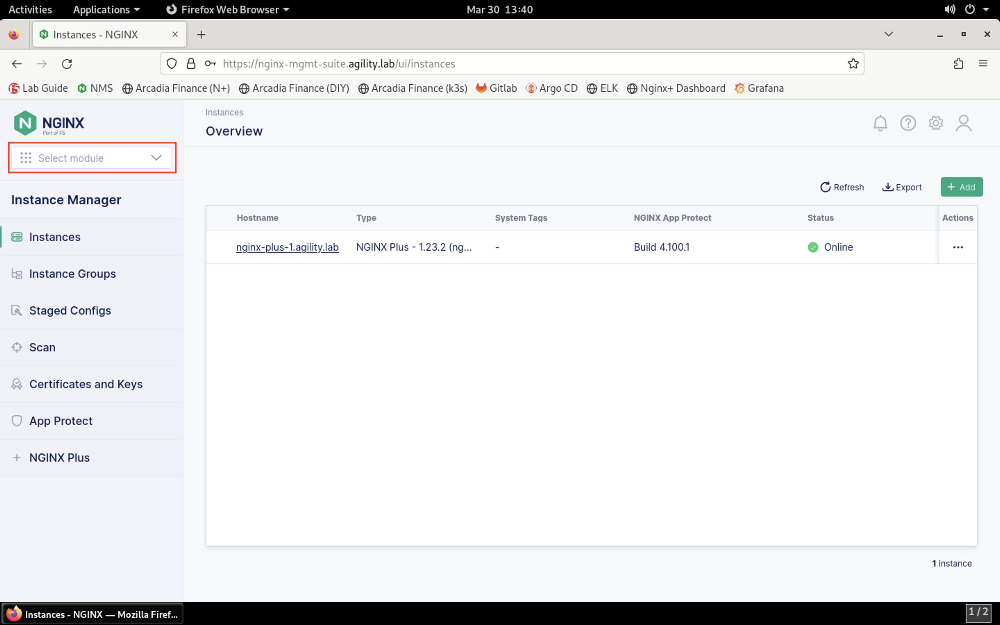
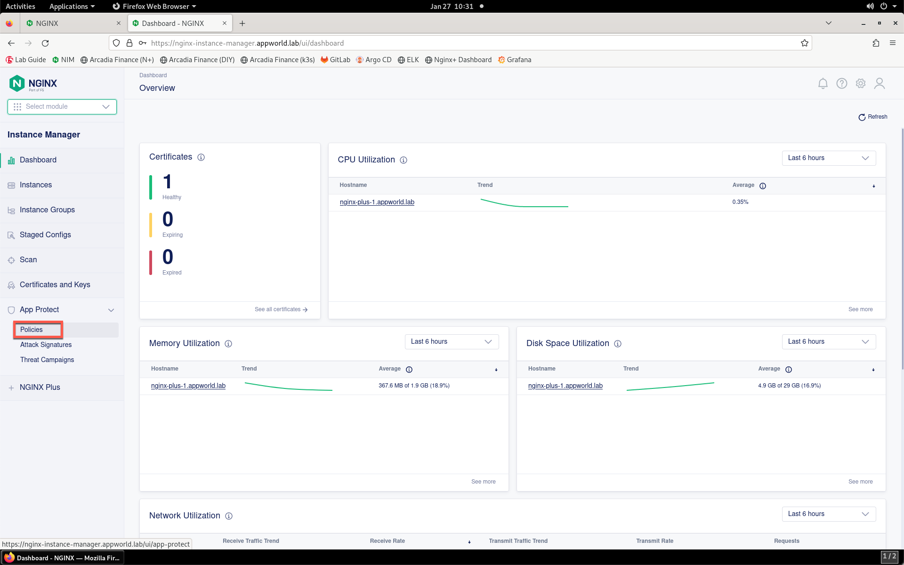
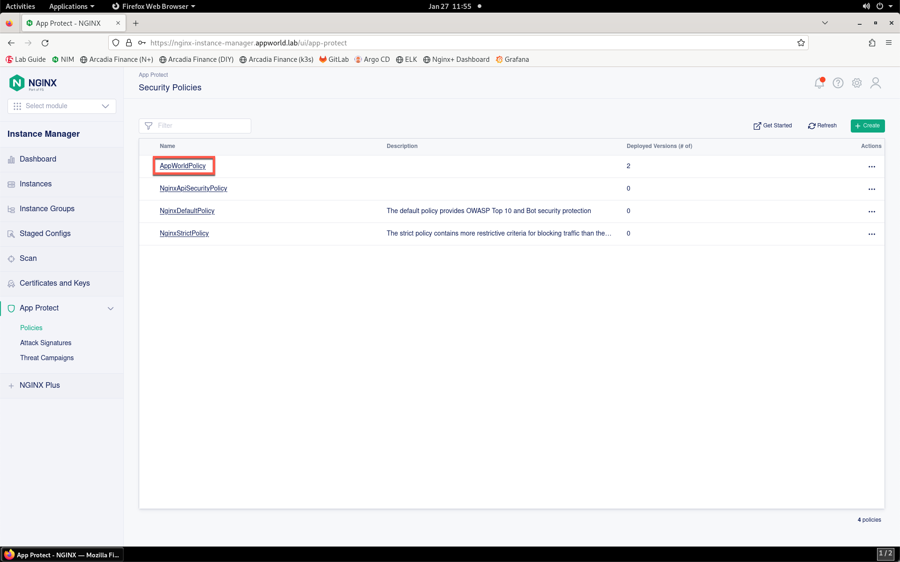
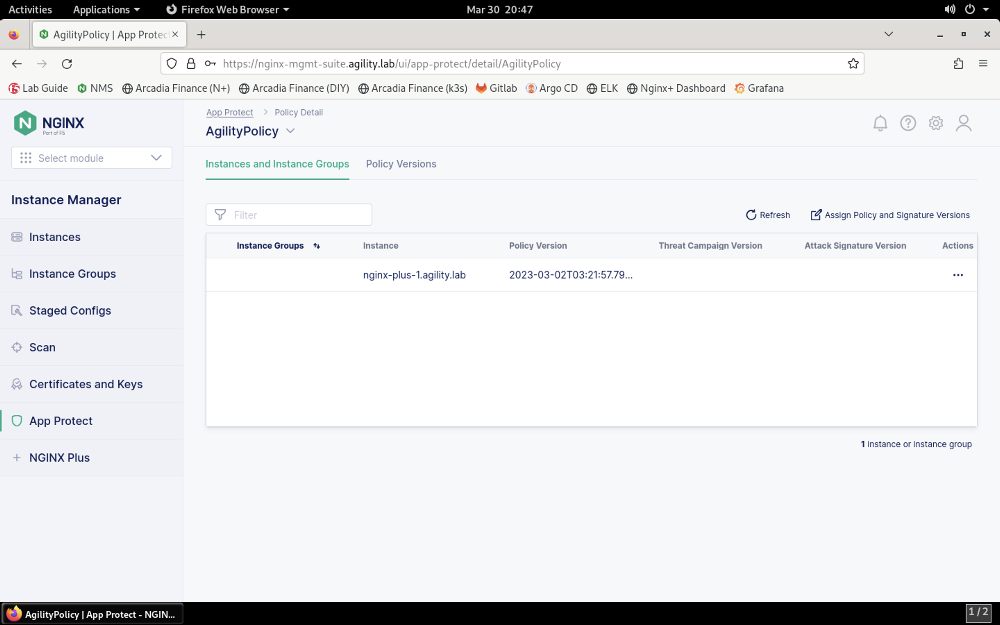
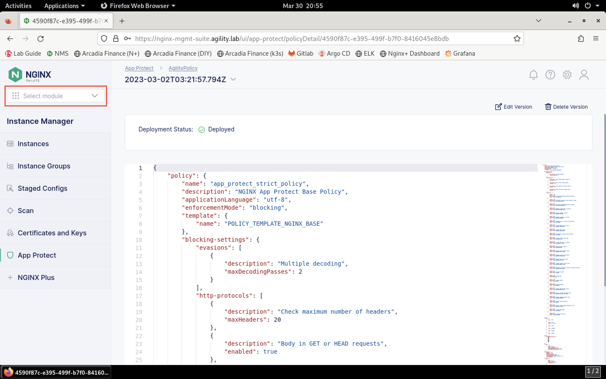
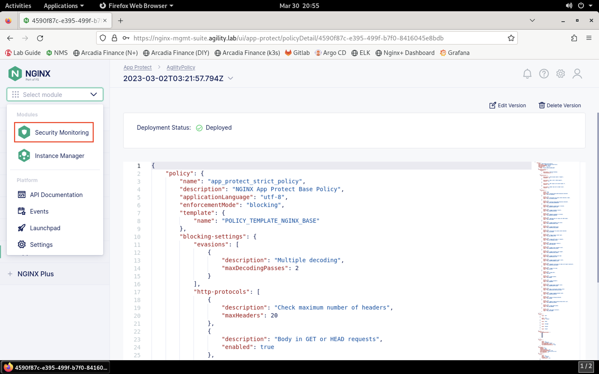
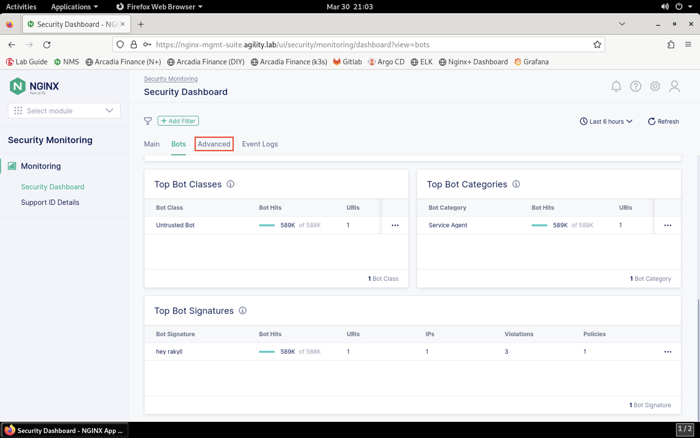
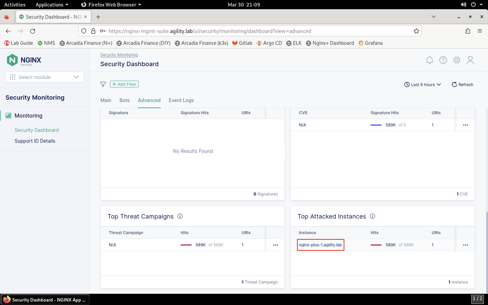

View NGINX App Protect in NMS
=============================

There are two components to NGINX App Protect within NMS: 

- NAP configuration via Instance Manager extension
- NAP monitoring via NGINX Security Monitoring (NMS-SM)

1. Let's take a look at both of these components. First, load the **NMS** bookmark in **Firefox** and login using the **lab** / **Agility2023!** credentials, if not already.

2. Click the **Select module** drop-down from the top of the left menu bar.

3. Click **Instance Manager** in the drop-down.

.. image:: images/nms_instance_manager_dropdown_selection.png

4. Let's take a look at the NGINX App Protect policies that exist in NMS. Click on **App Protect** towards the bottom of the **Instance Manager** menu bar. 

5. You should see a list of existing WAF policies. We can see three policies configured. Notice that only the **AgilityPolicy** is applied to an application. Click on the policy name to view more details.

6. Here we see that the policy is applied to an NGINX instance. The version of the policy that is applied is also shown. Click on the **Policy Versions** sub-tab to see existing versions of this policy. 

7. Currently, we see that there is only one version. Click on the version name of the policy version in the list.

.. image:: images/nim_nap_agility_policy_versions.png

8.  You will see the JSON configuration for this WAF policy. Scroll through the WAF policy to briefly view the policy configuration. We can see actions configured for particular violations, blocked file types, HTTP verbs, and more. Let's not make any changes just yet.

.. image:: images/nim_nap_agility_policy_json.png

9.  Now let's view metrics surrounding the App Protect instance. Click the **Select module** drop-down from the top of the left menu bar. 

10.  Select **Security monitoring** from the drop-down.

11. The **Security Dashboard** page will load, as shown below. 

.. image:: images/NMS-SM_security_dashboard.png

11. Scroll down through the **Main** tab to see statistics surrounding attack traffic types, IP addresses, violations, URIs, and more. 

.. image:: images/NMS-SM_dashboard_main.png

12. Click the **Bots** tab. 

.. image:: images/NMS-SM_dashboard_bots.png

13.  This tab shows information around bot traffic detected by App Protect. Scroll down to the **Top Bot Classes**, **Top Bot Categories**, and **Top Bot Signatures**. Click on **Untrusted Bot** in the **Top Bot Classes** list.

.. image:: images/NMS-SM_top_bot_lists.png

14. View extra details around the entry. Close the details box when finished.

.. image:: images/NMS-SM_top_bot_details.png

15. Click the **Advanced** tab. 
    

    
16.  This tab shows data relating to attacks matching downloaded signatures. Since signatures have not yet been downloaded, this data is not populated. 

.. image:: images/NMS-SM_dashboard_advanced.png

17.  Scroll down and review the additional metrics available. Click on the single entry under the **Top Attacked Instances** list to see additional details.

18.  Close the details box when finished.

.. image:: images/NMS-SM_dashboard_advanced_details.png

18. Finally, click on the **Events Log** tab to view the historical event list. 

.. image:: images/NMS-SM_dashboard_event_logs.png

19. You can click on any of the events in the list to view more details. Close the details box when finished.

.. image:: images/NMS-SM_dashboard_event_details.png

Now that you've reviewed where WAF policies exist in NMS, how they are deployed at the application level and how to monitor security statistics and events in NMS, let's continue to the next section of the lab.