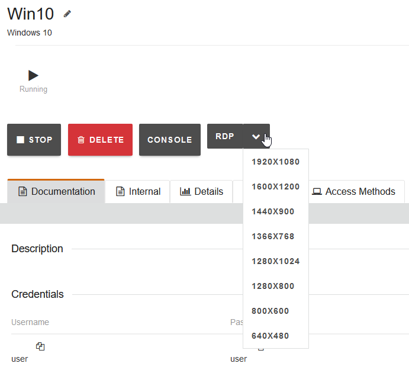
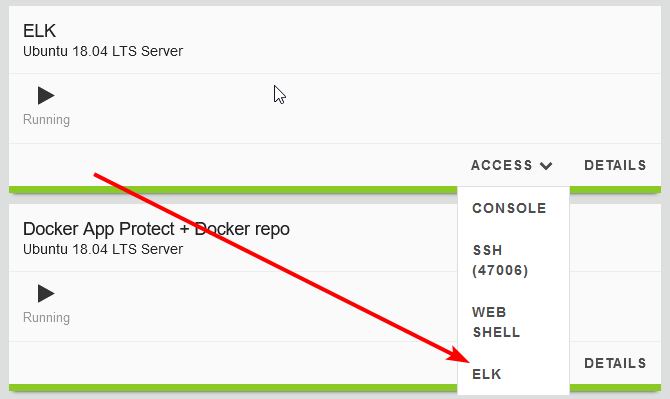
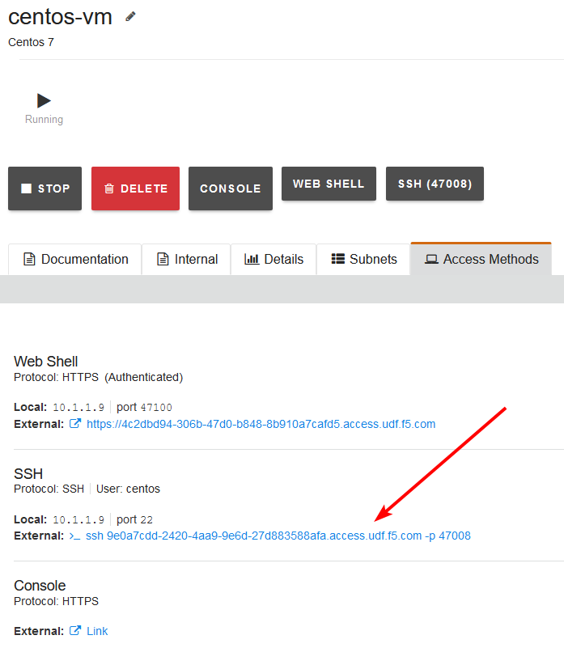
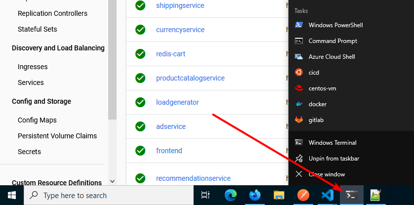
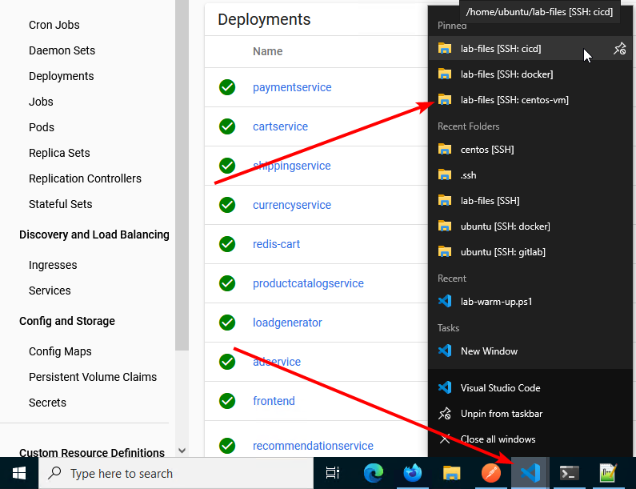

Using the UDF Tools
###################

This lab has a multiple tools provided. There are several ways to accomplish each task, use whichever tool you prefer. Many will find vscode the easier tool to use for most tasks. There is a video walk through at the bottom of this page, as well as many others in the guide.

.. note:: The videos may vary slightly from the lab guide- as it is much easier to update the guide than make new videos when there are minor changes. When in doubt, follow the lab guide. And please reach out to the authors if anything is not clear.

**RDP to the Win10 Hump Host**

Find the Win10 VM on the right-hand side of the UDF Systems.

We recommend a resolution slightly smaller than your desktop. 

.. note:: You can edit the .rdp file that is downloaded and customize your settings. The file may automatically download to a temp location, depending on your browser settings.

.. note:: The default username is ``Administrator``. You must change it to ``user`` with the password ``user``

**Direct Links to Web Tools**

The jump host can have a little lag, though it generally will make finding all the lab resources easier. 

As an alternative, you can use the direct links to the tools that have a browser UI. These links are under the VM you are using. For example, the ELK web dashboard is available by clicking the ``Access`` link to the right of it.

**Use Your Own SSH Client**

Optional: If you have a public key for SSH, we recommend adding it to UDF. Instructions for that are here (find: SSH Access): `UDF Guide
<https://help.udf.f5.com/en/articles/3832340-f5-training-course-interface#:~:text=access%20and%20when.-,SSH%20Access,-Many%20courses%20leverage>`_.

Once you add it, you can use the direct SSH access link under each VM. Depending on your browser's settings, the link may open your SSH client automatically. Otherwise copy the entire ssh command and paste into your client. On Windows, we recommend `Windows Terminal <https://www.microsoft.com/en-us/p/windows-terminal/9n0dx20hk701?activetab=pivot:overviewtab>`_. Note that vscode does not work remotely, you must use the jump host if you prefer vscode.

.. note:: Hostnames have been configured on all systems. Once you have SSHed into the rancher server (in the first exercise), you can ``ssh docker`` or ``ssh centos`` to get to the other VMs.

**Using the Win10 Jump Host**

Once on the jump host, you can quickly access the VMs from either vscode or Windows Terminal by right-clicking the icon on the taskbar.

.. note:: All the web applications that require passwords are saved in the browser, just click in the fields and they should populate.

-------------------------------

.. note:: The ``Pinned`` items in the vscode menu will bring you directly to the files intended for that system.

**Demo video of the UDF RDP Jump Host**

.. raw:: html

    

    <iframe width="1120" height="630" src="https://www.youtube-nocookie.com/embed/2vrxd2TJcA4" title="YouTube video player" frameborder="0" allow="accelerometer; autoplay; clipboard-write; encrypted-media; gyroscope; picture-in-picture" allowfullscreen></iframe>
    
