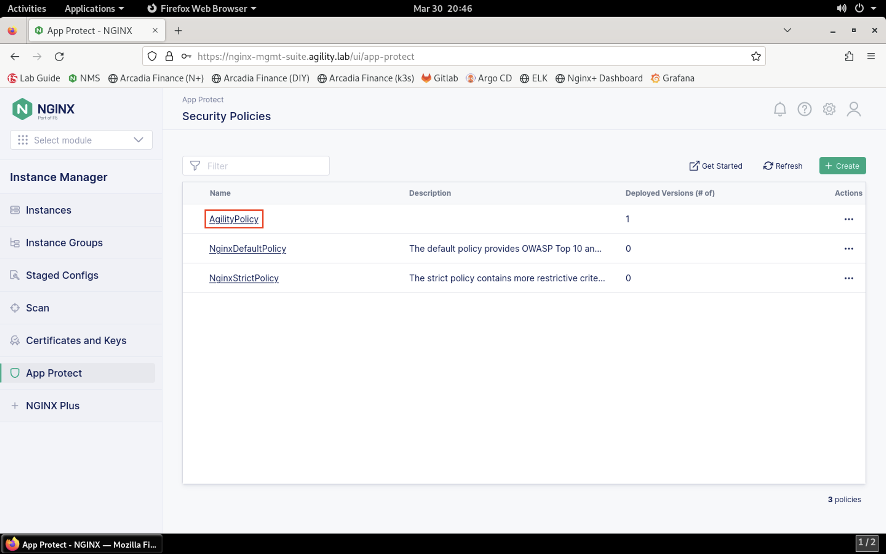
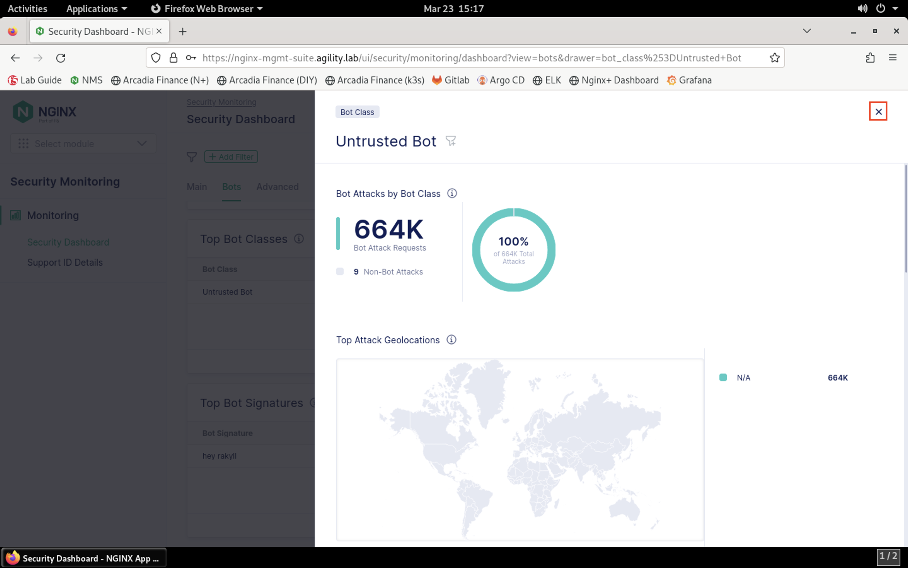
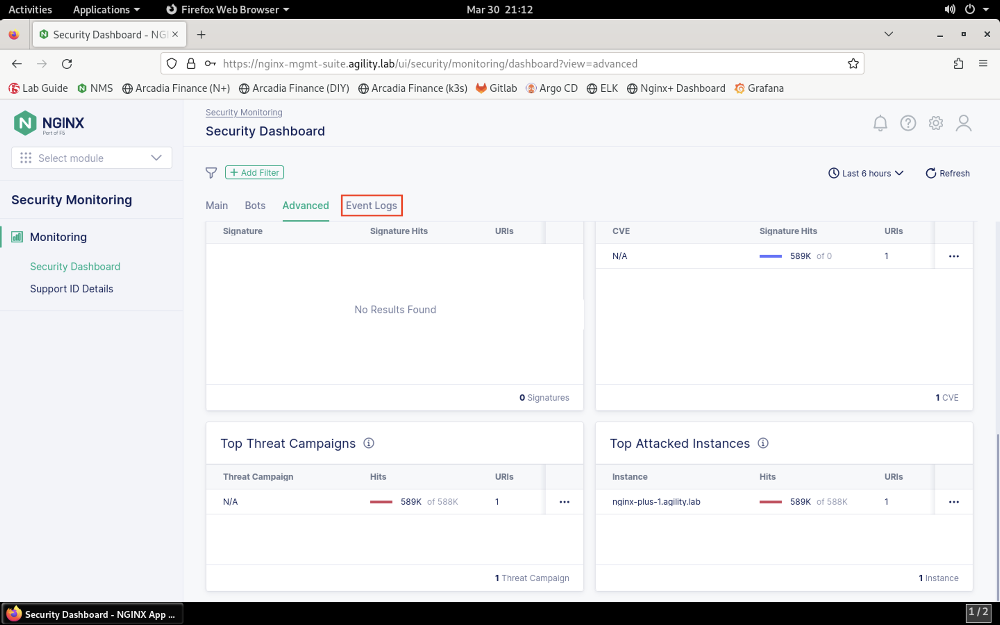

View NGINX App Protect in NMS
=============================

There are two components to NGINX App Protect within NMS: 

- NAP configuration via Instance Manager extension
- NAP monitoring via NGINX Security Monitoring (NMS-SM)

1. Let's take a look at both of these components. First, load the NGINX Dashboard in Firefox and login, if not already.

2. Click the **Select module** drop-down from the top of the left menu bar. Select **Instance Manager** from the drop-down.

.. image:: images/menu_drop_down_nim.png

3. Let's take a look at the NGINX App Protect policies that exist in NMS. Navigate to **App Protect** towards the bottom of the **Instane Manager** menu bar. You should see a list of existing WAF policies.

4. We can see three policies configured. Notice that only the **AgilityPolicy** is applied to an application. Click on the policy name to view more details.

.. image:: images/nim_nap_agility_policy.png

5. Here we see that the policy is applied to an NGINX instance. The version of the policy that is applied is also shown. Click on the **Policy Versions** sub-tab to see existing versions of this policy. Currently, we see that there is only one version.

.. image:: images/nim_nap_agility_policy_versions.png

1. Click on the version name of the policy version in the list. You will see the JSON configuration for this WAF policy. 

.. image:: images/nim_nap_agility_policy_json.png

7. Scroll through the WAF policy to briefly view the policy configuration. We can see actions configured for particular violations, blocked file types, HTTP verbs, and more. Let's not make any changes just yet.

8. If you'd like to review the application configuration that includes the application of the WAF policy, navigate back to the **Instances** > **nginx-plus-1.agility.lab** > **Edit Config** page. In the left navigation pane, select the arcadia-finance.conf file to view the application configuration in the editor pane, including the App Protect configuration lines.

.. image:: images/nim_instance_config_arcadia_finance.png

9. Now let's view metrics surrounding the App Protect instance. Click the **Select module** drop-down from the top of the left menu bar. Select **Security monitoring** from the drop-down.

.. image:: images/menu_drop_down_NMS-SM.png

10. The **Security Dashboard** page will load, as shown below. 

.. image:: images/NMS-SM_security_dashboard.png

11. Scroll down through the **Main** tab to see statistics surrounding attack traffic types, IP addresses, violations, URIs, and more. 

12. Click the **Bots** tab. This tab shows information around bot traffic detected by App Protect. 

.. image:: images/NMS-SM_dashboard_bots.png

13. Scroll down to the **Top Bot Classes**, **Top Bot Categories**, and **Top Bot Signatures**.

14. Click on any of the entries in the lists to show details around that entry. Close the details box when finished.

15. Click the **Advanced** tab. This tab shows data relating to attacks matching downloaded signatures. Since signatures have not yet been downloaded, this data is not populated.

.. image:: images/NMS-SM_dashboard_advanced.png

16. Click on an entry under the **Top Threat Campaigns** or **Top Attacked Instances** list to see additional details. Close the details box when finished.

17. Finally, click on the **Events Log** tab to view the historical event list. 

18. You can click on any of the events in the list to view more details. Close the details box when finished.

.. image:: images/NMS-SM_dashboard_event_details.png

Now that you've reviewed where WAF policies exist in NMS, how they are deployed at the application level and how to monitor security statistics and events in NMS, let's continue to the next section of the lab.