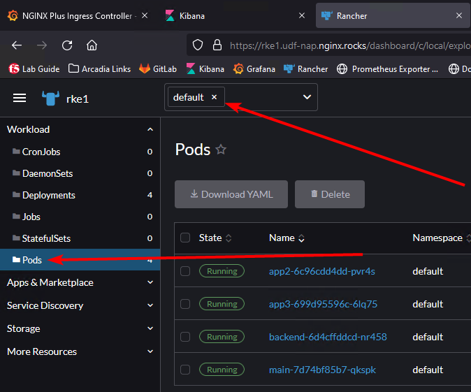

Step 1 - Deploy Arcadia Finance application in Kubernetes
#########################################################

This step is optional. The Arcadia application is already deployed so that each module could be done independently. It is still here in case you are interested in how it was deployed. You can run the commands below, it will not harm anything.

It's time to deploy Arcadia Finance application :)

**Deploy Arcadia Application with kubectl**

With Kubernetes, there are several ways to deploy containers. One way is to use ``kubectl`` command with a YAML manifest file.
I prepared this YAML file below (this is a portion of it below showing the main app container). You can have a look, and see it will deploy containers from my Gitlab.com repo.

.. code-block:: YAML

        ##################################################################################################
        # FILES - BACKEND
        ##################################################################################################
        apiVersion: apps/v1
        kind: Deployment
        metadata:
        name: backend
        namespace: default
        labels:
            app: backend
            version: v1
        spec:
        replicas: 1
        selector:
            matchLabels:
            app: backend
            version: v1
        template:
            metadata:
            labels:
                app: backend
                version: v1
            spec:
            containers:
            - env:
                - name: service_name
                value: backend
                image: registry.gitlab.com/arcadia-application/back-end/backend:latest
                imagePullPolicy: IfNotPresent
                name: backend
                ports:
                - containerPort: 80
                protocol: TCP
        ---

.. note:: This file contains all the deployments for the entire Arcadia application.

**Steps :**

    #. RDP to the jumphost as ``user:user`` credentials
    #. SSH to Rancher VM. You can use vscode, Windows terminal, or UDF Web shell. The files we will be using are in: ``/home/ubuntu/lab-files``
    #. Run this command

       .. code-block:: bash

         kubectl apply -f /home/ubuntu/lab-files/arcadia-manifests/arcadia-deployments.yaml

    #. Open the Firefox Browser
    #. Open ``Rancher`` Dashboard bookmark (if not already opened)
    #. Login with admin/admin (it should already be saved)
    #. You should see the pods under Workload>Pods and select the default namespace. Feel free to click around in the GUI. 

.. note:: If you are returning to this lab and any deployment is failed, you can try restarting it with ``kubectl rollout restart -n default``. Just replace "default" with the namespace of the failed deployment.

.. warning:: Arcadia Application is running but not yet available for the customers. We need to create a Kubernetes service to expose it.

**Video of this lab (force HD 1080p in the video settings)**

.. raw:: html

    

    <iframe width="1120" height="630" src="https://www.youtube.com/embed/Qb5YyQrc7mk" frameborder="0" allow="accelerometer; autoplay; encrypted-media; gyroscope; picture-in-picture" allowfullscreen></iframe>
    

