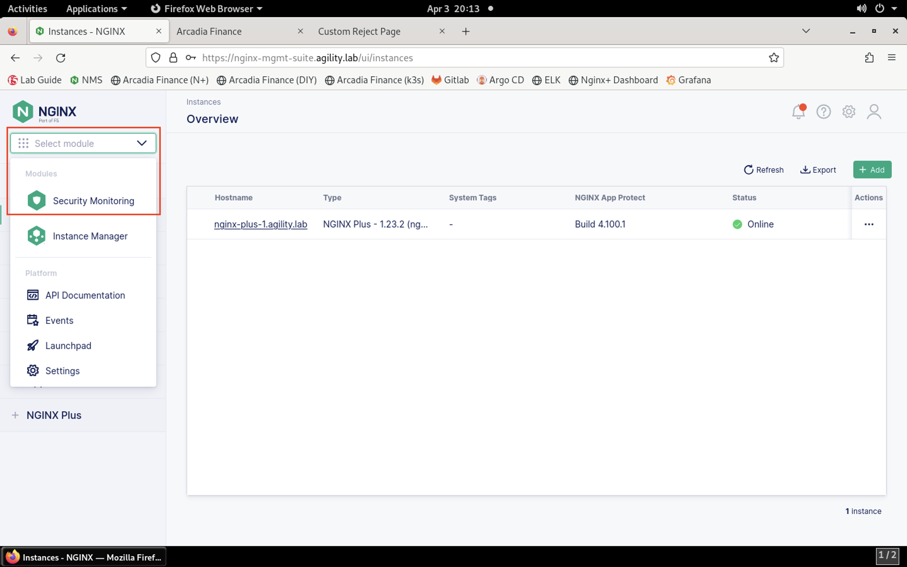

Modify the WAF Policy to Resolve an App Issue
=============================================

1. In **Firefox**, open a new tab, then click the **Arcadia Finance (N+)** bookmark or navigate to https://nginx-plus.arcadia-finance.io/. 

.. image:: images/new_tab.png

2. You should see a partially blank page load as shown below.

.. image:: images/arcadia_partial_load.png

2. Now, click on the **Arcadia Finance (DIY)** bookmark or navigate to https://diy.arcadia-finance.io/. 

.. image:: images/diy_bookmark.png

3. Notice that this page includes more images than the **Arcadia Finance (N+)** page.

.. image:: images/arcadia_full_load.png

4. Load the **Arcadia Finance (N+)** bookmark again. Right-click in the middle of the white space in the browser where the banner image should have loaded. Click **Open Image in New Tab** on the context menu that appears.

.. image:: images/load_image_new_tab.png

5. Click on the **Custom Reject Page** that loads in the new tab.

.. image:: images/custom_reject_page_link.png

6. You should see the custom reject page as shown below:

.. image:: images/custom_reject_page.png

7. NGINX App Protect redirected us to this page. Notice that a **support ID** is generated when the page loads. We can use this ID to identify the cause of the image block. **Select and copy this value** so that we can search for it in NMS-SM.

.. image:: images/select_copy_support_id.gif

8. Return to NMS and navigate to Security Monitoring by clicking the drop-down in the top left of the screen and selecting **Security Monitoring**.

9. You'll be presented with the Security Monitoring landing page, as shown below:

.. image:: images/NMS-SM_overview.png

9. On the left menu, select **Support ID Details**. 
    

10.   You'll be prompted for your support ID.

.. image:: images/NMS-SM_support_id_prompt.png

11. Enter your support ID into the search field and click the **arrow** to search.

.. note:: For the remainder of this lab, you will encounter support IDs when the NAP WAF policy blocks a request. Feel free to return to this tool to look at the details of the protection.

12.  Once the security event has loaded, you can see details surrounding the violation that is blocking images on your app. 

.. image:: images/NMS-SM_support_id_details.png

13. Notice that the image URI is listed as **/images/slider/slide-3.jpg**.

14.  If you scroll down to the **Attack Details** section, you can expand the individual sections showing **Violations**, **Subviolations**, **CVEs**, and **Threat Campaigns**. 

.. image:: images/NMS-SM_support_id_attack_details.png

14. Notice that the **Violations** section shows a single violation: **Illegal File Type**. 

.. image:: images/NMS-SM_support_id_illegal_file_type.png

15. We need to allow JPG files to enable our application to operate properly. In order to do so, we need to modify our WAF policy. Let's start that process by navigating back to **Instance Manager** from the **Select module** drop-down at the top of the left menu bar.

.. image:: images/menu_drop_down_nim.png

16. Inside of the **Instance Manager** dashboard, click on **App Protect** towards the bottom of the left menu bar.

.. image:: images/nim_app_protect_menu.png

17. Click on the **AgilityPolicy** in the policy list. 

.. image:: images/nim_app_protect_agilitypolicy.png

18. Now, click on the **Policy Versions** tab inside of the **Policy Detail** page.

.. image:: images/nim_app_protect_agilitypolicy_versions.png

19. Click on the version name under the **Versions** column in the list.

.. image:: images/nim_app_protect_agilitypolicy_version_view.png

20. The JSON configuration of the policy will be displayed, as shown below:
  
.. image:: images/nap_agilitypolicy_json.png

21. To modify the policy based on this version of the policy, click **Edit Version**. 

.. image:: images/nap_agilitypolicy_edit_version.png

22.  Provide a description of the changes you'll be making in the **Description** field. 

.. image:: images/nap_agilitypolicy_version_edit.png

23. Place your mouse cursor inside the policy editor. Press **CTRL+F** to open the search dialog.

.. image:: images/nim_app_protect_agilitypolicy_version_search.png

22. Search for **"jpg"** and you'll find on line 240 that JPG files are not being allowed. Modify line 241 to change **"allowed": false** to **"allowed": true**. Note that false and true are not encapsulated in quotation marks.

.. image:: images/nim_app_protect_agilitypolicy_version_modified.png

23. Click the **Save New Version** button to create a new version of the policy. 
    
.. image:: images/save_new_version.png
    
24.  You will see confirmation that the new version has been created.

.. image:: images/nim_app_protect_new_version_created.png

24. Click on the policy name at the top of the screen.

.. image:: images/nap_app_protect_link.png

25. Select the **Policy Versions** tab.

.. image:: images/nim_agilitypolicy_versions.png

26. Notice the new policy version is now listed.

.. image:: images/nim_app_protect_new_version_listed.png

27. Return to the the **Instances and Instance Groups** tab. 

.. image:: images/nim_app_protect_agilitypolicy_instance_tab.png

28. Now click on the **Assign Policy and Signature Versions** button above the instance list. 

.. image:: images/assign_policy_version.png

29. Notice that the version listed in the **Policy Version** column is in a drop-down box. You may need to hover your mouse arrow over this section to see the drop-down appear.

.. image:: images/policy_version_dropdown.png

30. Change this to your newer version (compare timestamps) and click **Publish**. 

.. image:: images/publish.png

31.  A pop-up will confirm that you have changed the version.

.. image:: images/publish_confirmation.png

32. Click X to close the confirmation window. 

.. image:: images/publish_confirmation_close.png

33. Click **Cancel** to close the assignment window. 

.. image:: images/close_assignment_window.png

34. On the top of the left menu bar, click **Instances**.

.. image:: images/nim_instances_link.png

35.  Select the **nginx-plus-1** instance from the list.

.. image:: images/active_instance_select.png

36.  Look for the deployment status in the **Last Deployment Details** section. You should see a status of **Finalized**. If not, wait a few moments for the deployment to commence and complete. You may need to refresh your browser for the status to update.

**Deployment not finished**

.. image:: images/deployment_status_unknown.png

**Deployment finished**

.. image:: images/deployment_status.png

37.  Once the deployment has finished, check the site to see if the issue is remediated. In a new tab in **Firefox**, open a new tab and click on the **Arcadia Finance (N+)** bookmark. Notice that the images are now loading successfully.

.. caution:: If images do not load, press **CTRL + Shift + R** to force the browser to fully reload the page.

.. image:: images/successful_full_load.png

Now that you have viewed, diagnosed and remedied a false positive in a WAF policy, let's continue to the next section of the lab.

