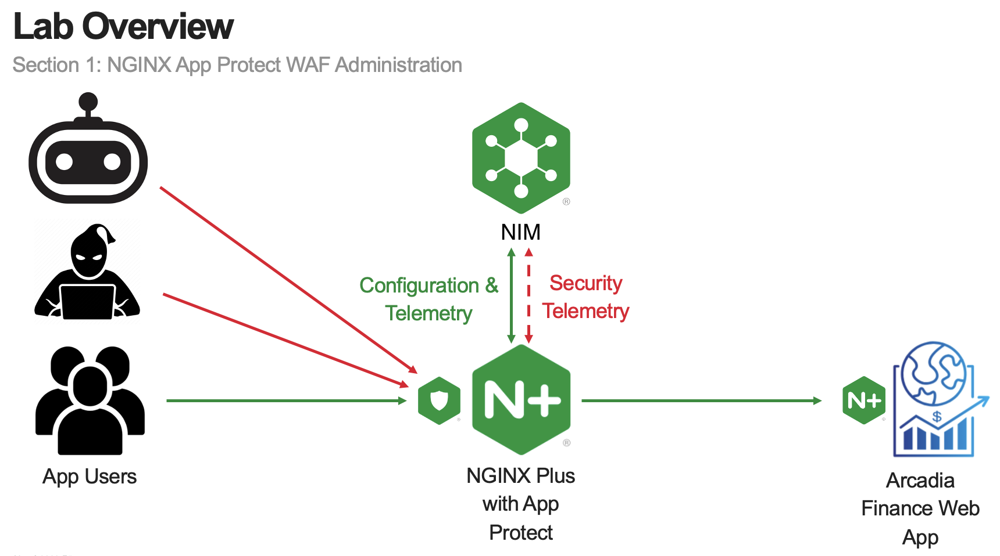

Module 1 - Test Driving NGINX Plus with App Protect WAF and NGINX Instance Manager
##################################################################################

In this module, you will review an existing NGINX Plus instance running NGINX App Protect WAF protecting an deployed application. 

Estimated completion time: 20 minutes

.. note:: The goal of this module is to provide an overview of an entire functioning solution, including features of centralized management for NAP WAF.

.. toctree::
   :maxdepth: 1
   :caption: Content:
   :glob:

   lab*/lab*
   recap
