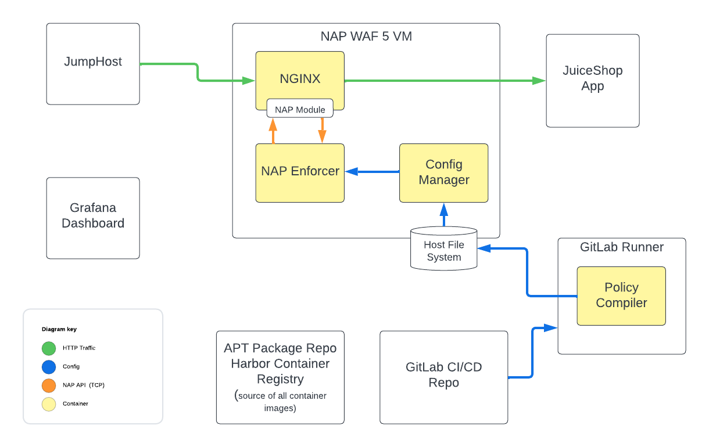

Module 1: NGINX App Protect 5 OSS in a VM
-------------------------------

We will install NGINX App Protect on NGINX OSS to protect the JuiceShop
application. The JuiceShop application has already been installed in the
UDF deployment for you.

Install NGINX OSS and NGINX App Protect 5 Module
~~~~~~~~~~~~~~~~~~~~~~~~~~~~~~~~~~~~~~~~~~~~~~~~

1. Open a **Web Shell** session to the **NAP WAF VM** UDF component.

   .. figure:: images/nap-vm-webshell-access.png
      :alt: NAP VM Web Shell access method

   Alternatively, you can open the **Visual Studio Code** access method:

   .. figure:: images/nap-vm-vscode-access.png
      :alt: NAP VM Visual Studio Code access method

   Once Visual Studio Code loads, to open the shell, press ``CTRL + ~``.

2. Install prerequisite packages:

   .. code:: shell

      apt-get update && apt-get install -y apt-transport-https lsb-release ca-certificates wget gnupg2 ubuntu-keyring

3. Download and add the NGINX signing key:

   .. code:: shell

      wget -qO - https://cs.nginx.com/static/keys/nginx_signing.key | gpg --dearmor \
          | tee /usr/share/keyrings/nginx-archive-keyring.gpg >/dev/null

4. Download the apt configuration to ``/etc/apt/apt.conf.d``:

   .. code:: shell

      wget -P /etc/apt/apt.conf.d https://cs.nginx.com/static/files/90pkgs-nginx

5. Add the NGINX Open Source repository:

   .. code:: shell

      echo "deb [signed-by=/usr/share/keyrings/nginx-archive-keyring.gpg] \
      http://nginx.org/packages/mainline/ubuntu `lsb_release -cs` nginx" \
          | tee /etc/apt/sources.list.d/nginx.list

6. Set up repository pinning to prefer our packages over
   distribution-provided ones:

   .. code:: shell

      echo -e "Package: *\nPin: origin nginx.org\nPin: release o=nginx\nPin-Priority: 900\n" \
          | tee /etc/apt/preferences.d/99nginx

7. Add the NGINX App Protect WAF 5 repository that is local to your UDF
   deployment:

   .. code:: shell

      tee /etc/apt/sources.list.d/nginx-app-protect.list > /dev/null <<EOF
      deb [trusted=yes] https://repositories.f5demos.com/debian jammy nginx-plus
      EOF

8. Install NGINX OSS and the NGINX App Protect WAF 5 package.

   .. code:: 
      
      sudo apt-get update; apt-get install -y nginx=1.25.5-1~jammy app-protect-module-oss
      nginx -t

9. Set NGINX to start on system boot:

   .. code:: shell

      systemctl enable --now nginx
      systemctl status nginx

Installation Check
~~~~~~~~~~~~~~~~~~

1. Check the NGINX binary version to ensure that it was installed
   correctly as a dependency:

   .. code:: shell

      nginx -v

   You should see the following output:

   .. code:: shell

      nginx version: nginx/1.25.5

Policy Compilation
~~~~~~~~~~~~~~~~~~

NGINX App Protect WAF 5 includes support for all existing security
features of NGINX App Protect WAF. For detailed information on these
supported security features, see the `NGINX App Protect WAF
Configuration
Guide <https://docs.nginx.com/nginx-app-protect-waf/configuration-guide/>`__.

A key distinction with NGINX App Protect WAF 5 is the compilation of
security policies and logging profiles into bundle files prior to
deployment. This pre-compilation step significantly speeds up the data
plane deployment process. Ideally, this process would be automated and
your policy’s source of truth is Git. In this lab, we will be using
GitLab to build the App Protect policy and log profiles into a tarball,
and deploy it to the target systems when the policy has been updated in
source control.

NGINX Configuration
~~~~~~~~~~~~~~~~~~~

1.  In your existing Web Shell session to the **NAP WAF VM**, open the
    ``/etc/nginx/nginx.conf`` file in your preferred editor. For
    example:

    .. code:: bash

       nano /etc/nginx/nginx.conf

    You can also edit it with Visual Studio Code if you are using the
    access method for it:

    .. code:: bash

       code /etc/nginx/nginx.conf

2.  At the top of the ``nginx.conf`` file, insert the following
    directive to load the NGINX App Protect WAF 5 module:

    .. code:: nginx

       load_module modules/ngx_http_app_protect_module.so;

3.  Configure the Enforcer address in the ``http`` context of the
    ``nginx.conf`` file by adding the ``app_protect_enforcer_address``
    directive to instruct the App Protect module to connect to the
    enforcer container that we will later deploy with Docker Compose:

    .. code:: nginx

       app_protect_enforcer_address 127.0.0.1:50000;

    The file should now look similar to this excerpt:

    .. code:: nginx

       load_module modules/ngx_http_app_protect_module.so;

       user  nginx;
       worker_processes  auto;

       error_log  /var/log/nginx/error.log notice;
       pid        /var/run/nginx.pid;

       events {
           worker_connections  1024;
       }

       http {
           app_protect_enforcer_address 127.0.0.1:50000;
           include       /etc/nginx/mime.types;
           default_type  application/octet-stream;

           log_format  main  '$remote_addr - $remote_user [$time_local] "$request" '
                           '$status $body_bytes_sent "$http_referer" '
                           '"$http_user_agent" "$http_x_forwarded_for"';

           access_log  /var/log/nginx/access.log  main;

           ...
       }

4.  Save the file (e.g. ``CTRL+O, Enter`` in nano or ``CTRL+S`` in
    Visual Studio Code), and close the editor if using the Web Shell
    access method.

5.  Open the ``/etc/nginx/conf.d/default.conf`` file in your preferred
    editor.

    For example:

    .. code:: bash

       nano /etc/nginx/conf.d/default.conf

    Or:

    .. code:: bash

       code /etc/nginx/conf.d/default.conf

6.  Update the first 2 lines in the ``server`` context in the
    ``default.conf`` with the following:

    .. code:: nginx

       listen 443 ssl;
       server_name nap-vm.f5demos.com;

7.  Un-comment the ``access_log`` line so it looks like the following:

    .. code:: nginx

       access_log  /var/log/nginx/host.access.log  main;

8.  Below the line in the previous step, add the following references to
    the lab’s TLS certificate and key:

    .. code:: nginx

       ssl_certificate /etc/ssl/certs/wildcard.f5demos.com.crt.pem;
       ssl_certificate_key /etc/ssl/private/wildcard.f5demos.com.key.pem;

9.  Enable NGINX App Protect WAF by adding the following line below the
    ones in the previous step:

    .. code:: nginx

       app_protect_enable on;

10. Below the line in the previous step, set the
    ``app_protect_policy_file`` directive to the tarball that GitLab has
    already deployed for you the first time:

    .. code:: nginx

       app_protect_policy_file "/etc/app_protect/bundles/nap5_policy.tgz";

11. Below the line in the previous step, add the
    ``app_protect_security_log_enable`` directive to indicate that we
    will want to log security events:

    .. code:: nginx

       app_protect_security_log_enable on;

12. Below the line in the previous step, add the
    ``app_protect_security_log`` directive to indicate which log profile
    bundle we will use, as well as where to send the logs. GitLab has
    already deployed the log profile tarball for you for you the first
    time. The logs will be sent to the LogStash syslog ingestion
    container running in the **Dashboard** VM:

    .. code:: nginx

       app_protect_security_log "/etc/app_protect/bundles/nap5_log_profile.tgz" syslog:server=dashboard.f5demos.com:8515;

13. In the ``location /`` block, remove the 2 existing lines.

14. Inside this ``location`` block, use the ``proxy_pass`` directive to
    proxy incoming traffic to the JuiceShop application:

    .. code:: nginx

       proxy_pass http://appserver.f5demos.com:3000/;

    The file should now look similar to this excerpt:

    .. code:: nginx

       server {
           listen 443 ssl;
           server_name nap-vm.f5demos.com;
           access_log  /var/log/nginx/host.access.log  main;

           ssl_certificate /etc/ssl/certs/wildcard.f5demos.com.crt.pem;
           ssl_certificate_key /etc/ssl/private/wildcard.f5demos.com.key.pem;

           app_protect_enable on;
           app_protect_policy_file "/etc/app_protect/bundles/nap5_policy.tgz";
           app_protect_security_log_enable on;
           app_protect_security_log "/etc/app_protect/bundles/nap5_log_profile.tgz" syslog:server=dashboard.f5demos.com:8515;

           location / {
               proxy_pass http://appserver.f5demos.com:3000/;
           }

           #error_page  404              /404.html;

           # redirect server error pages to the static page /50x.html
           #
           error_page   500 502 503 504  /50x.html;
           location = /50x.html {
               root   /usr/share/nginx/html;
           }

           ...
       }

15. Save the file, and close the editor if using the Web Shell access
    method.

With the NGINX App Protect WAF 5 dynamic module installed, you can now
proceed to install the Docker containers required by the new
architecture.

Deploy App Protect WAF 5 Docker Containers
~~~~~~~~~~~~~~~~~~~~~~~~~~~~~~~~~~~~~~~~~~

1. Log in to the local Harbor image registry:

   .. code:: shell

      docker login repositories.f5demos.com:8443

   If prompted, use ``admin`` and ``Harbor12345`` as the credentials.

2. Next, we need to set up the directories with the correct ownership
   for NGINX App Protect WAF 5 services, where ``101:101`` are the
   default UID/GID for the ``systemd-resolve`` user in Ubuntu that the
   App Protect WAF containers will use to access the runtime config on
   the host.

   Create Directories:

   .. code:: shell

      mkdir -p /opt/app_protect/config /opt/app_protect/bd_config

   Set Ownership:

   .. code:: shell

      chown -R 101:101 /opt/app_protect/

3. Examine the Docker Compose file (``~/nap5/docker-compose.yaml``) in
   your editor.

   You will note that a ``waf-enforcer`` and ``waf-config-mgr``
   container will be deployed. They will be pulled from the Harbor image
   registry in the local deployment. Additionally, note that various
   volumes are used in order to facilitate runtime config and bundle
   sharing between the NGINX App Protect WAF module and the App Protect
   WAF containers.

4. In the **NAP WAF VM** Web Shell session, start the Docker containers
   using Docker Compose:

   .. code:: shell

      cd ~/nap5
      docker compose up -d

   You should see output similar to the following:

   .. code:: shell

      [+] Running 11/11
      ✔ waf-enforcer 4 layers [⣿⣿⣿⣿]      0B/0B     Pulled   3.0s
      ✔ c10e5867c864 Pull complete                            .3s
      ✔ 610bc942f22e Pull complete                            .3s
      ✔ 3be51ed0c879 Pull complete                            .1s
      ✔ 1d00429e5679 Pull complete                            .5s
      ✔ waf-config-mgr 5 layers [⣿⣿⣿⣿⣿]      0B/0B  Pulled  1.4s
      ✔ f5ce2c949773 Pull complete                            .1s
      ✔ 94794f16c736 Pull complete                            .1s
      ✔ 4ca9a728d9c3 Pull complete                            .3s
      ✔ a79fde38653f Pull complete                            .4s
      ✔ 4f4fb700ef54 Pull complete                            .2s
      [+] Running 2/3
      ⠸ Network nap5_waf_network  Created                    1.3s
      ✔ Container waf-enforcer    Started                    0.8s
      ✔ Container waf-config-mgr  Started

5. Confirm that the App Protect WAF Docker containers are running:

   .. code:: shell

      docker ps

   You should see output similar to:

   .. code:: shell

      CONTAINER ID   IMAGE                                                    COMMAND                  CREATED          STATUS          PORTS                                           NAMES
      cc878708af8a   repositories.f5demos.com:8443/nap/waf-config-mgr:5.3.0   "/service/config-mgr…"   21 seconds ago   Up 20 seconds                                                   waf-config-mgr
      d1f660623bb7   repositories.f5demos.com:8443/nap/waf-enforcer:5.3.0     "/start-enforcer"        21 seconds ago   Up 20 seconds   0.0.0.0:50000->50000/tcp, :::50000->50000/tcp   waf-enforcer

6. Restart (or Start) NGINX to reconfigure it with all the config
   updates we made earlier:

   .. code:: shell

      systemctl restart nginx

..

   Note: Unlike in NGINX Plus, the NGINX OSS must be restarted in order
   to load the updated configuration. This disrupts existing connections
   and prevents the establishment of new connections while restarting.
   This is one of the reasons we recommend NGINX Plus for its
   non-disruptive behavior during configuration reloads.

Test the JuiceShop Application
~~~~~~~~~~~~~~~~~~~~~~~~~~~~~~

1. In UDF, open the **Firefox** access method of the **JumpHost** VM.
   This will open the **Lab Links** page in the first tab.

   .. figure:: images/firefox-access.png
      :alt: JumpHost Firefox access method

2. Click the **NAP 5 VM** link.

   .. figure:: images/nap-vm-lab-link.png
      :alt: NAP WAF VM lab link

   You should see the JuiceShop page:

   .. figure:: images/juiceshop.png
      :alt: Juiceshop app

3. Perform a Cross-Site Scripting (XSS) attack by modifying the url to

   .. code::

      https://nap-vm.f5demos.com/p=<script>

   and hit enter.

   You should see a WAF block page:

   .. figure:: images/css-attack-url.png
      :alt: XSS block page

   You can also open the browser dev tools (``CTRL + SHIFT + I``) and
   analyze any other requests.

   .. figure:: images/css-attack-url-devtools.png
      :alt: XSS block page devtools

   Note down all of the support IDs in each response before moving onto
   the next step.

View Security Events of the JuiceShop Application
~~~~~~~~~~~~~~~~~~~~~~~~~~~~~~~~~~~~~~~~~~~~~~~~~

In order to view events generated from App Protect WAF, we will be using
Kostas Skenderidis’ excellent
`dashboard <https://github.com/f5devcentral/nap-policy-management/tree/main/dashboard>`__
for App Protect.

1. In the lab’s **Firefox**, click on the **Lab Links** tab.

2. Click the **Grafana Dashboard** link.

   .. figure:: images/grafana-lab-link.png
      :alt: Grafana lab link

3. If you are prompted to log in, use ``admin`` and ``N@pWaf5`` as the
   credentials.

4. Click the Dashboard icon, and **Browse** as pictured below:

   .. figure:: images/dashboard-browse.png
      :alt: Grafana dashboard browse link

5. Click the **General** link, then click the **NGINX NAP Main
   Dashboard**.

   .. figure:: images/dashboard-general-nav.png
      :alt: Grafana general navigation

6. You will be presented with the main dashboard in this solution. You
   should see at least one attacker and attack indicated. Additionally,
   you will see a violations list below. Feel free to drill into the
   data and explore the other dashboards while you are here.

   .. figure:: images/dashboard-attacks.png
      :alt: Dashboard attacks

Drilling down into events
~~~~~~~~~~~~~~~~~~~~~~~~~

1. Go back to the Dashboard icon, and **Browse** as before:

   .. figure:: images/dashboard-browse2.png
      :alt: Grafana dashboard browse link

2. Click the **General** link, then click the **NGINX NAP SupportID**.

   .. figure:: images/dashboard-support-id.png
      :alt: Grafana support ID

3. Click the box next to the **SupportID** field.

   .. figure:: images/dashboard-support-id-filter.png
      :alt: Grafana support ID

4. Paste in the Support ID from the other tab.

   .. figure:: images/dashboard-support-id-filter-paste.png
      :alt: Grafana support ID

5. Look at the box containing the violations in this request.

   .. figure:: images/dashboard-support-id-violations.png
      :alt: Grafana support ID

6. Scroll down to the box containing the signatures in this request.

   .. figure:: images/dashboard-support-id-signatures.png
      :alt: Grafana support ID

7. You can then repeat this for the other Support ID(s) in the requests
   that you analyzed earlier in the browser devtools.

The Bundle Compilation Process
~~~~~~~~~~~~~~~~~~~~~~~~~~~~~~

NGINX App Protect WAF 5 offers default security policies and logging
profiles that work out of the box for general use cases. However, for
more specific requirements, you may need to create bundles based on your
custom security policies and logging profiles. This customization
ensures that the deployment is finely tuned to your unique security and
operational environment. This lab makes use of a custom policy and log
profile. We will examine these files.

Log into GitLab
^^^^^^^^^^^^^^^

1. In the lab’s **Firefox**, click on the **Lab Links** tab.

2. Click the **GitLab** link.

   .. figure:: images/gitlab-lab-link.png
      :alt: GitLab lab link

3. Log into GitLab with ``root`` / ``GitL@bF5``.

   .. figure:: images/gitlab-login.png
      :alt: GitLab login form

4. Click the **nap5** project link as pictured below:

   .. figure:: images/gitlab-project-link.png
      :alt: nap5 project link

5. You will be presented with a list of files in the **nap5** git
   repository, not necessarily in this order:

   -  ``nap5_policy.json`` - The App Protect WAF security policy for our
      demo applications.
   -  ``nap5_log_profile.json`` - The App Protect WAF log profile to be
      used for the logging of security events.
   -  ``.gitlab-ci.yml`` - The configuration for the GitLab CI/CD
      pipeline that will compile the JSON App Protect WAF policy and
      JSON log profile file into bundles and deploy them to the App
      Protect WAF deployments’ host file systems.
   -  ``updated_policy_contents.txt`` - Simply a text file containing
      JSON that we will use to update ``nap5_policy.json`` file’s
      contents in the next steps.

6. Click the ``nap5_policy.json`` file. This is the policy file that has
   been compiles into a tarball, and deployed to the App Protect WAF 5
   enforcer that we were testing in the previous section. This is a
   simple App Protect policy file with few modifications. Note that this
   policy is in blocking mode.

7. Click the button to go back to the repository:

   .. figure:: images/gitlab-back-to-repo.png
      :alt: nap5 project link

8. Once back in the repository, click on the ``nap5_log_profile.json`` file. This is a typical JSON log profile,
   with the addition of a specific log format specified that the
   Security Grafana Dashboard requires. This is the log profile
   currently in use.

9. Click the button to go back to the repository, then click on the
   ``.gitlab-ci.yml`` file. This is the spec file of the CI/CD pipeline
   that the nap repository uses. This build pipeline has 2 stages:
   ``build`` and ``deploy``.

   The ``build`` stage uses a Docker image in the local Harbor image
   registry that contains a waf compiler that has been provided for you.
   In the build stage, the ``apcompile`` utility contained in this
   container image will compile policies and log profiles into bundles
   contained in ``.tgz`` archive files (tarballs).

   The ``deploy`` stage uses a simple alpine image to copy the 2 bundles
   created in the build stage, and deploy them to both the NAP WAF VM
   and K3s Kubernetes cluster (used later in this lab). Once these are
   deployed, the ``waf-config-mgr`` containers are restarted to apply
   the latest changes to the waf enforcer container.

      Note: As long as the name of the policy name or bundle files’
      names have not changed, a restart of NGINX is not necessary in
      order to make policy or log profile changes effective.

   .. figure:: images/gitlab-pipeline-sections.png
      :alt: GitLab pipeline

Update the Security Policy
~~~~~~~~~~~~~~~~~~~~~~~~~~

Let’s say our attack from earlier represented legitimate behavior for
that specific application. We can modify the security policy to allow
that behavior, though it should be noted this specific attack would be a
poor example of legitimate behavior in practice.

1.  Click the button to go back to the repository, then click on the
    ``updated_policy_contents.txt`` file. This is a JSON file that we
    will use to update the ``nap5_policy.json`` file.

2.  Select the contents of the file, and press **Ctrl+C** to store in
    Firefox’s VNC clipboard buffer.

3.  Click the button to go back to the repository, then click on the
    ``nap5_policy.json`` file.

4.  Click the **Edit** button, then click **Edit single file**. The
    policy file will open in an editor.

    .. figure:: images/gitlab-lab-policy-orig-edit-btn.png
       :alt: Gitlab edit policy file

5.  Highlight all the contents of the file, and press **Ctrl+V** to
    paste in the value.

6.  Update the commit message describing this change.

7.  Click the **Commit changes** button.

    .. figure:: images/gitlab-lab-policy-update-commit.png
       :alt: GitLab commit message

8.  GitLab will display a message indicating that the changes to the
    file have been committed.

9.  Click **Build** then **Pipelines** in the left navigation.

    .. figure:: images/gitlab-policy-change-commit-success.png
       :alt: GitLab file committed

10. The first item at the top list is the pipeline that has been
    automatically initiated due to your change. Click the status icon as
    pictured below:

    .. figure:: images/gitlab-pipeline-running.png
       :alt: GitLab pipeline running

11. You will be taken to a page that displays the status of the pipeline
    instance. Within one minute, you should see a status page similar to
    the image below signifying that the build and deploy stages have
    completed successfully.

    .. figure:: images/gitlab-pipeline-success.png
       :alt: GitLab pipeline success

12. In Firefox, click the tab that contains the request containing XSS
    that was blocked.

13. Click refresh to reload the page. Notice that the request now goes
    through, since we allowed the earlier behavior that had been
    blocked.

This is the end of the VM based lab for NGINX App Protect.
