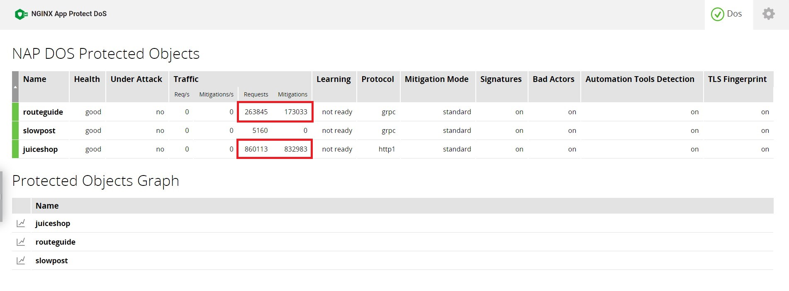

Module 10 - Live Activity Monitoring with NGINX App Protect DoS Dashboard
#########################################################################

Overview
--------

NGINX App Protect DoS provides various monitoring tools for your application:

* The interactive DoS Dashboard page - a real-time live activity monitoring interface that shows status and information of your Protected Objects.
* NGINX App Protect DoS REST API - an interface that can obtain extended metrics information of your Protected Objects.

Example configuration
---------------------

The DoS Dashboard has been enabled for this lab by specifying the **/dashboard-dos.html** location. By default the DoS Dashboard is located in the root directory (for example, /usr/share/nginx/html) specified by the root directive.

.. code-block:: nginx
   :linenos:

    server {
      listen 80;
      location /api {
        app_protect_dos_api;
      }
      location = /dashboard-dos.html {
        root /usr/share/nginx/html;
      }
    }

Accessing the Dashboard
-----------------------

Go to **NAP DOS 1** VM, navigate to **Access** and select **NAPDOS - Dashboard**, then click **Dos Protected Objects**.

Tab Overview
------------

The DoS tab provides statistics and configuration per each Protected Object.

Status indicators (colors - green / orange / red), one in the tab name, the other is in the table of protected objects, per protected object.

The logic for the colors is as follows:

* green - no attack, s/h < 0.9
* yellow - under attack, s/h < 1 or no attack ,s/h > 0.9 and < 1
* red - under attack S/H >= 1
