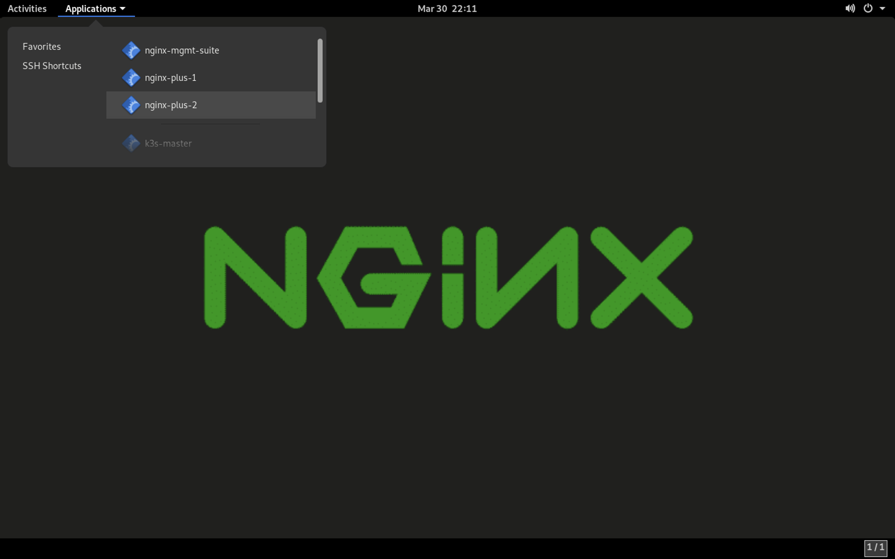
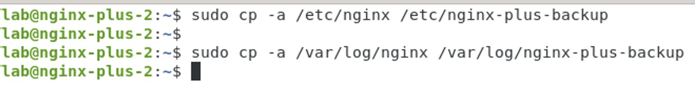
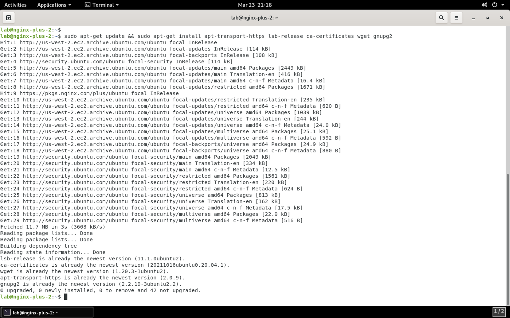
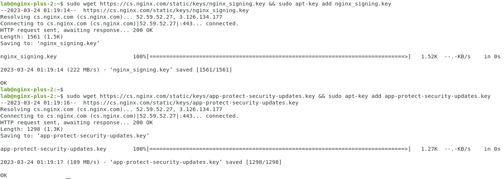
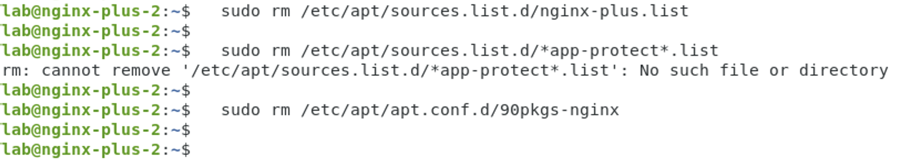
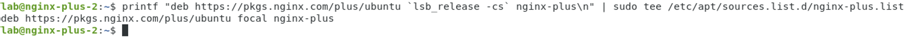
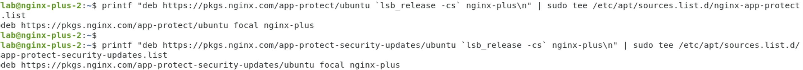
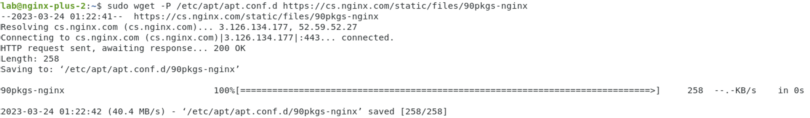
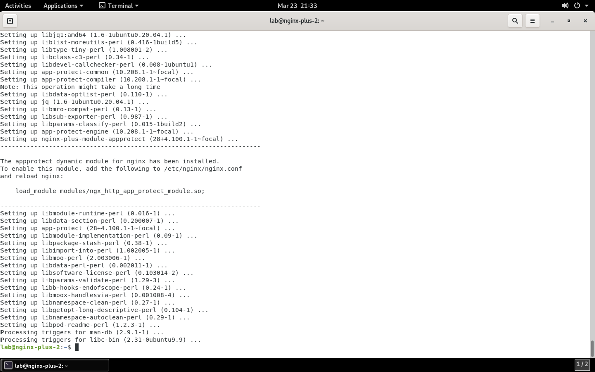
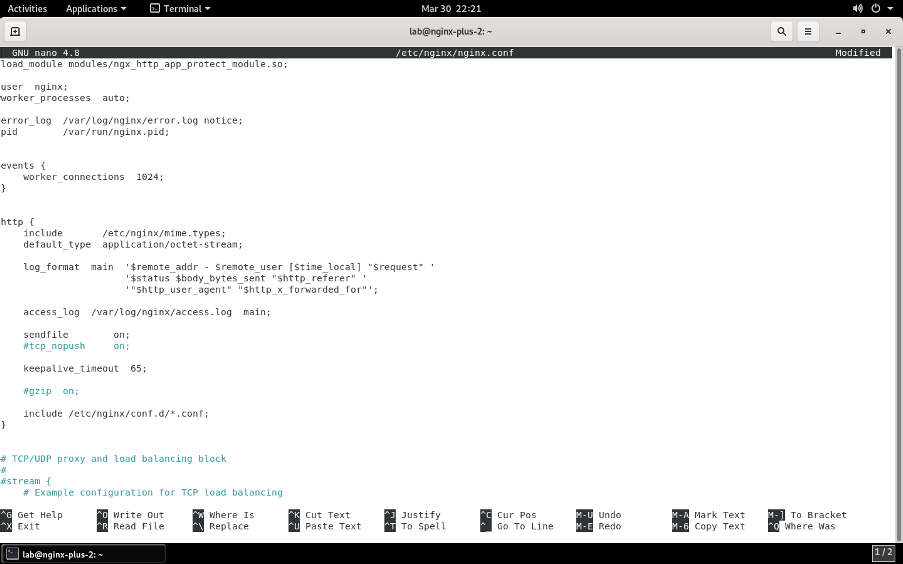

Installing NGINX App Protect on an existing NGINX Plus instance
===============================================================

.. note:: NGINX Plus and NGINX App Protect repositories are accessed using a cert/key pair that enables access for customers who have purchased licenses. In this lab, NGINX Plus repo keys are already copied to the Ubuntu VM.

.. note:: This section of the lab covers installation of NGINX App Protect. General instructions for installation can be found at https://docs.nginx.com/nginx-app-protect-waf/admin-guide/install/. The steps in this guide are customized to this lab environment and operating system.

1. Connect to the jump host via RDP if not already.

2. Installation of NGINX App Protect is performed on the CLI of the host. Click on the **Applications** menu, select **SSH Shortcuts** and select **nginx-plus-2**. 

3. This host has NGINX Plus installed and serving the Arcadia Finance app, but NGINX App Protect is not installed. First, backup the existing NGINX Plus configuration files and logs. Type or paste the commands below:

.. code-block:: bash

  sudo cp -a /etc/nginx /etc/nginx-plus-backup
  sudo cp -a /var/log/nginx /var/log/nginx-plus-backup

**Result**

4. Install the prerequisite packages by typing or pasting the commands below:

.. code-block:: bash

  sudo apt-get update && sudo apt-get install -y apt-transport-https lsb-release ca-certificates wget gnupg2

**Result**

5. NGINX packages are signed to ensure integrity of the contents. You need to download and add the NGINX signing keys to the **apt** package manager:

.. code-block:: bash

  sudo wget https://cs.nginx.com/static/keys/nginx_signing.key && sudo apt-key add nginx_signing.key
  sudo wget https://cs.nginx.com/static/keys/app-protect-security-updates.key && sudo apt-key add app-protect-security-updates.key

**Result**

  
6. Remove any previous NGINX Plus repository and apt configuration files:

.. caution:: It's okay if these commands return an error. The target files may not exist.

.. code-block:: bash

  sudo rm /etc/apt/sources.list.d/nginx-plus.list
  sudo rm /etc/apt/sources.list.d/*app-protect*.list
  sudo rm /etc/apt/apt.conf.d/90pkgs-nginx

**Result**

  
7. Add the NGINX Plus repository:

.. code-block:: bash

  printf "deb https://pkgs.nginx.com/plus/ubuntu `lsb_release -cs` nginx-plus\n" | sudo tee /etc/apt/sources.list.d/nginx-plus.list

**Result**

  
8. Add NGINX App Protect WAF repositories:

.. code-block:: bash

  printf "deb https://pkgs.nginx.com/app-protect/ubuntu `lsb_release -cs` nginx-plus\n" | sudo tee /etc/apt/sources.list.d/nginx-app-protect.list
  printf "deb https://pkgs.nginx.com/app-protect-security-updates/ubuntu `lsb_release -cs` nginx-plus\n" | sudo tee /etc/apt/sources.list.d/app-protect-security-updates.list

**Result**

  
9. Download the apt configuration to ``/etc/apt/apt.conf.d``:

.. code-block:: bash

  sudo wget -P /etc/apt/apt.conf.d https://cs.nginx.com/static/files/90pkgs-nginx

**Result**

  
10. Update the repository and install the proper version of the NGINX App Protect WAF package (which includes NGINX Plus):

.. note:: For lab stability purposes, you will install a specific version of NGINX App Protect that is compatible with the lab instance of NGINX Instance Manager.

.. code-block:: bash

  sudo apt-get update && sudo apt install -y app-protect=28+4.100.1-1~focal nginx-plus-module-appprotect=28+4.100.1-1~focal app-protect-engine=10.208.1-1~focal app-protect-compiler=10.208.1-1~focal app-protect-common=10.208.1-1~focal app-protect-common=10.208.1-1~focal app-protect-plugin=4.100.1-1~focal

**Result**

11. Load the NGINX App Protect WAF module on the main context in the nginx.conf file:

Open the file in an editor:

.. code-block:: bash

  sudo nano /etc/nginx/nginx.conf

Add the following line to the top of the file:

.. code-block:: bash

  load_module modules/ngx_http_app_protect_module.so;

Your configuration file should look similar to below:

Press **CTRL + X** to save the file, followed by **Y** when asked to save the buffer, then **enter** when asked for the filename. 

12. Start the NGINX App Protect service and set it to start at boot:

.. code-block:: bash

  sudo systemctl enable --now nginx-app-protect

13. Restart the NGINX service:

.. code-block:: bash

  sudo nginx -s reload

Providing that no errors have occurred during these steps, you now have NGINX App Protect installed. Continue to the next section of the lab.