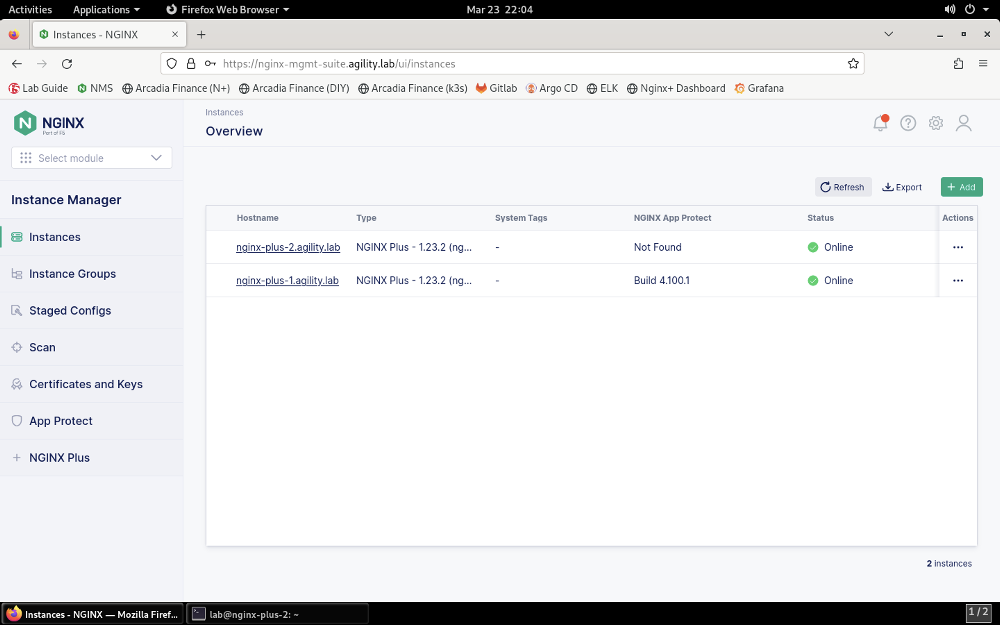

Adding the NGINX Plus with App Protect Instance to NGINX Management Suite
=========================================================================

Since our lab utilizes NMS, we're going to install the NGINX Agent and add the instance to the NGINX Management Suite for centralized management and analytics.

.. warning:: If you're installing the NGINX Agent in your environment, a few steps are required before starting the installation process. See https://docs.nginx.com/nginx-management-suite/nginx-agent/install-nginx-agent/ for more information. In this lab, these have been checked for you.

1. Connect to the NGINX Plus 2 instance via SSH, if not already connected.

2. The NGINX Agent will be pulled from the NGINX Management Suite server and installed:

.. code-block:: bash

  curl -k https://nginx-mgmt-suite.agility.lab/install/nginx-agent | sudo sh

**Result**

.. image:: images/nginx_agent_install_result.png

3. Configure the NGINX Agent

Load the file into a file editor:

.. code-block:: bash

  sudo nano /etc/nginx-agent/nginx-agent.conf

Add the following configuration block to the end of the file:

.. code-block:: bash

  metrics:
    # specify the size of a buffer to build before sending metrics
    bulk_size: 20
    # specify metrics poll interval
    report_interval: 1m
    collection_interval: 15s
    mode: aggregated

  # Enable reporting NGINX App Protect details to the control plane.
  nginx_app_protect:
    # Report interval for NGINX App Protect details - the frequency the NGINX Agent checks NGINX App Protect for changes.
    report_interval: 15s
    # Enable precompiled publication from the NGINX Management Suite (true) or perform compilation on the data plane host (false).
    precompiled_publication: true

4.  Create the Metrics service on NGINX:

5.  Return to the NMS Dashboard. 

6.  Click on **Instances** in the **Instance Manager** to view the instance list.

7.  Click the **nginx-plus-2.agility.lab** instance in the list. 

8.  Click the **Edit Config** button.

9.  Click on **Add File**. 

10.  Provide the filename **/etc/nginx/conf.d/metrics.conf**.

11.  Click **Create**.

12.  Paste the following configuration into the editor:

.. code-block:: bash

  server {
      listen 8080;

      location /api/ {
        api write=on;
        allow 127.0.0.1;
        deny all;
      }
  }

13. Click the **Publish** button.

14. Click **Publish** when presented with the confirmation prompt.

.. image:: images/publish_confirm.png

15.  You will see the Published notification shortly after. 

.. image:: images/published_notification.png

16.   Restart NGINX:

.. code-block:: bash
  sudo nginx -s reload

17.  Start and Enable NGINX Agent

To start the NGINX Agent on systemd systems, run the following command:

.. code-block:: bash

  sudo systemctl start nginx-agent

To enable the NGINX Agent to start on boot, run the following command:

.. code-block:: bash

  sudo systemctl enable nginx-agent

18. Verifying NGINX Agent is Running and Registered

Run the following command on your data plane to verify that the NGINX Agent process is running:

.. code-block:: bash

  ps aux | grep nginx-agent

You should see output that looks similar to the following example:

.. image:: images/nginx_agent_ps_aux_result.png

19. Once you’ve verified the NGINX Agent is running on your data plane, you should confirm it’s registered with Instance Manager. Open the NGINX Management Suite web interface and log in. The registered instance is shown in the Instances list.

Once you see the **NGINX Plus 2** instance listed in the NMS Instances list, this section of the lab is complete.
