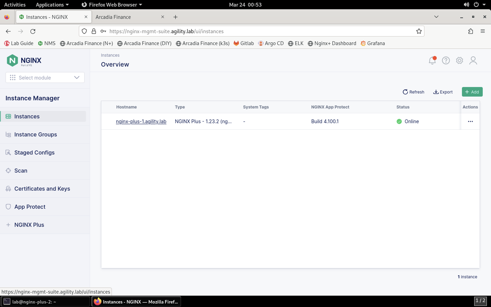

Adding the NGINX Plus with App Protect Instance to NGINX Management Suite
=========================================================================

Since our lab utilizes NMS, we're going to install the NGINX Agent and add the instance to the NGINX Management Suite for centralized management and analytics.

.. warning:: If you're installing the NGINX Agent outside of this lab environment, a few steps are required before starting the installation process. See https://docs.nginx.com/nginx-management-suite/nginx-agent/install-nginx-agent/ for more information. In this lab, these have been checked for you.

1. Connect to the NGINX Plus 2 instance via SSH, if not already connected.

2. The NGINX Agent will be pulled from the NGINX Management Suite server and installed:

.. code-block:: bash

  curl -k https://nginx-mgmt-suite.agility.lab/install/nginx-agent | sudo sh

**Result**

.. image:: images/nginx_agent_install_result.png

3. Configure the NGINX Agent

Load the file into a file editor:

.. code-block:: bash

  sudo nano /etc/nginx-agent/nginx-agent.conf

Add the following configuration block to the end of the file:

.. code-block:: nginx

  # Enable reporting NGINX App Protect details to the control plane.
  nginx_app_protect:
    # Report interval for NGINX App Protect details - the frequency the NGINX Agent checks NGINX App Protect for changes.
    report_interval: 15s
    # Enable precompiled publication from the NGINX Management Suite (true) or perform compilation on the data plane host (false).
    precompiled_publication: true

Press **CTRL + X** to save the file, followed by **Y** when asked to save the buffer, then **enter** when asked for the filename. 

4. Start the NGINX Agent:

.. code-block:: bash

  sudo systemctl start nginx-agent

5. Set the NGINX Agent to start at boot:

.. code-block:: bash

  sudo systemctl enable nginx-agent

6.  Create the Metrics service on NGINX. Navigate to **NMS** in **Firefox** and click on **Instances** in the **Instance Manager** to view the instance list.

7. Click **Refresh** in the toolbar. The second instance should now appear in the list.

.. image:: images/nms_refresh_result.png

8.  Click the **nginx-plus-2.agility.lab** instance in the list. 

.. image:: images/nginx_plus_2_detail.png

9.  Click the **Edit Config** button.

.. image:: images/edit_button.png

10. Click on **Add File** button in the navigation pane.

.. image:: images/add_file_button.png

11.  Provide the filename **/etc/nginx/conf.d/metrics.conf**.

.. image:: images/filename_prompt.png

12.  Click **Create**.

13.  Paste the following configuration into the editor:

.. code-block:: bash

  server {
      listen 8080;

      location /api/ {
        api write=on;
        allow 127.0.0.1;
        deny all;
      }
  }

**Result**

.. image:: images/file_contents.png

1.  Click the **Publish** button.

.. image:: images/publish_button.png

15. Click **Publish** when presented with the confirmation prompt.

.. image:: images/publish_confirm.png

16. You will see the Published notification shortly after. 

.. image:: images/published_notification.png

17. Return to the SSH terminal to the NGINX Plus 2 instance. Restart NGINX:

.. code-block:: bash
    sudo nginx -s reload

1.  Start and Enable NGINX Agent

To start the NGINX Agent on systemd systems, run the following command:

.. code-block:: bash
    sudo systemctl start nginx-agent

To enable the NGINX Agent to start on boot, run the following command:

.. code-block:: bash
    sudo systemctl enable nginx-agent

1.  Verifying NGINX Agent is Running:

Run the following command on your data plane to verify that the NGINX Agent process is running:

.. code-block:: bash

  ps aux | grep nginx-agent

You should see output that looks similar to the following example:

.. image:: images/nginx_agent_ps_aux_result.png

Now that your instance has NGINX App Protected and the NGINX Agent installed and running, and is appearing in the **NMS Management Suite** **Instance Manager** instances list, we can continue.