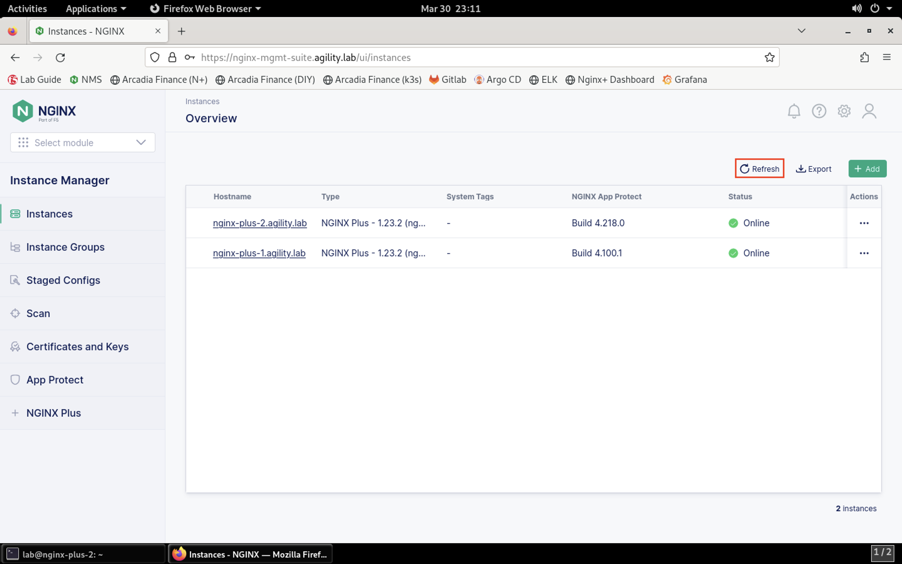

Adding the NGINX Plus with App Protect Instance to NGINX Management Suite
=========================================================================

Since our lab utilizes NMS, we're going to install the NGINX Agent and add the instance to the NGINX Management Suite for centralized management and analytics.

.. warning:: If you're installing the NGINX Agent in your environment, a few steps are required before starting the installation process. See https://docs.nginx.com/nginx-management-suite/nginx-agent/install-nginx-agent/ for more information. In this lab, these have been checked for you.

1. Connect to the NGINX Plus 2 instance via SSH, if not already connected.

2. The NGINX Agent will be pulled from the NGINX Management Suite server and installed:

.. code-block:: bash

  curl -k https://nginx-mgmt-suite.agility.lab/install/nginx-agent | sudo sh

**Result**

.. image:: images/nginx_agent_install_result.png

3. Configure the NGINX Agent

Load the file into a file editor:

.. code-block:: bash

  sudo nano /etc/nginx-agent/nginx-agent.conf

Add the following configuration block to the end of the file:

.. caution:: When you paste the block below, extra line breaks may be included. Please remove those line spaces to ensure no errors occur.

.. code-block:: bash

  # Enable reporting NGINX App Protect details to the control plane.
  nginx_app_protect:
    # Report interval for NGINX App Protect details - the frequency the NGINX Agent checks NGINX App Protect for changes.
    report_interval: 15s
    # Enable precompiled publication from the NGINX Management Suite (true) or perform compilation on the data plane host (false).
    precompiled_publication: true
  # NGINX App Protect Monitoring config
  nap_monitoring:
    # Buffer size for collector. Will contain log lines and parsed log lines
    collector_buffer_size: 50000
    # Buffer size for processor. Will contain log lines and parsed log lines
    processor_buffer_size: 50000
    # Syslog server IP address the collector will be listening to
    syslog_ip: "127.0.0.1"
    # Syslog server port the collector will be listening to
    syslog_port: 514

4. Start the NGINX Agent and set to start at boot:

.. code-block:: bash

  sudo systemctl enable --now nginx-agent

Create the Metrics service on NGINX
-----------------------------------

The NGINX Agent is now configured and started. We'll need a few more configuration pieces to finish the installation.

5. Open **Firefox** by selecting **Applications** > **Favorites** > **Firefox** from the top menu bar.

.. image:: images/firefox_launch.png

6. Click the NMS bookmark or navigate to https://nginx-mgmt-suite.agility.lab/ui/.

7. Log into NMS using the username **lab** and the password **Agility2023!**.

.. image:: images/login.png

8. Click on the **Instance Manager** tile to launch NIM. 

.. image:: images/nim_tile.png

9. You should now see second instance in the list. Click **Refresh** in the toolbar if you do not see the new instance.

10.  Click the **nginx-plus-2.agility.lab** instance in the list. 

.. image:: images/nginx_plus_2_detail.png

11.  Click the **Edit Config** button.

.. image:: images/edit_button.png

12. Click on **Add File** button in the navigation pane.

.. image:: images/add_file_button.png

13.  Provide the filename **/etc/nginx/conf.d/metrics.conf**. Click **Create**.

.. image:: images/filename_prompt.png

14.   Paste the following configuration into the editor:

.. code-block:: bash

  server {
      listen 8080;

      location /api/ {
        api write=on;
        allow 127.0.0.1;
        deny all;
      }
  }

**Result**

.. image:: images/file_contents.png

15.  Click the **Publish** button.

.. image:: images/publish_button.png

16. Click **Publish** when presented with the confirmation prompt.

.. image:: images/publish_confirm.png

17. You will see the Published notification shortly after. 

.. image:: images/published_notification.png

18. Return to the SSH terminal to the NGINX Plus 2 instance. Restart NGINX:

.. code-block:: bash

   sudo nginx -s reload

19. Restart the NGINX Agent

To start the NGINX Agent on systemd systems, run the following command:

.. code-block:: bash

   sudo systemctl restart nginx-agent

20.  Verifying NGINX Agent is Running and Registered

Run the following command on your data plane to verify that the NGINX Agent process is running:

.. code-block:: bash

  ps aux | grep nginx-agent

You should see output that looks similar to the following example:

.. image:: images/nginx_agent_ps_aux_result.png

This section of the lab is complete.
