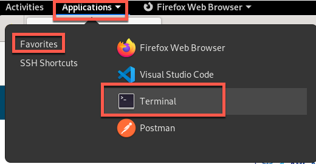
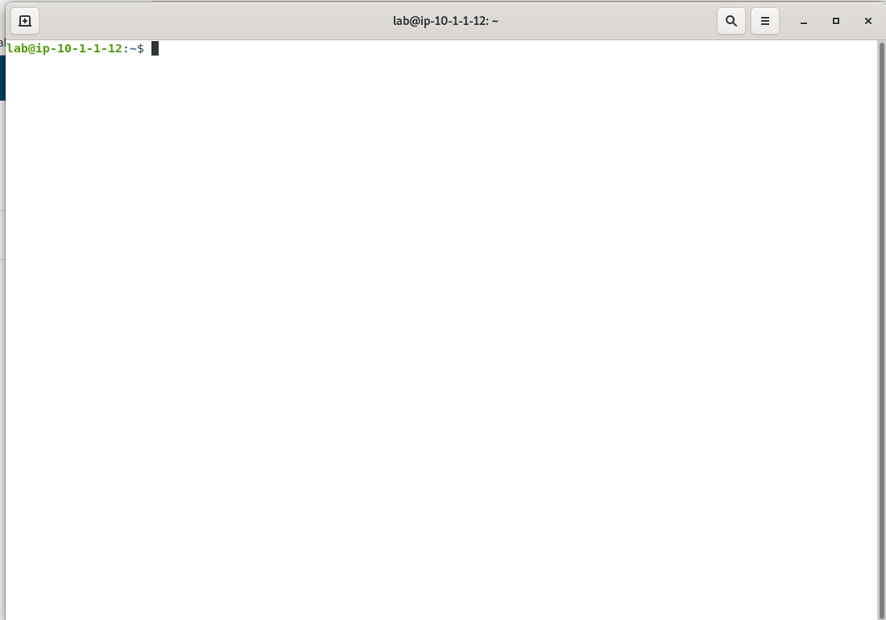
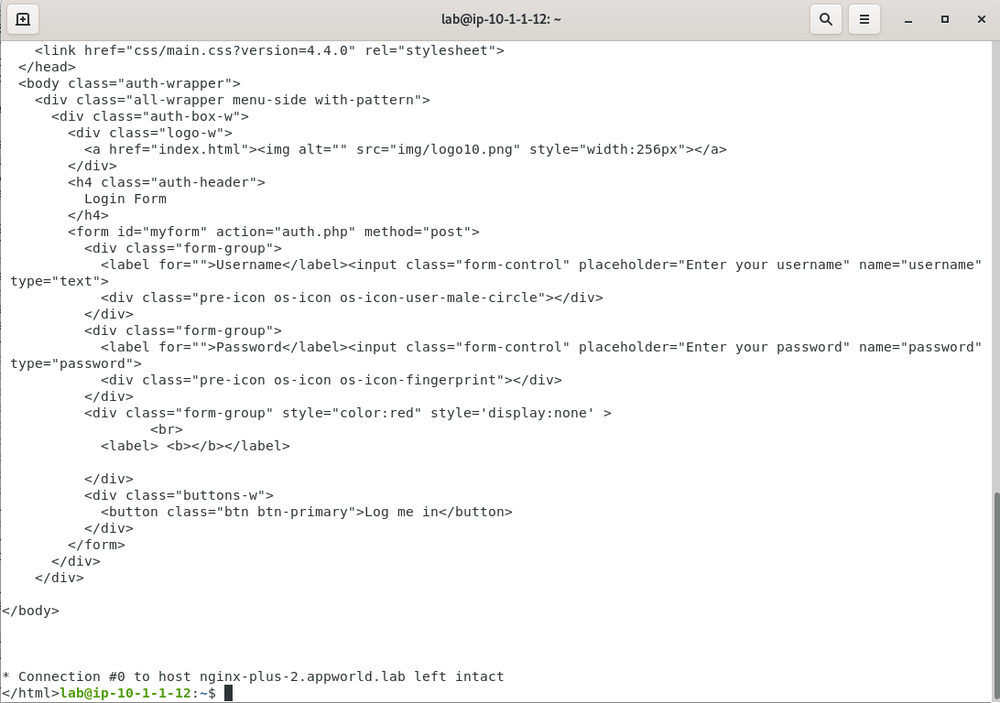

Test a SQL Injection Attack against the Arcadia Finance App
===========================================================

<<<<<<< HEAD
1. Before you enable the App Protect service, attempt a SQL injection attack on the Arcadia Finance app. In your Jump Server RDP session, click **Applications** and then **Terminal**.
=======
1. Before you enable the App Protect service, attempt a SQL injection attack on the Acardia Finance app. In **Firefox**, open a new tab then click on the **Arcadia Finance (DIY)** bookmark or navigate to **https://diy.arcadia-finance.io/**. 
>>>>>>> origin/master

2. In the terminal window that opens, enter the command below.

.. code-block:: bash

   curl -vd POST -kLH "host: diy.arcadia-finance.io" "https://nginx-plus-2.appworld.lab/trading/auth.php" -H 'Sec-Fetch-User: ?1' --data-raw 'username='+or+1=1'--&password='

While your SQL injection was not successful in logging into the system, the attempt was also not blocked. You were just redirected back to the login page. We'll enable the App Protect WAF policy and re-attempt to ensure protection is enforce as you progress through the lab.
