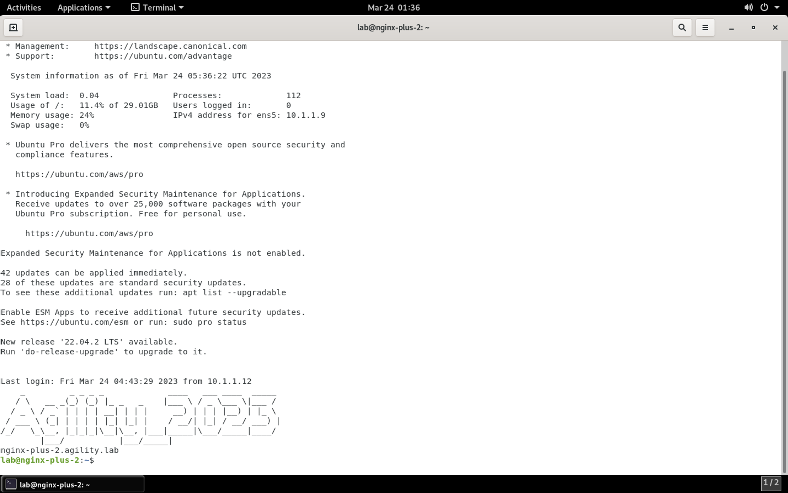
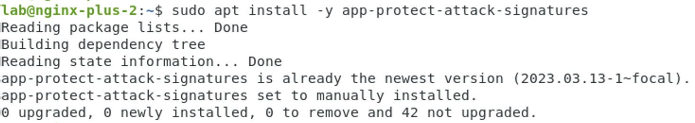
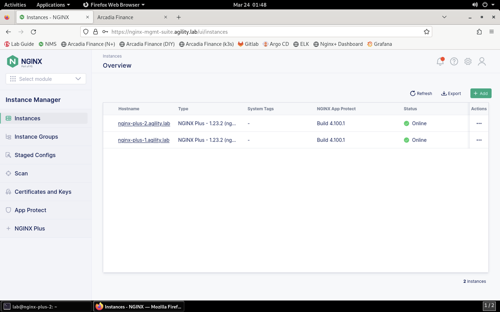
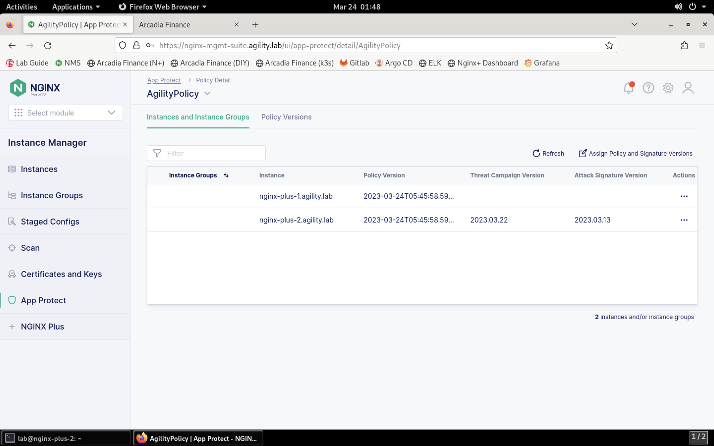

Enable NGINX App Protect Threat Campaigns and Signature Updates
===============================================================

1. Log into the NGINX Plus 2 SSH terminal session.

2. Add NGINX Plus App Protect signatures repository:

.. code-block:: bash

  sudo wget -P /etc/yum.repos.d https://cs.nginx.com/static/files/app-protect-security-updates-7.repo

**Result**

.. image:: images/nap_sec_updates_repo_result.png

3. Install attack signature updates:

.. code-block:: bash
  sudo apt install -y app-protect-attack-signatures

**Result**

4. Install the Threat Campaign package:

Threat Campaigns consist of a constantly updated feed from the F5 Threat Intelligence team. The team identifies threats 24/7 and creates very specific signatures for these current threats. With these specific signatures, there is very low probability of false positives. Unlike signatures, Threat Campaign provides with ruleset. A signature uses patterns and keywords like ' or or 1=1. Threat Campaign uses rules that match perfectly an attack detected by our Threat Intelligence team. Unlike signatures that can generate False Positives due to low accuracy patterns, the Threat Campaigns feature is very accurate and reduces drastically false positives.
  
.. code-block:: bash

  sudo apt install -y app-protect-threat-campaigns

5. Restart NGINX process to apply the new signatures:

.. code-block:: bash

  sudo nginx -s reload

.. note:: The command nginx -s reload is the command that tells nginx to check for new configurations, ensure it is valid, and then create new worker processes to handle new connections with the new configuration. The older worker processes are terminated when the clients have disconnected. This allows nginx to be upgraded or reconfigured without impacting existing connections.

6. Return to Firefox and click on the **NMS** bookmark. Log in using **lab** and **Agility2023!** as the credentials.

7. Click on **App Protect** in the left menubar, then select the **AgilityPolicy**. You'll see that the Threat Campaigns and Attack Signatures columns are populated on NGINX Plus 2.

You've now verified that threat and signature feeds are working. Continue to the next section of the lab.
