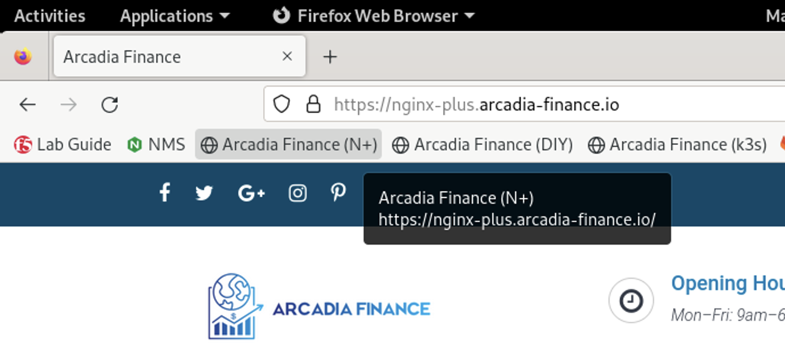

Test a SQL Inject Attack against the Arcadia Finance App
========================================================

1. Before we enable the App Protect service, let's attempt a SQL injection attack on the Acardia Finance app. In **Firefox**, open a new tab then click on the **Arcadia Finance (DIY)** bookmark or navigate to **https://diy.arcadia-finance.io/**. 

2. Click the **Login** button to load the login screen.

3. You will see the **Arcadia Finance** application login screen.

.. image:: images/arcadia_login_prompt.png

4. For the username, type or paste the following value:

.. code-block:: bash

   ' or 1=1--

and click **Log me in**. 

5. You should be immediately returned to the empty login prompt. While our injection was not successful in logging into the system, the attempt was not blocked. We'll enable the App Protect WAF policy and re-attempt to ensure protection is enforce as we progress through the lab.
