Enable NGINX App Protect on the Arcadia Finance App
===================================================

Now you will now enable NGINX App Protect and apply a WAF policy to the Arcadia Finance app.

<<<<<<< HEAD
1. Open **Firefox** and click on the **NIM** bookmark.
=======
.. attention:: The release we've used in the lab, 2.8.0, has a known issue. This issue is fixed in releases 2.9.0 and higher. Due to time restrictions, we were unable to upgrade this lab prior to the event. 
  
  For details on the known-issue, refer to *Precompiled Publication setting is reverted to false after error publishing NGINX App Protect policy* on the `NGINX Management Suite Known Issues <https://docs.nginx.com/nginx-management-suite/nim/releases/known-issues/>`_ page.

1. First, you'll need to address the known-issue in the lab's release of NGINX Management Suite. From the **Applications** menu, click **SSH Shortcuts** and log into **nginx-plus-2**. Issue the following command: 

.. code-block:: bash

  sudo sed -i 's/precompiled_publication: true/precompiled_publication: false/g' /etc/nginx-agent/nginx-agent.conf; sudo systemctl restart nginx-agent; sleep 7; sudo sed -i 's/precompiled_publication: false/precompiled_publication: true/g' /etc/nginx-agent/nginx-agent.conf; sudo systemctl restart nginx-agent

2. Open **Firefox** and click on the  **NMS** bookmark.
>>>>>>> origin/master

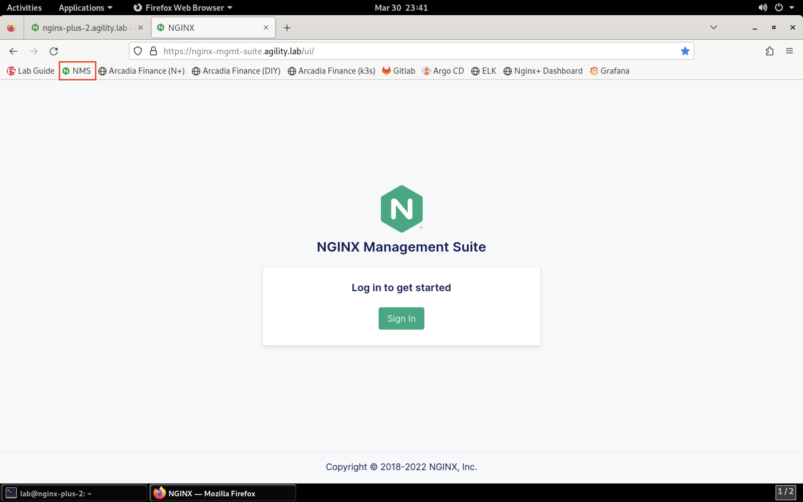

<<<<<<< HEAD
2. Log in using the **lab** / **AppWorld2024!** credentials. Click on the **Instance Manager** tile.
=======
3. Log in using the **lab** / **Agility2023!** credentials. Click on the **Instance Manager** tile.
>>>>>>> origin/master

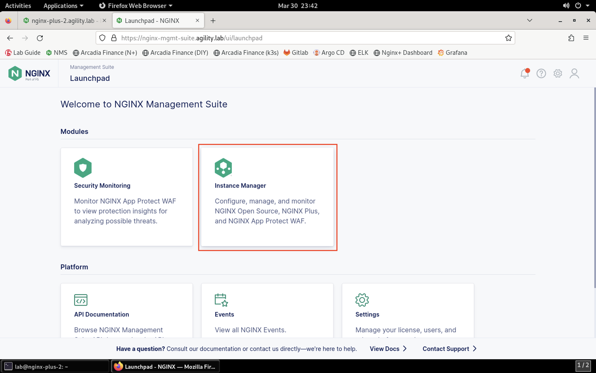

3. Click on **nginx-plus-2.appworld.lab** instance in the list. 

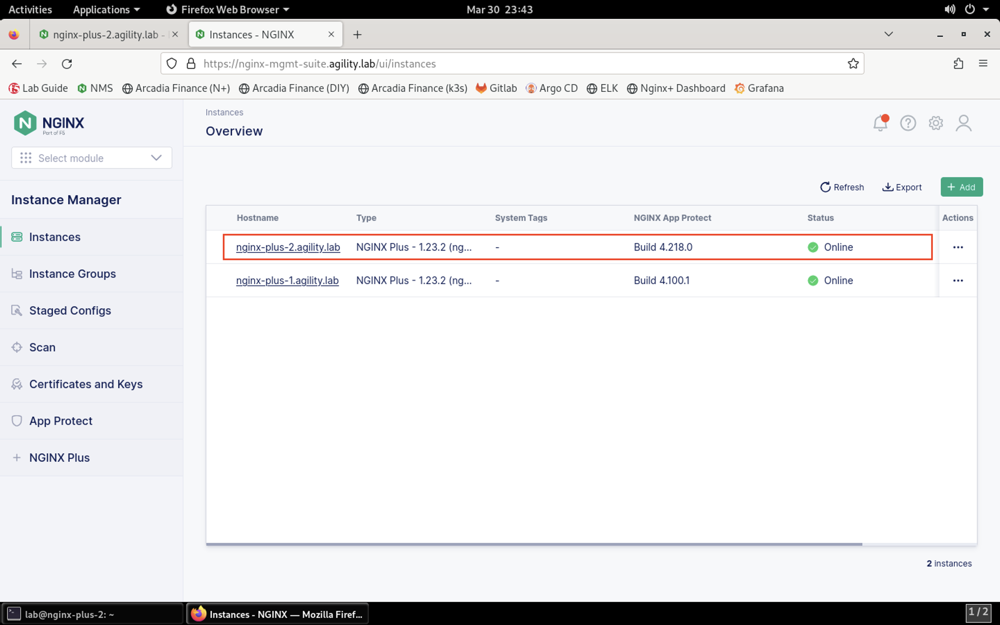

4. Click on the **Edit Config** button. 

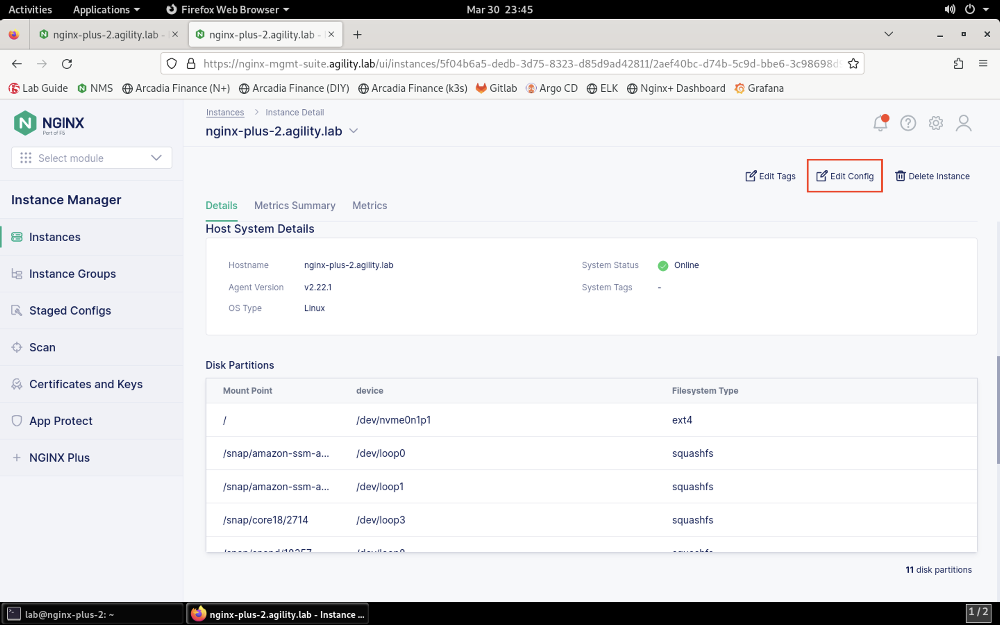

5. Select the **arcadia-financial.conf** file in the navigation pane on the left.

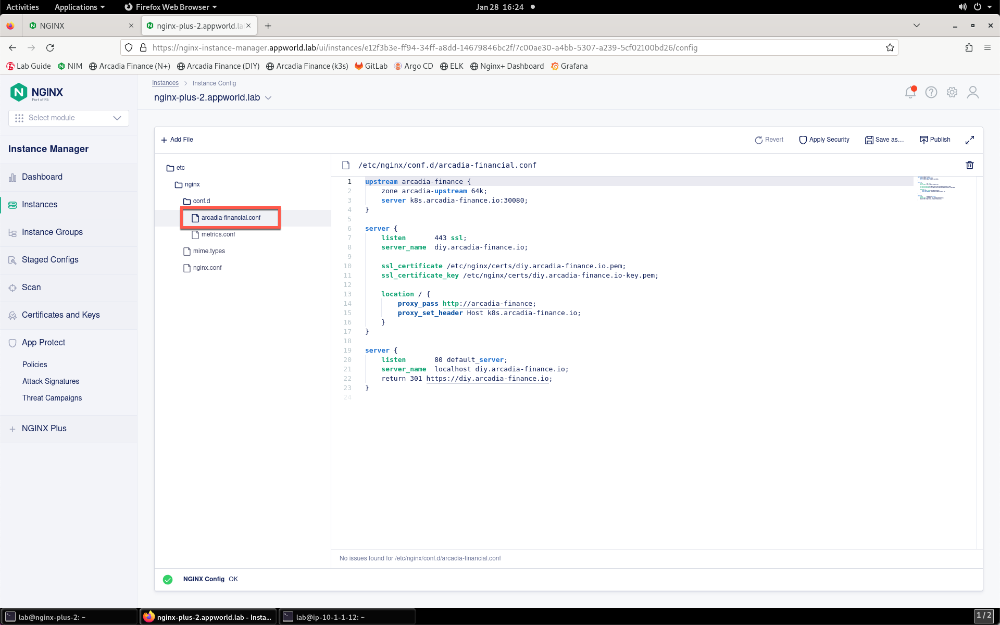

6. Add the following configuration lines to the **server** block that includes the *listen 443 ssl* directive:

.. code-block:: bash

      app_protect_enable on;
      app_protect_policy_file "/etc/nms/AppWorldPolicy.tgz";
      app_protect_security_log_enable on;
      app_protect_security_log "/etc/nms/secops_dashboard.tgz" syslog:server=127.0.0.1:514;

Your screen should look similar to below:

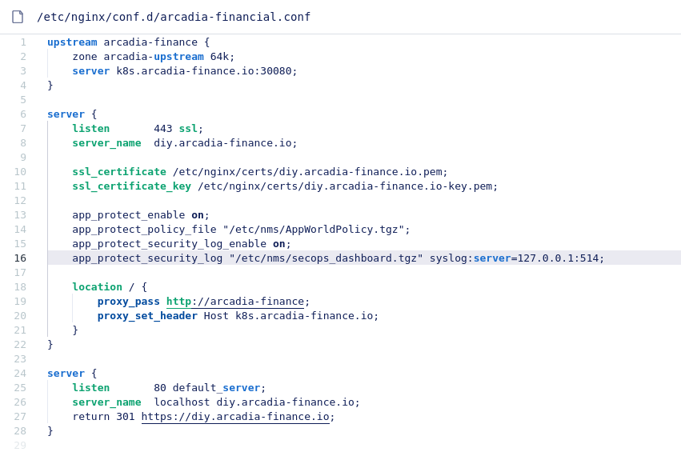

7. Click the **Publish** icon in the toolbar in the file editor.

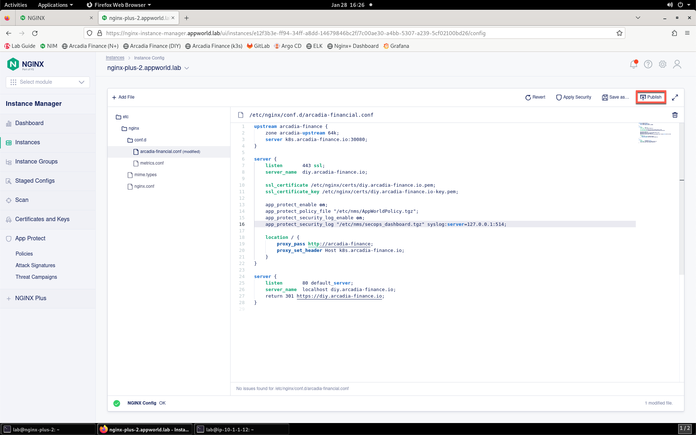

8. You will be presented with a confirmation prompt. Click **Publish** to continue. 

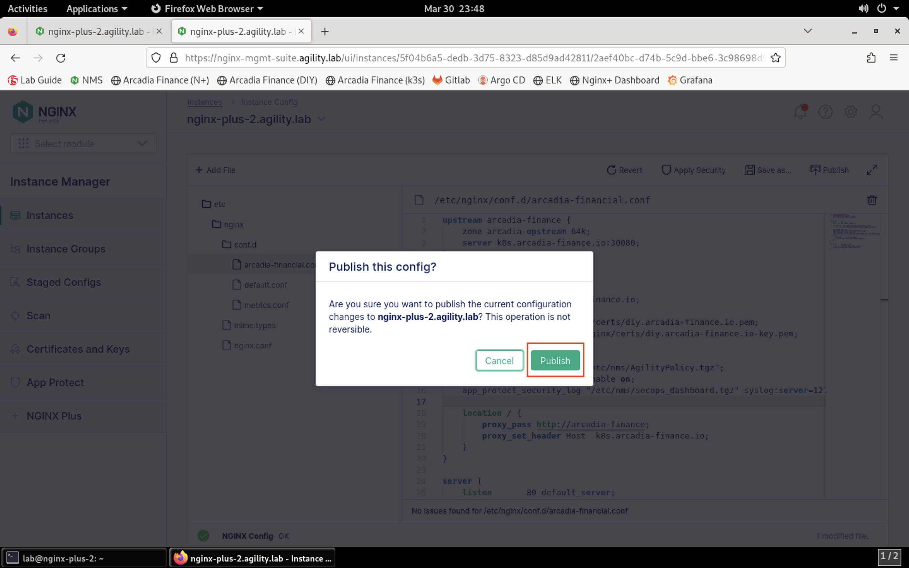

9. After a few moments, you will see a notification that the configuration was successfully published. If the Publish initially fails, please click Publish and confirm publishing again.

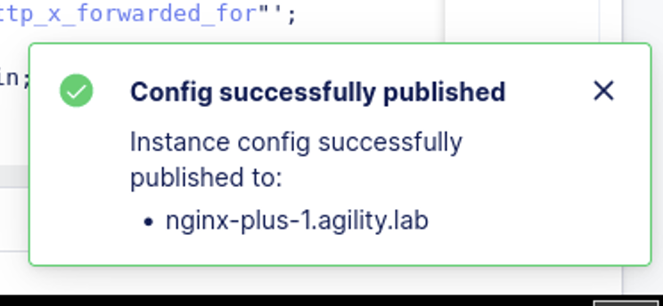

10. Click on **App Protect** **Policies** from the menu. 

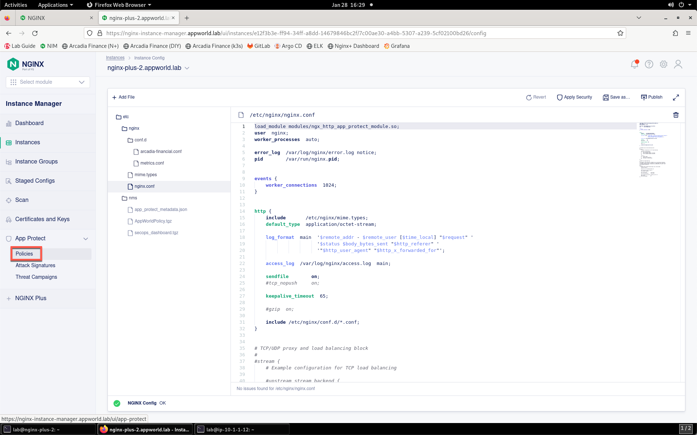

11. On the list of policies, click on the name **AppWorldPolicy**.

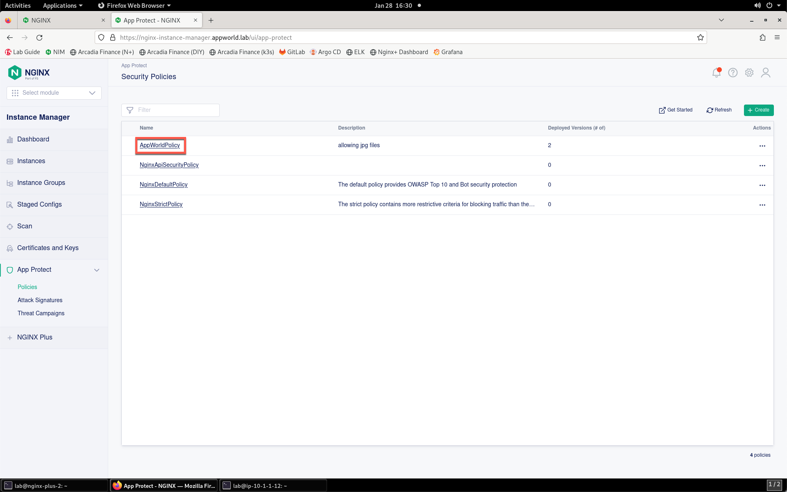

12. On this screen, you can see that the policy is applied.

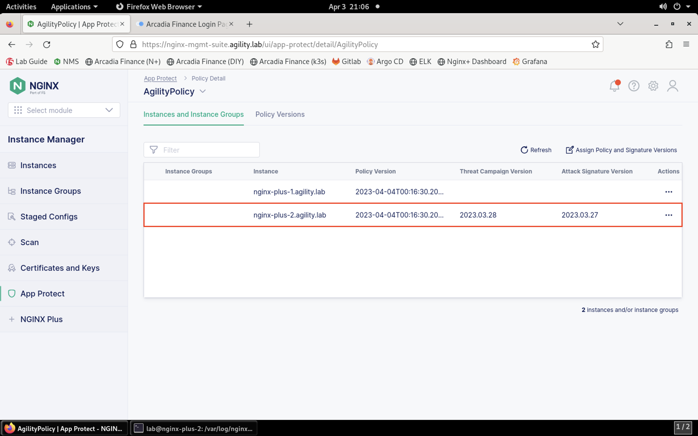
