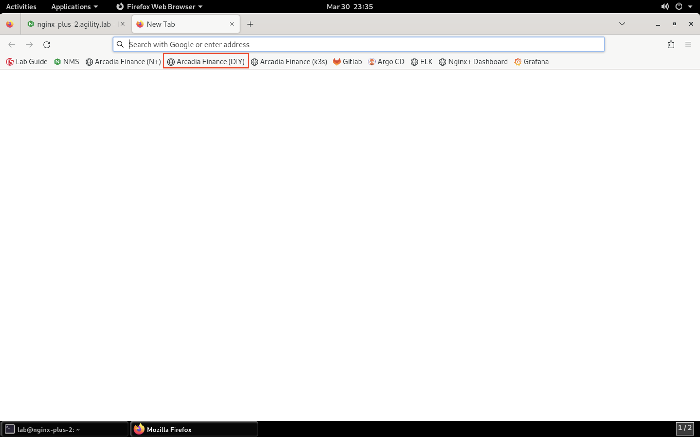

Test a SQL Inject Attack against the Arcadia Finance App
========================================================

1. Before we enable the App Protect service, let's attempt a SQL injection attack on the Acardia Finance app. In Firefox, click on the **Arcadia Finance (DIY)** bookmark or navigate to **https://diy.arcadia-finance.io/**. 

2. Click the **Login** button to load the login screen.

.. image:: images/arcadia_login_prompt.png

3. For the username, paste the following value:

.. code-block:: bash

   ' or 1=1--

and click **Log me in**. 

4. While our injection was not successful, the attempt was not blocked. We'll enable the App Protect WAF policy and re-attempt to ensure protection is enforce as we progress through the lab.
