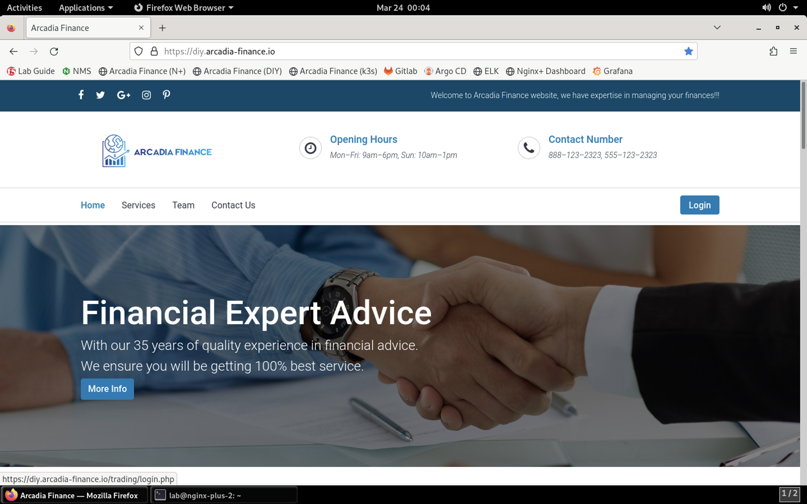
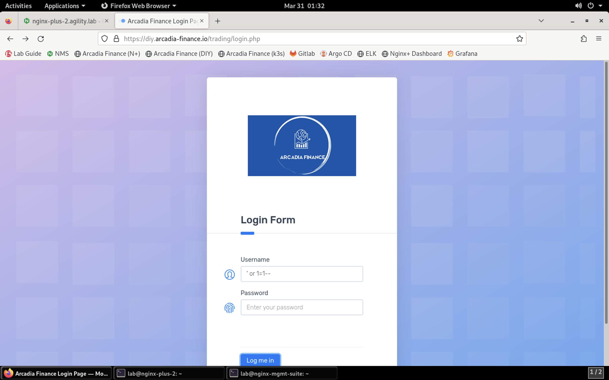
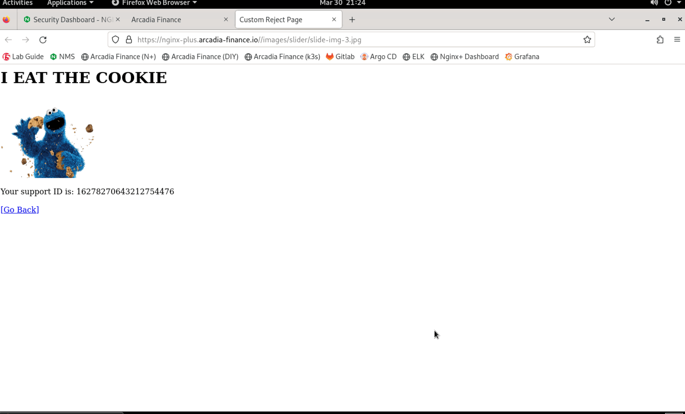
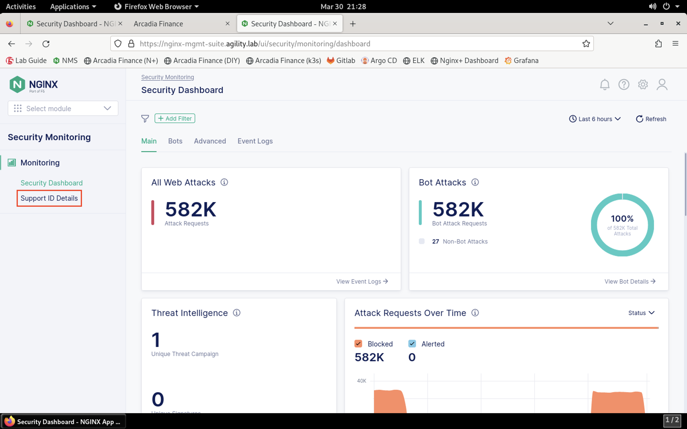
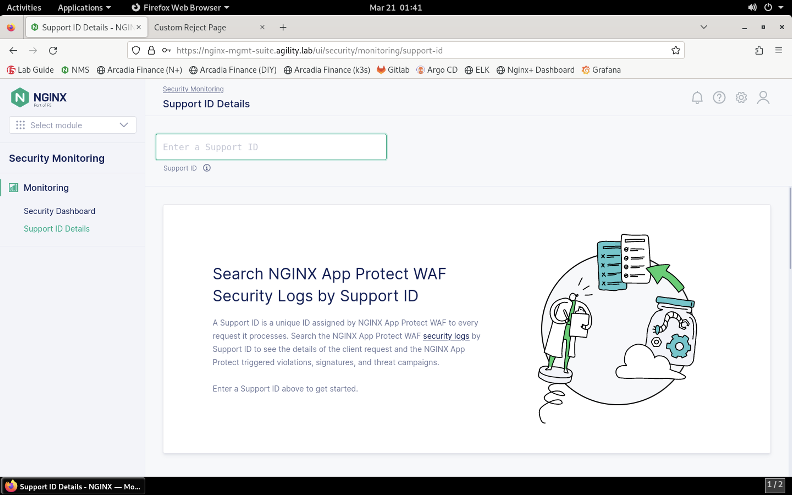

Test the WAF Policy by Replicating the SQL Injection Attack
===========================================================

1. Now that the WAF policy is applied, let's retry the SQL injection attack to see if the attempt is blocked. Click on the **Arcadia Finance (DIY)** bookmark or navigate to https://diy.arcadia-finance.org/.

2. Click the **Login** button to load the login screen.

.. image:: images/arcadia_login_prompt.png

3. For the username, paste the following value:

.. code-block::bash

   ' or 1=1-- '

and click **Log me in**. 

4. You should see the custom block page as shown below, showing that the attempt was blocked. Notice that, once again, a **support ID** is generated when the page loads. **Select and copy this value** so that we can search for it in NMS-SM.

5. Return to NMS and navigate to Security Monitoring by clicking the drop-down in the top left of the screen and selecting **Security Monitoring**.

.. image:: images/NMS-SM-tile.png

6. You'll be presented with the Security Monitoring landing page, as shown below:

.. image:: images/NMS-SM_overview.png

7. On the left menu, select **Support ID Details**. 
    

8.   You'll be prompted for your support ID.

9. Enter your support ID into the search field and click the **arrow** to search.

.. image:: images/NMS-SM_support_id_entry.png

10.  Once the security event has loaded, you can see details surrounding the violation that is blocking images on your app. 

.. image:: images/NMS-SM_support_id_details.png

NGINX App Protect WAF is now enforcing protection for the site. 