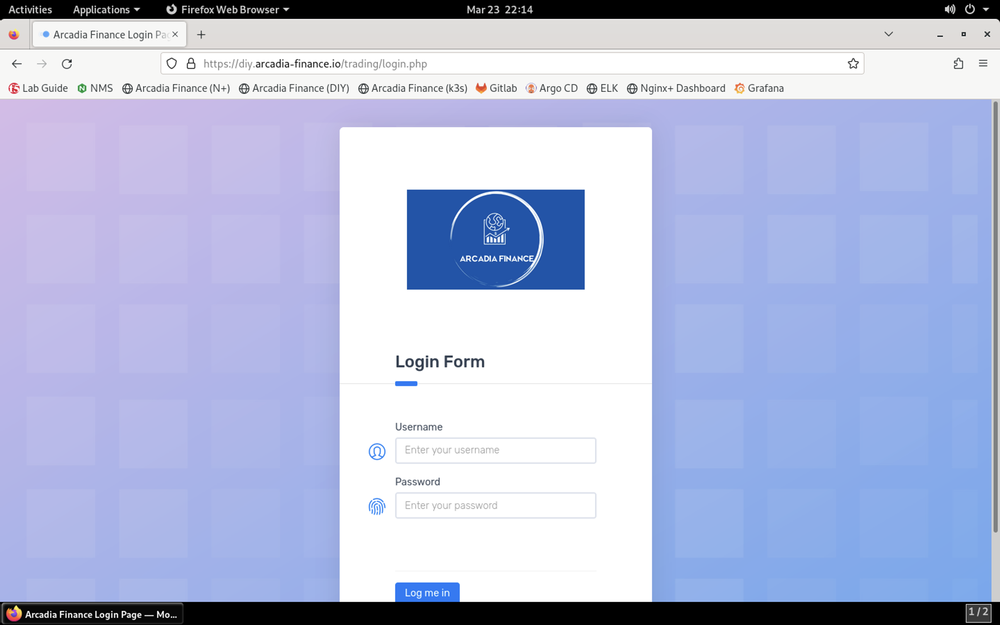
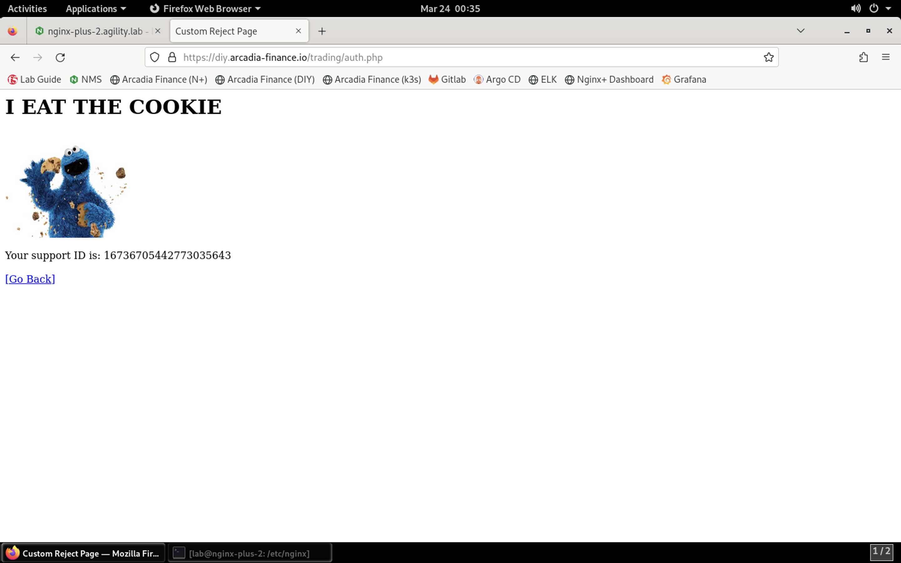

Test the WAF Policy by Replicating the SQL Injection Attack
===========================================================

1. Now that the WAF policy is applied, let's retry the SQL injection attack to see if the attempt is blocked. Click on the **Arcadia Finance (DIY** bookmark or navigate to https://diy.arcadia-finance.org/.

.. image:: images/arcadia_diy.png

#. Click the **Login** button to load the login screen.

#. For the username, paste the following value:

.. code-block:: bash
  ' or 1=1--

and click **Log me in**. You should see the custom block page as shown below, showing that the attempt was blocked.

