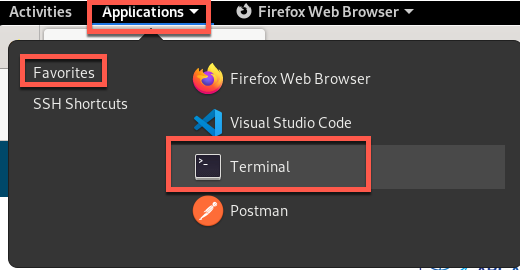
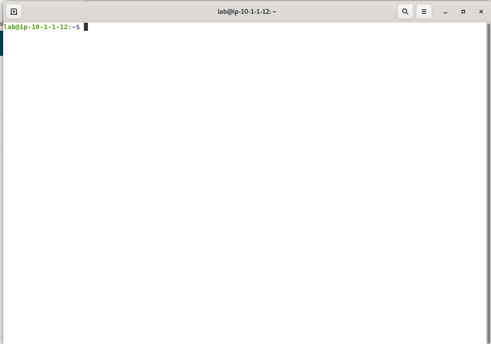
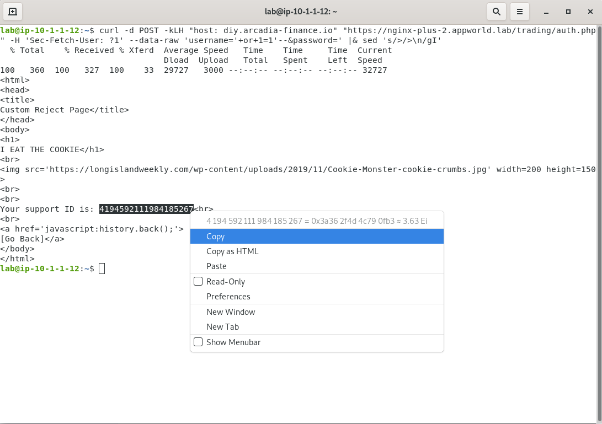
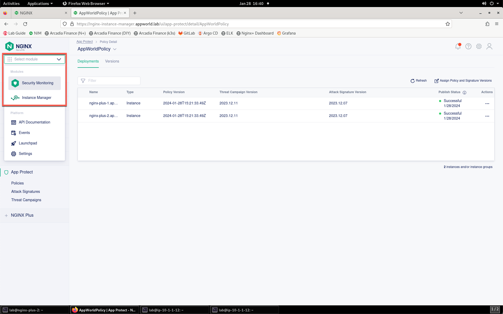
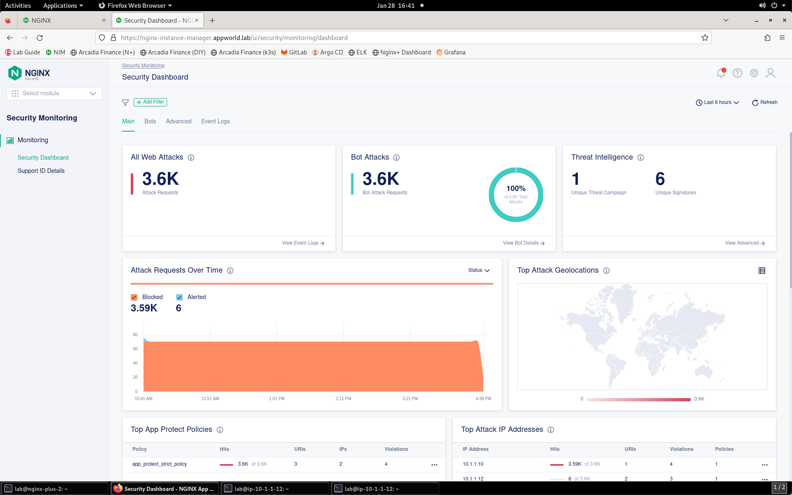
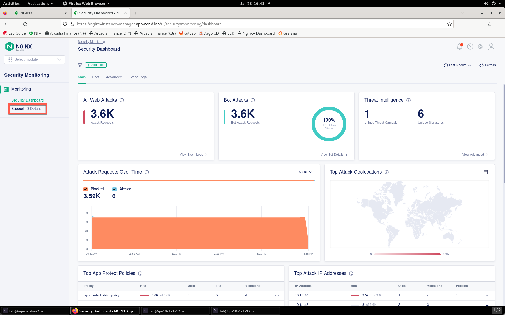
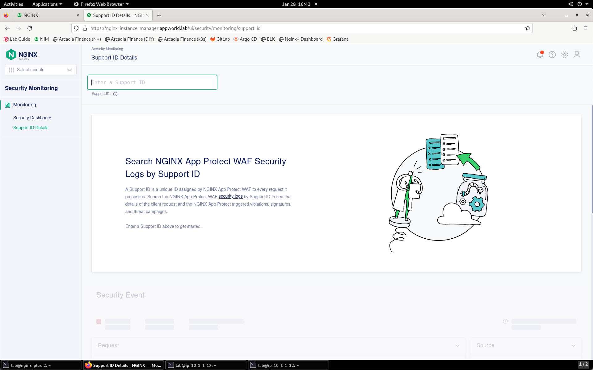
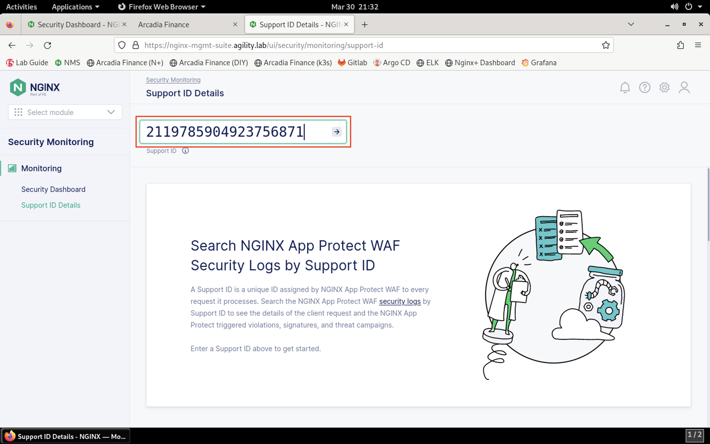
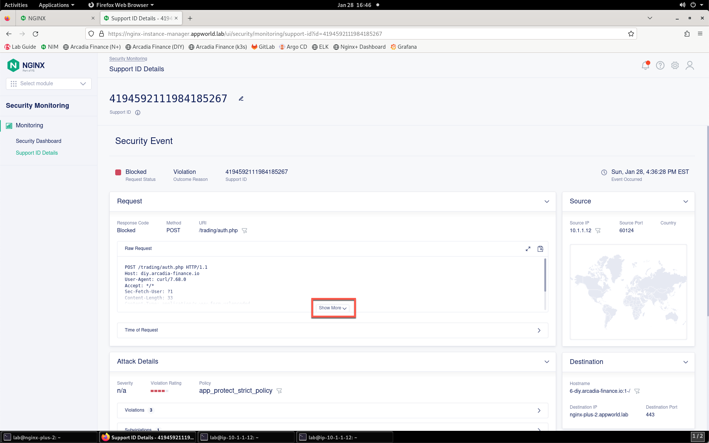
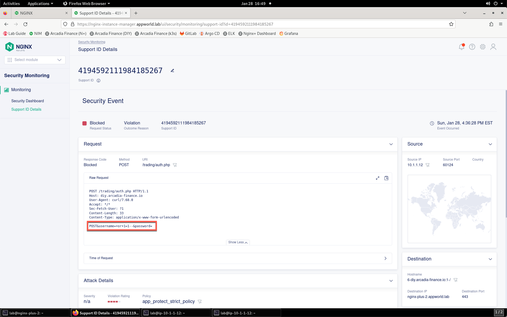

Test the WAF Policy by Replicating the SQL Injection Attack
===========================================================

Now that the WAF policy is applied, retry the SQL injection attack to see if the attempt is blocked.

1. In your Jump Server RDP session, click **Applications** and then **Terminal**.

2. In the terminal window that opens, enter the command below.

.. code-block:: bash

   curl -d POST -kLH "host: diy.arcadia-finance.io" "https://nginx-plus-2.appworld.lab/trading/auth.php" -H 'Sec-Fetch-User: ?1' --data-raw 'username='+or+1=1'--&password=' |& sed 's/>/>\n/gI'

3. As shown below, a support ID is generated when the response is returned. **Select and copy this value** so that you can search for it in SM.

4. Return to NIM and navigate to Security Monitoring by clicking the drop-down in the top left of the screen and selecting **Security Monitoring**.

5. You'll be presented with the Security Monitoring landing page, as shown below.  Please spend a minute or so looking around at the Security Dashboard details while the system processes the attack.

6. On the left menu, select **Support ID Details**. 
    

7. You'll be prompted for your support ID.

8. Enter your support ID into the search field and click the **arrow** to search. If you initially receive an error, wait a few moments and click **Try Again**.

9. Once the security event has loaded, click the **Show More** button to reveal the complete request. You can see details surrounding the violation that is blocking images on your app. 

NGINX App Protect WAF is now enforcing protection for the site.
