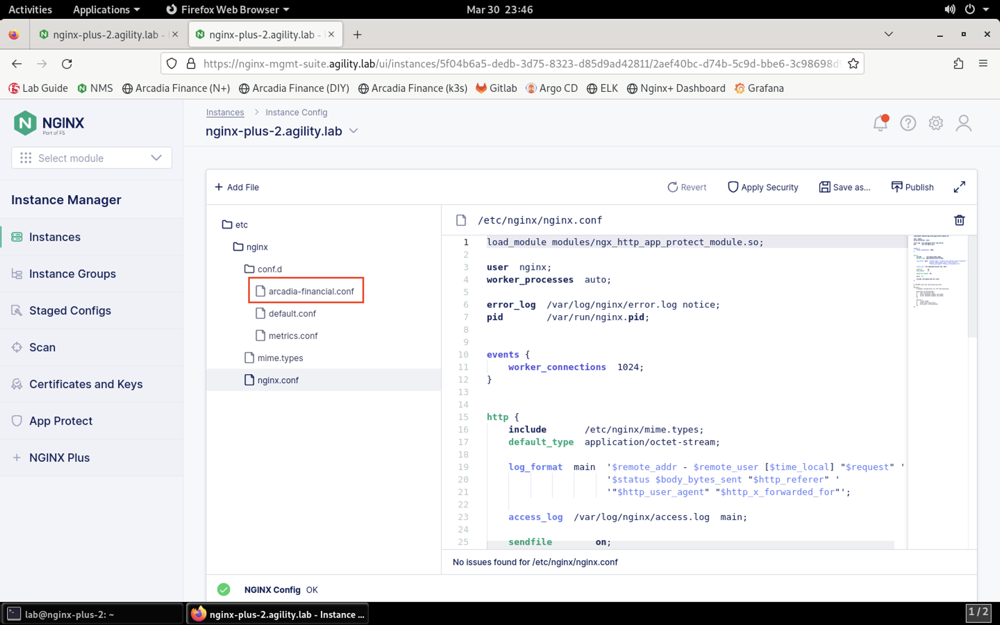
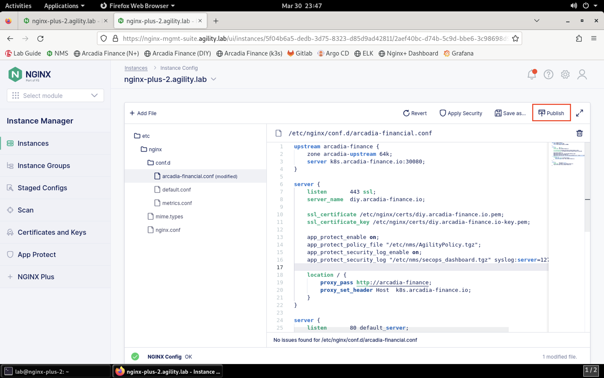

Enable NGINX App Protect on the Arcadia Finance App
===================================================

We will now enable NGINX App Protect and apply a WAF policy to the Arcadia Finance app.

1. Open **Firefox** and click on the  **NMS** bookmark.

.. image:: images/nms_bookmark

2. portal using the username **lab** and password **Agility2023!**.

.. image:: images/nms_dashboard.png

2. Click on **Instance Manager**. You'll see the list of instances managed by NMS.

.. image:: images/nms_instances.png

3. Click on **nginx-plus-2.agility.lab** in the list. 

.. image:: images/nms_instance_detail.png

4. Notice the NGINX App Protect WAF is now enabled.

.. image:: images/nms_app_protect_status.png

5. Click on the **Edit Config** button. 

.. image:: images/nms_instance_edit_config.png

6. Select the **arcadia-financial.conf** file in the navigation pane on the left.

7. Add the following configuration lines to the **server** block:

.. code-block:: bash

  app_protect_enable on;
  app_protect_policy_file "/etc/nms/AgilityPolicy.tgz";
  app_protect_security_log_enable on;
  app_protect_security_log "/etc/nms/secops_dashboard.tgz" syslog:server=127.0.0.1:514;

Your screen should look similar to below:

.. image:: images/modified_arcadia-financial_conf.png

8. Click the **Publish** icon in the toolbar in the file editor.

9. You will be presented with a confirmation prompt. Click **Publish** to continue. 

.. image:: images/publish_confirm.png

10. After a few moments, you will see a notification that the configuration was successfully published:

11. Click on **Instances** in the left menubar to return to the list of instances. Click on **nginx-plus-2** to view the instance details. You should see under the **Last Deployment Details** and **App Protect Details** sections should show the WAF enabled.

.. image:: images/instance_detail_result.png
