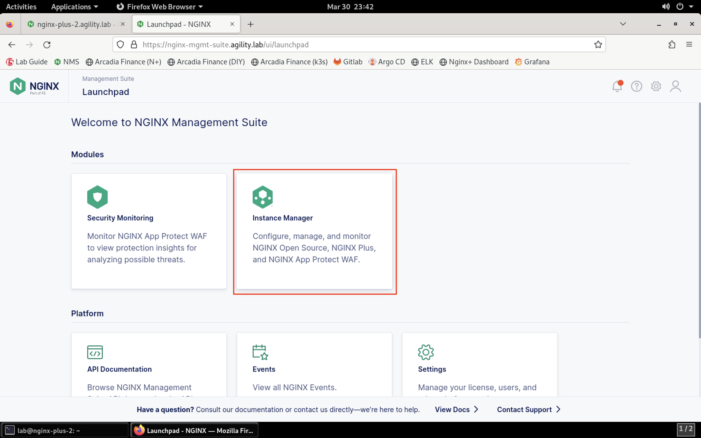
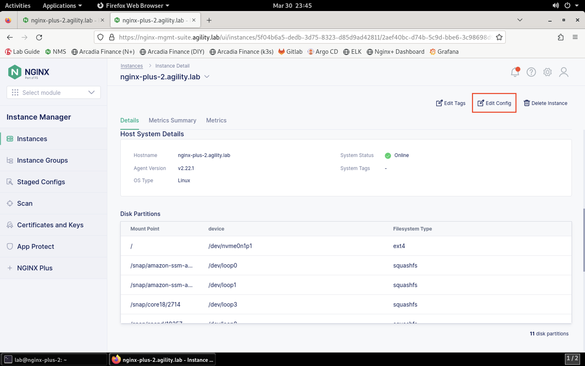

Enable NGINX App Protect on the Arcadia Finance App
===================================================

We will now enable NGINX App Protect and apply a WAF policy to the Arcadia Finance app.

1. Open Firefox and log into the NMS portal using the username **lab** and password **Agility2023!**.

1. Navigate to **Instance Manager** > **Instances**. You'll see the list of instances managed by NMS.

.. image:: images/nms_instances.png

3. Click on **nginx-plus-2.agility.lab** in the list. 

.. image:: images/nms_instance_detail.png

1. Notice the NGINX App Protect WAF is showing as active.

.. image:: images/nms_app_protect_status.png

5. Click on the **Edit Config** button. 

6. Select the **arcadia-financial.conf** file in the navigation pane on the left.

.. image:: images/config_nav_pane.png

7. Add the following configuration lines to the **server** block:

.. code-block:: nginx

    app_protect_enable on;
    app_protect_policy_file "/etc/nms/AgilityPolicy.tgz";
    app_protect_security_log_enable on;
    app_protect_security_log "/etc/nms/secops_dashboard.tgz" syslog:server=127.0.0.1:514;

Your screen should look similar to below:

.. image:: images/modified_arcadia-financial_conf.png

8. Click the **Publish** icon in the toolbar in the file editor.

.. image:: images/publish_btn.png

9. You will be presented with a confirmation prompt. Click **Publish** to continue. 

10. After a few moments, you will see a notification that the configuration was successfully published:

.. image:: images/publish_notification.png

.. warning:: You may encounter an error at this point in the lab.

If you see an error similar to this: 

.. image:: images/nap_JSON_error.png

This is due to a known issue. This is the workaround:

- SSH into **nginx-plus-2** and check if directory **/etc/nms** exists. If the /etc/nms directory doesn’t exist, run the following command to create it:

.. code-block:: bash

    sudo mkdir /etc/nms
    sudo chown root:nginx-agent /etc/nms

- Scroll to the bottom of the NGINX Agent configuration file and change the precompiled_publication setting to false:

.. code-block:: bash

    sudo nano /etc/nginx-agent/nginx-agent.conf

Press **CTRL + X** to save the file, followed by **Y** when asked to save the buffer, then **enter** when asked for the filename. 

- Restart the NGINX Agent:

.. code-block:: bash

    sudo systemctl restart nginx-agent 

- Scroll to the bottom of the NGINX Agent configuration file and change the precompiled_publication setting to true.

.. code-block:: bash

    sudo vi /etc/nginx-agent/nginx-agent.conf

Press **CTRL + X** to save the file, followed by **Y** when asked to save the buffer, then **enter** when asked for the filename. 

- Restart the NGINX Agent:

.. code-block:: bash

    sudo systemctl restart nginx-agent 

.. note:: More information about this known issue can be found at https://docs.nginx.com/nginx-management-suite/nim/releases/known-issues/

11. If you had to incorporate the workaround, make sure you added the following lines to the **arcadia-finance.conf** file afterwards:

.. code-block:: nginx
    
    app_protect_enable on;
    app_protect_policy_file "/etc/nms/AgilityPolicy.tgz";
    app_protect_security_log_enable on;
    app_protect_security_log "/etc/nms/secops_dashboard.tgz" syslog:server=127.0.0.1:514;

12.   Click on **Instances** in the left menubar to return to the list of instances. Click on **nginx-plus-2** to view the instance details. You should see under the **Last Deployment Details** and **App Protect Details** sections should show the WAF enabled.

.. image:: images/instance_detail_result.png

Continue to the next portion of the lab. 