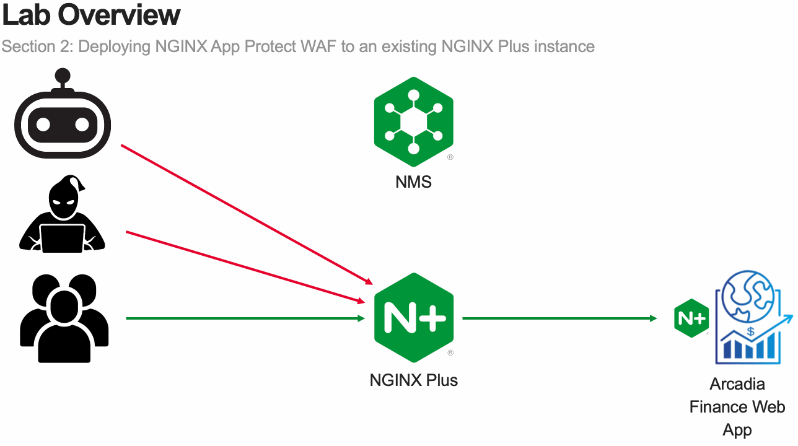

Module 2 - Protect the Arcadia Finance App with NGINX App Protect WAF
=====================================================================

In this module, you will deploy NGINX App Protect WAF on an existing NGINX Plus instance.

.. note:: The goal of this module is to provide familiarity with the process of adding NGINX App Protect WAF to an existing application.

.. toctree::
   :caption: Content:
   :maxdepth: 1
   :glob:

   lab*/lab*
   recap
