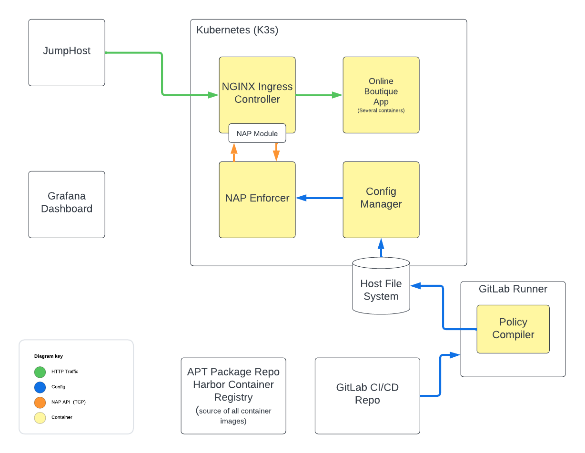

Module 2: NGINX App Protect 5 in a Kubernetes Cluster
-------------------------------------------

In this lab, we will install NGINX Ingress Controller (NIC), including
the enterprise-grade NGINX Plus. Additionally, we will deploy NGINX App
Protect WAF, version 5 to integrate with NIC. This deployment will be
configured to protect the Online Boutique application. This application
has already been installed in the Kubernetes cluster for you.

   Kubernetes Lab Scenario

Inspect the Cluster
~~~~~~~~~~~~~~~~~~~

Inspect the Online Boutique Application
^^^^^^^^^^^^^^^^^^^^^^^^^^^^^^^^^^^^^^^

1. In UDF, open a **Web Shell** session to the **K3s VM** component.

   .. figure:: images/k3s-vm-webshell-access.png
      :alt: K3s VM Web Shell access method

      K3s VM Web Shell access method

      And then log in as the **ubuntu** user by typing: 

   .. code:: shell

      su - ubuntu

   Alternatively, you can use the **Visual Studio Code** access method:

   .. figure:: images/k3s-vm-vscode-access.png
      :alt: K3s VM Web Shell access method

      K3s VM Visual Studio Code access method

   If using Visual Studio Code, press `CTRL + ~` to open a terminal. It should already be logged in as the **ubuntu** user.

2. Use ``kubectl`` to show the pods in the cluster running in the
   default namespace:

   .. code:: shell

      kubectl get pods

   It will show output similar to the following:

   .. code:: shell

      NAME                                     READY   STATUS    RESTARTS       AGE
      productcatalogservice-7b8f994b95-pcgmp   1/1     Running   6 (141m ago)   3d5h
      redis-cart-57bc6dc4fc-vgkxj              1/1     Running   6 (141m ago)   3d5h
      shippingservice-5bff5fcbbc-pfckm         1/1     Running   6 (141m ago)   3d5h
      checkoutservice-599d89fc57-5g6vk         1/1     Running   6 (141m ago)   3d5h
      paymentservice-7cc9f766f5-fz5j2          1/1     Running   6 (141m ago)   3d5h
      loadgenerator-66dd46bc94-999d6           1/1     Running   6 (141m ago)   3d5h
      recommendationservice-7d9d8b4c7f-qtfmb   1/1     Running   6 (141m ago)   3d5h
      emailservice-5f55cf4ff5-n756v            1/1     Running   6 (141m ago)   3d5h
      frontend-64fb4f9dfc-btztg                1/1     Running   6 (141m ago)   3d5h
      currencyservice-7f7bd7fdb5-fmf26         1/1     Running   6 (141m ago)   3d5h
      cartservice-64d6456888-6z5mh             1/1     Running   6 (141m ago)   3d5h
      adservice-654cf865cf-lp2w7               1/1     Running   6 (141m ago)   3d5h

The pods contain the microservices of the Online Boutique application
which has already been installed in the cluster for you. This is the
application we will be protecting with NGINX App Protect WAF 5.

1. Use ``kubectl`` to list the existing Services in the cluster
   configured in the default namespace:

   .. code:: shell

      kubectl get services

   You will see a list of Service similar to the following:

   .. code:: shell

      NAME                    TYPE           CLUSTER-IP      EXTERNAL-IP   PORT(S)        AGE
      kubernetes              ClusterIP      10.43.0.1       <none>        443/TCP        3d7h
      adservice               ClusterIP      10.43.84.49     <none>        9555/TCP       3d5h
      cartservice             ClusterIP      10.43.98.88     <none>        7070/TCP       3d5h
      currencyservice         ClusterIP      10.43.121.160   <none>        7000/TCP       3d5h
      shippingservice         ClusterIP      10.43.233.12    <none>        50051/TCP      3d5h
      checkoutservice         ClusterIP      10.43.90.3      <none>        5050/TCP       3d5h
      frontend                ClusterIP      10.43.100.205   <none>        80/TCP         3d5h
      productcatalogservice   ClusterIP      10.43.6.86      <none>        3550/TCP       3d5h
      recommendationservice   ClusterIP      10.43.82.137    <none>        8080/TCP       3d5h
      redis-cart              ClusterIP      10.43.119.38    <none>        6379/TCP       3d5h
      emailservice            ClusterIP      10.43.46.208    <none>        5000/TCP       3d5h
      paymentservice          ClusterIP      10.43.74.73     <none>        50051/TCP      3d5h
      frontend-external       LoadBalancer   10.43.119.122   10.1.1.7      80:30783/TCP   3d5h

   Notice the ``frontend-external`` service of type ``LoadBalancer``.
   When the Online Boutique application was installed, it created this
   service to expose the web application to clients outside the cluster.
   We will be updating this service to a type of ``ClusterIP`` so we can
   later create a service of type ``LoadBalancer`` that exposes the
   NGINX OSS pod we will be deploying.

2. Run the following to open the ``frontend-service`` resource in your editor of choice.
   For example:

   .. code:: shell

      EDITOR=nano kubectl edit service frontend-external

   Or with Visual Studio Code: 

   .. code:: shell

      EDITOR="code -w -" kubectl edit service frontend-external

3. Change ``type: LoadBalancer`` to ``type: ClusterIP``.

4. Save and exit the editor.

5. Run the following to confirm that the ``frontend-external`` service
   has changed to type ``ClusterIP`` and no longer has an
   ``EXTERNAL-IP``:

   .. code:: shell

      kubectl get service frontend-external

   Output:

   .. code:: shell

      NAME                TYPE        CLUSTER-IP      EXTERNAL-IP   PORT(S)   AGE
      frontend-external   ClusterIP   10.43.119.122   <none>        80/TCP    12m

Inspect the NGINX App Protect WAF and NGINX Ingress Controller Images
~~~~~~~~~~~~~~~~~~~~~~~~~~~~~~~~~~~~~~~~~~~~~~~~~~~~~~~~~~~~~~~~~~~~~

As a reminder, in this lab we will be deploying images contained in a
local registry rather than the official private NGINX image registry.
The images you will use have already been pushed to your local Harbor
image registry.

1. In the lab’s **Firefox**, click on the **Lab Links** tab.

2. Click the **Harbor** link.

   .. figure:: images/harbor-lab-link.png
      :alt: Harbor lab link

      Harbor lab link

3. Use ``admin`` and ``Harbor12345`` to log into the image registry.

   .. figure:: images/harbor-login.png
      :alt: Harbor login

      Harbor login

4. A ``nap`` project has been created to contain the App Protect images.
   Click this link.

   .. figure:: images/harbor-nap-project.png
      :alt: Harbor nap project

      Harbor nap project

5. Note there are 4 container images:

   -  ``app-protect-tools`` - A utility container used to export
      signatures for the Dashboard in this lab. You will not be
      interacting with this image in the lab.
   -  ``waf-compiler-custom`` - The WAF policy compiler. This image is
      responsible for converting JSON policy files and signature sets
      into policy bundles that the enforcer makes use of. The GitLab
      CI/CD pipeline we used earlier in this lab uses this image.
   -  ``waf-config-mgr`` - The configuration management image. This
      image is responsible for (TBD: complete this). This image is
      provided in the official NGINX private repo, but has been provided
      here for you.
   -  ``waf-enforcer`` - The WAF enforcement engine. This image is
      responsible for (TBD: complete this). This image is provided in
      the official NGINX private repo, but has been provided here for
      you.

   .. figure:: images/harbor-nap-images.png
      :alt: Harbor NAP images

      Harbor NAP images

6. Click the ``< Projects`` link to go back to the Projects menu.

7. A ``nginx-ic-nap-v5`` project has been created to contain the NIC
   images. Click this link.

   .. figure:: images/harbor-nginx-ic-nap-v5-project.png
      :alt: Harbor nginx-ic-nap-v5 project

      Harbor nginx-ic-nap-v5 project

8. There is one container image in this project:

   -  ``nginx-plus-ingress`` - NGINX Ingress Controller, NGINX Plus, and
      the NGINX App Protect 5 NGINX module.

   .. figure:: images/harbor-nginx-ic-nap-v5-images.png
      :alt: Harbor NGINX Ingress Controller images

      Harbor NGINX Ingress Controller images

You will be using `Helm <https://helm.sh/>`__, a package manager for
Kubernetes, to deploy all of these images for you. Let’s get started on
that.

Deploy NGINX Ingress Controller and NGINX App Protect WAF to Kubernetes
~~~~~~~~~~~~~~~~~~~~~~~~~~~~~~~~~~~~~~~~~~~~~~~~~~~~~~~~~~~~~~~~~~~~~~~

1. Return to your Web Shell session for the **K3s** VM.

2. In the ubuntu user’s home directory, switch to the
   ``nginx-ingress-nap5`` directory:

   .. code:: shell

      cd ~/nginx-ingress-nap5

   This directory contains a custom helm chart that creates a
   host-mounted volume to present the NAP policy bundle to the WAF
   enforcer running in Kubernetes, then installs NIC.

3. In the ``templates`` folder, inspect the ``nap5-storage.yaml`` file
   in your preferred editor.

   This ``PersistentVolume`` and ``PersistentVolumeClaim`` will be
   utilized to provide the App Protect WAF containers access to the
   security policy bundles.

      Note: For simplicity in this lab, we’re using a hostPath backed
      persistent volume claim, which generally is not a preferred
      practice in production Kubernetes cluster.

4. Open the ``values.yaml`` file in an editor. This file contains only a
   minimal number of parameters that need to be specified to install NIC
   with NAP WAF 5. We have customized the values file to:

   -  Enable NAP WAF 5
   -  Specify a private image registry to pull from including image
      names and tags
   -  Volumes required for the general operation of NAP WAF, and for the
      location of the policy bundle
   -  An external IP that NIC will effectively listen on for requests

5. Install NGINX Ingress Controller from Helm chart into the
   ``nginx-ingress`` namespace:

   .. code:: shell

      helm install nginx-ingress -n nginx-ingress --create-namespace .

   When the installation is complete you will see:

   .. code:: shell

      NAME: nginx-ingress
      LAST DEPLOYED: Thu Oct  3 15:08:00 2024
      NAMESPACE: nginx-ingress
      STATUS: deployed
      REVISION: 1
      TEST SUITE: None

6. Use ``kubectl`` to show the pods in the cluster running in the
   nginx-ingress namespace:

   .. code:: shell

      kubectl get pods -n nginx-ingress

   Output:

   .. code:: shell

      NAME                                        READY   STATUS             RESTARTS      AGE
      nginx-ingress-controller-65c8bbc79c-q9hfb   2/3     CrashLoopBackOff   4 (34s ago)   5m14s

   ..

      Note: The deployment may show ``CrashLoopBackOff`` with only 2 out
      of 3 containers available. This means the ``waf-enforcer``
      container isn’t starting because there is no policy bundle
      deployed. If this is the case, it will be resolved once you deploy
      a policy.

Deploy a Virtual Server Resource
~~~~~~~~~~~~~~~~~~~~~~~~~~~~~~~~

NIC includes a custom resource called a ``VirtualServer`` that we will
use to route traffic to the Online Boutique application, while
protecting it with NAP WAF.

1. Change to the home directory:

   .. code:: shell

      cd ~

2. Create a file called ``vs-online-boutique.yaml`` with the following
   contents:

   .. code:: yaml

      apiVersion: k8s.nginx.org/v1
      kind: VirtualServer
      metadata:
        name: vs-online-boutique
      spec:
        host: k3s.f5demos.com
        tls:
          secret: nginx-tls
        policies:
          - name: waf-policy
        upstreams:
          - name: online-boutique
            service: frontend-external
            port: 80
            tls:
              enable: false
        routes:
          - path: /
            action:
              pass: online-boutique

   This resource will route all requests to **k3s.f5demos.com** to the
   Online Boutique application. Note that a tls secret and waf policy
   are attached. The tls secret has already been created for you. You
   will build the waf policy next.

3. Save the file.

4. Create a file called ``waf-policy.yaml`` with the following contents:

   .. code:: yaml

      apiVersion: k8s.nginx.org/v1
      kind: Policy
      metadata:
        name: waf-policy
      spec:
        waf:
          enable: true
          apBundle: "nap5_policy.tgz"
          securityLogs:
            - enable: true
              apLogBundle: "nap5_log_profile.tgz"
              logDest: "syslog:server=10.1.1.9:8515"

5. Save the file.

6. Deploy the ``Policy`` and ``VirtualServer`` resources to the default
   namespace:

   .. code:: shell

      kubectl apply -f waf-policy.yaml -f vs-online-boutique.yaml

   The output of this command should be the following:

   .. code:: shell

      policy.k8s.nginx.org/waf-policy created
      virtualserver.k8s.nginx.org/online-boutique created

Verify Deployment
~~~~~~~~~~~~~~~~~

1. Check the status of the deployment:

   .. code:: shell

      kubectl get virtualserver vs-online-boutique

   If successfully deployed, you should see an output similar to the
   following:

   .. code:: shell

      NAME                 STATE   HOST              IP         PORTS      AGE
      vs-online-boutique   Valid   k3s.f5demos.com   10.1.1.7   [80,443]   27s

   You might need to wait a few minutes for the virtual server to get an IP address.
 
2. Now that our Virtual Server and NAP WAF policy are deployed, let’s
   revisit the health of the pods in the NIC deployment:

   .. code:: shell

      kubectl get pods -n nginx-ingress

   Output:

   .. code:: shell

      NAME                                        READY   STATUS    RESTARTS        AGE
      nginx-ingress-controller-65c8bbc79c-6bx8d   3/3     Running   3 (9m27s ago)   12m

   Note that all 3 containers in the NIC deployment are running.

Test the Online Boutique Application
~~~~~~~~~~~~~~~~~~~~~~~~~~~~~~~~~~~~

1. In the lab’s **Firefox**, click on the **Lab Links** tab.

2. Click the **NAP 5 Kubernetes** link.

   .. figure:: images/k8s-lab-link.png
      :alt: Kubernetes lab link

      Kubernetes lab link

   The Online Boutique application will display.

   .. figure:: images/online-boutique.png
      :alt: Online Boutique application

      Online Boutique application

3. Append ``//etc/passwd`` to the URL and press enter to trigger an
   execution attempt violation.

4. You should be presented with the block page we customized earlier in
   the lab. *Why?* Because the GitLab CI/CD pipeline compiled the policy
   and deployed it to both the VM-based and NIC w/App Protect 5
   instances earlier in this lab.

View Security Events of the Online Boutique Application
~~~~~~~~~~~~~~~~~~~~~~~~~~~~~~~~~~~~~~~~~~~~~~~~~~~~~~~

1. In the lab’s **Firefox**, click on **Grafana Dashboard** tab.

2. Navigate to the **NGINX NAP Main
   Dashboard**.

   .. figure:: images/dashboard-browse.png
      :alt: Grafana time filter dialog

   .. figure:: images/dashboard-general-nav.png
      :alt: Grafana time filter dialog

3. Click the time range button up in the top right portion of the
   screen, select **Last 5 minutes**, then click the refresh icon just
   to the right of it.

   .. figure:: images/dashboard-time-filter.png
      :alt: Grafana time filter dialog

4. Scroll down the dashboard and you should see the new attack attempts.

   .. figure:: images/dashboard-execution-sigs.png
      :alt: Grafana execution attempt signatures

OPTIONAL - Modify the Security Policy
~~~~~~~~~~~~~~~~~~~~~~~~~~~~~~~~~~~~~

If time permits, go back into GitLab and make a valid change of your
choosing to the security policy. The policy will be compiled, deployed
to the host file system of the k3s cluster, and will trigger a restart
of the deployment rollout for you.

Summary
~~~~~~~

This lab provided you a brief introduction to the value of NGINX App
Protect 5, as well as multiple deployment options. For more information
about NGINX App Protect 5 including additional deployment scenarios,
consult the `official
documentation <https://docs.nginx.com/nginx-app-protect-waf/>`__ once
generally available.
