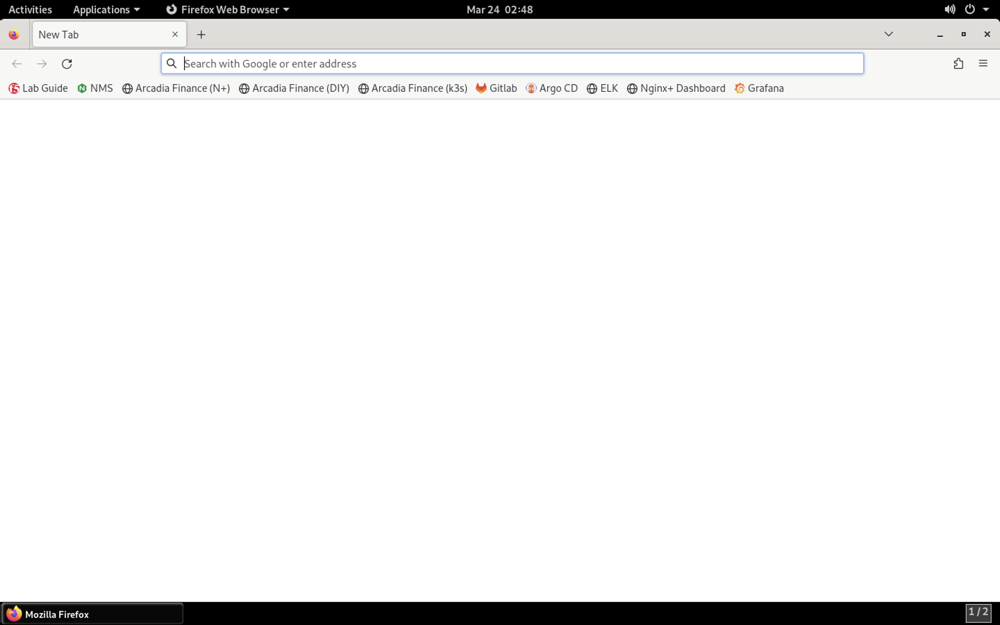
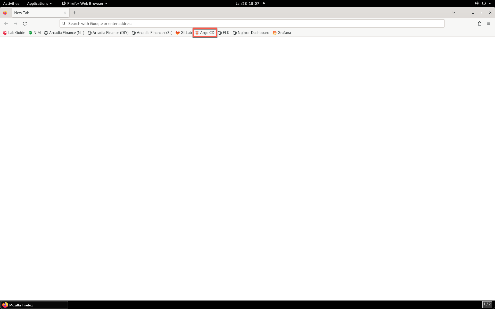
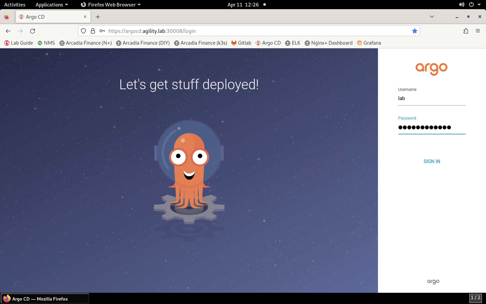
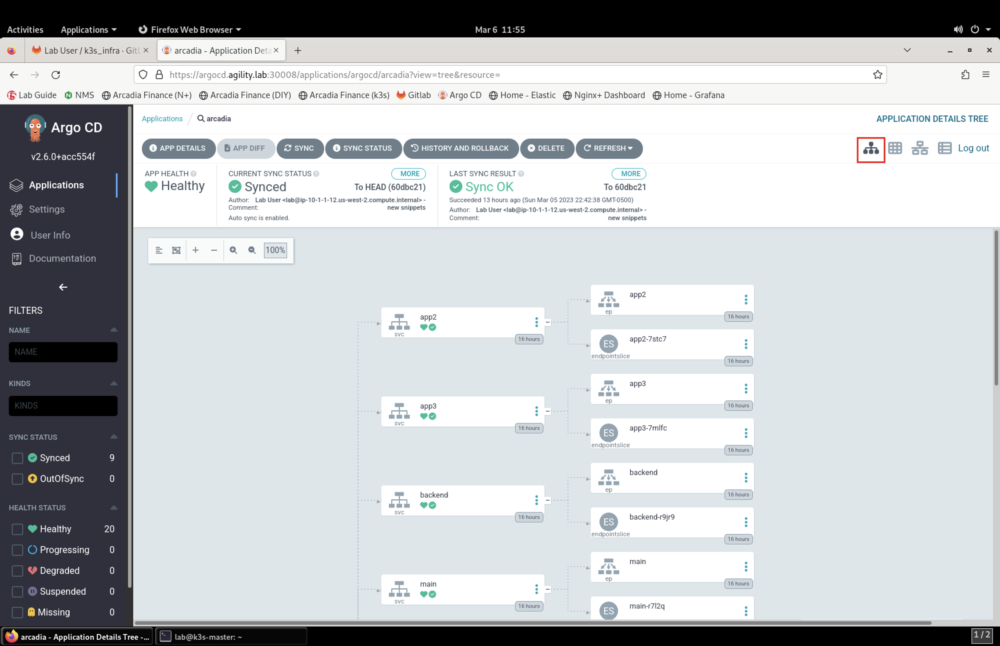
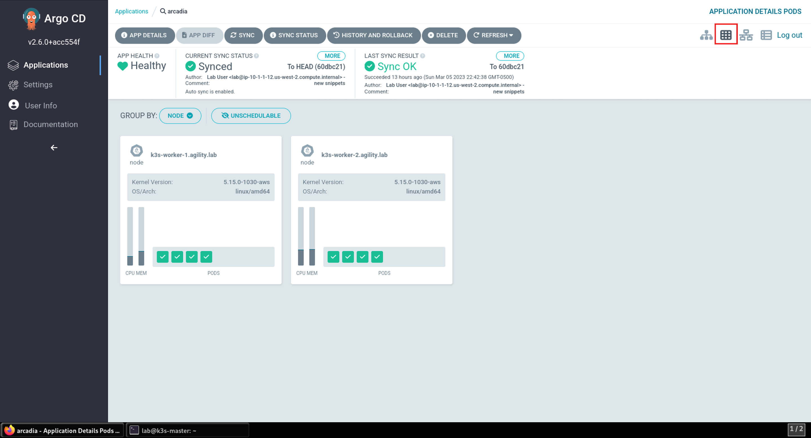
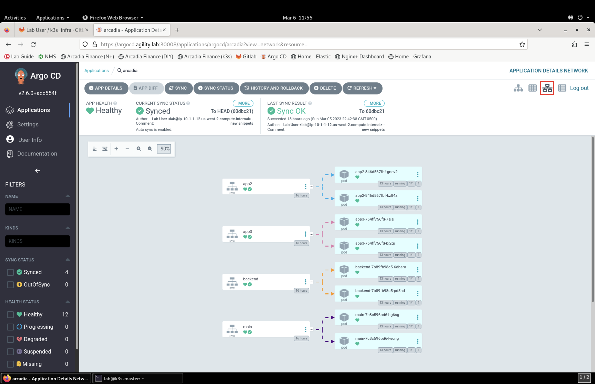
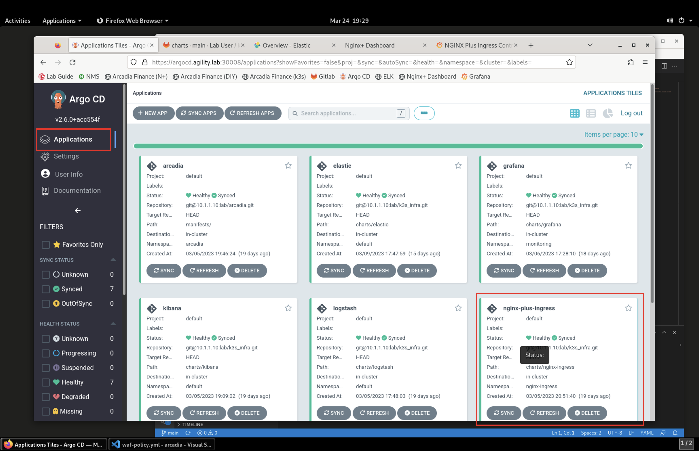
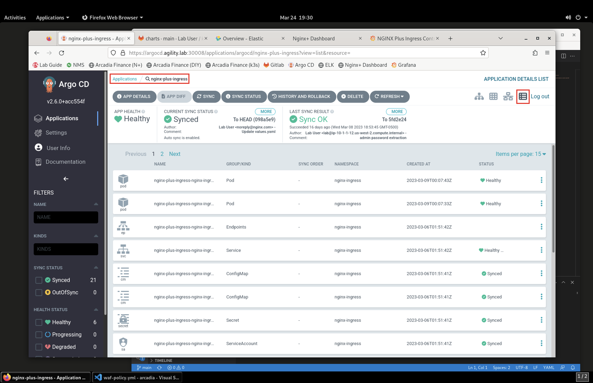
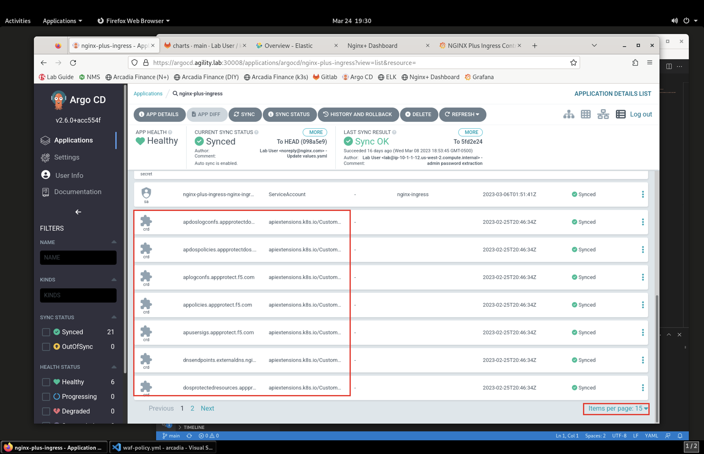

Review the Arcadia Finance Micro-Services-Based App Deployment
==============================================================

In this section, we'll review the Arcadia Finance application and then NGINX Plus Ingress Controller with App Protect deployment in Kubernetes.

To visualize the application deployment, we've setup an open source utility named Argo Continuous Deployment, or Argo CD for short.

Argo CD is a Kubernetes-native continuous deployment (CD) tool. Unlike external CD tools that only enable push-based deployments, Argo CD can pull updated code from Git repositories and deploy it directly to Kubernetes resources. It enables developers to manage both infrastructure configuration and application updates in one system.

Argo CD offers the following key features and capabilities:
 - Manual or automatic deployment of applications to a Kubernetes cluster.
 - Automatic synchronization of application state to the current version of declarative configuration.
 - Web user interface and command-line interface (CLI).
 - Ability to visualize deployment issues, detect and remediate configuration drift.
 - Role-based access control (RBAC) enabling multi-cluster management.
 - Single sign-on (SSO) with providers such as GitLab, GitHub, Microsoft, OAuth2, OIDC, LinkedIn, LDAP, and SAML 2.0
 - Support for webhooks triggering actions in GitLab, GitHub, and BitBucket.

1. To get started, open Firefox on the jump host RDP session.

2. Click on the Argo CD bookmark or navigate to https://argocd.agility.lab:30008/login.

3. Log into Argo using the **lab** / **Agility2023!** credentials.

4. When Argo loads, you will see tiles that contain applications that are deployed in Kubernetes. Click on the **Arcadia** app tile.

.. image:: images/argocd_application_tiles.png

5. The Arcadia app consists of several containerized micro-services.

In the Application Tree, which is the default tab in the application view, you can see the individual containers and the components that make up the service.

6. Click on the **Pods** icon:

Here you can see the Kubernetes pods that are running the Arcadia Finance containers. 

7. Finally, click on the **Network** icon:

This screen shows how traffic flows to the containers running the micro-services.

8. Now that you seen the power of Argo CD, lets review the manifest files for our infrastructure side of the lab. Under **Applications** look for the **nginx-plus-ingress** tile.

9. On the top right, click on the **List** icon: 
    

This list shows all the configuration parts that make our ingress controller work. 

10. Scroll to the bottom of the page to expand the items per page to 15 and take note of the *Custom Resource Definitions (CRDs)* installed with NGINX Plus Ingress. 

These CRDs power **VirtualServer**, **VirtualServerRoute**, **TransportServer**, and **Policies**.

