Install NGINX App Protect on the Arcadia App in Kubernetes
==========================================================

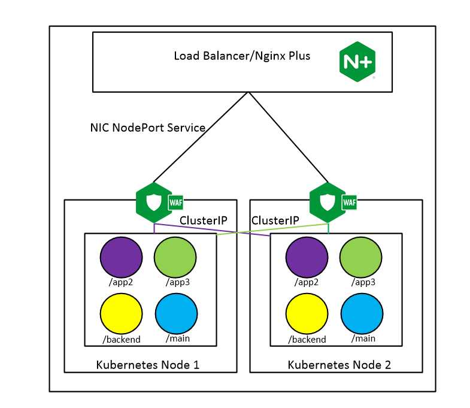

Now we will be deploying our App Protect policy on the Ingress Controller and exposing our service via NodePort from the ingress controller. Normally there would be a load balancer in front of our cluster. To save time, the ingress contorller has already been deployed. Let's look at how we deployed our Nginx Plux Ingress Controller via Helm.
Navigating to our **Gitlab** instance under the **ks3_infra** repository, you find all the infrastructure objects deployed. 

1. On the jump host, use the **Applications** menu bar to launch **FireFox Web Browser**. From the bookmark toolbar open **Gitlab**.

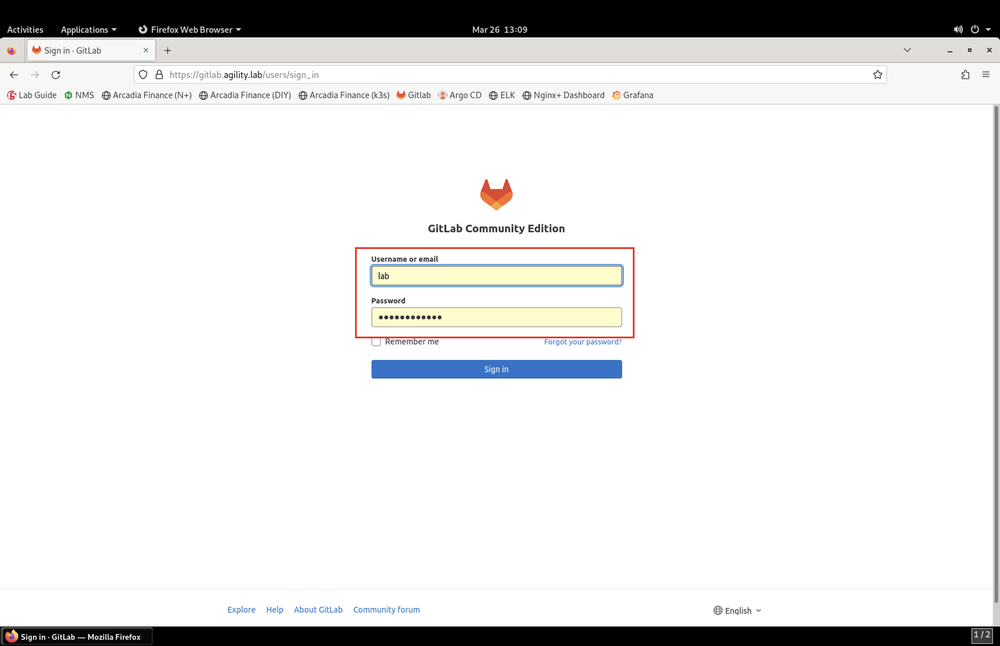

2. Now select the **ks3_infra** project repository. This repository houses all the infrastructure commponents used in this lab. All have been deployed with Helm and the help of Argo CD.

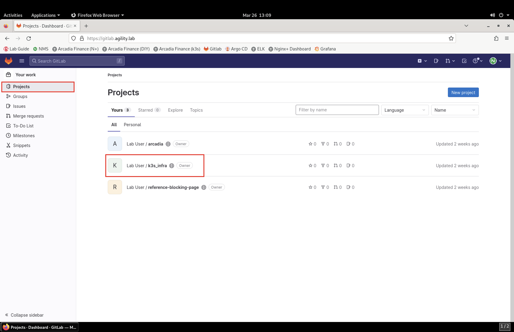

Once inside the project, click on **charts** directory:

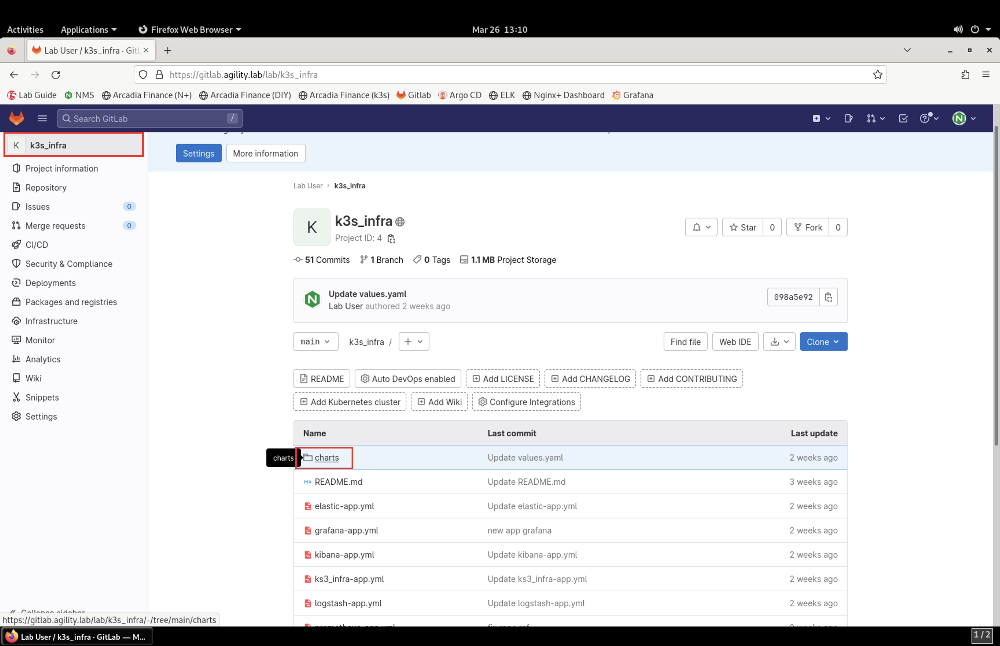

Here you will find the two main files we'll discuss:
 - **Charts.yaml**
 - **values.yaml**
  
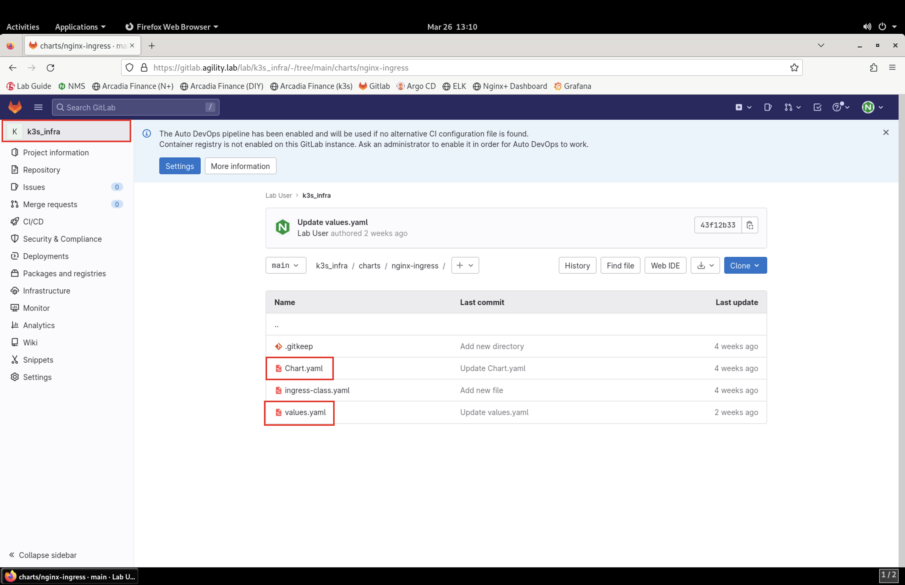

Our **Charts.yamml** contains information on what chart version to use and depdencies it relies on.    

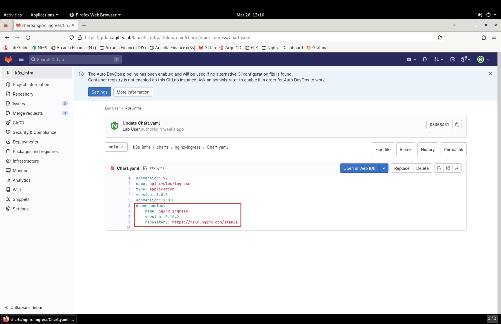

In the **values.yaml** file we define what options we want our ingress controller to have (app-protect, app-dos, snippets etc.), and what registry to pull our image.

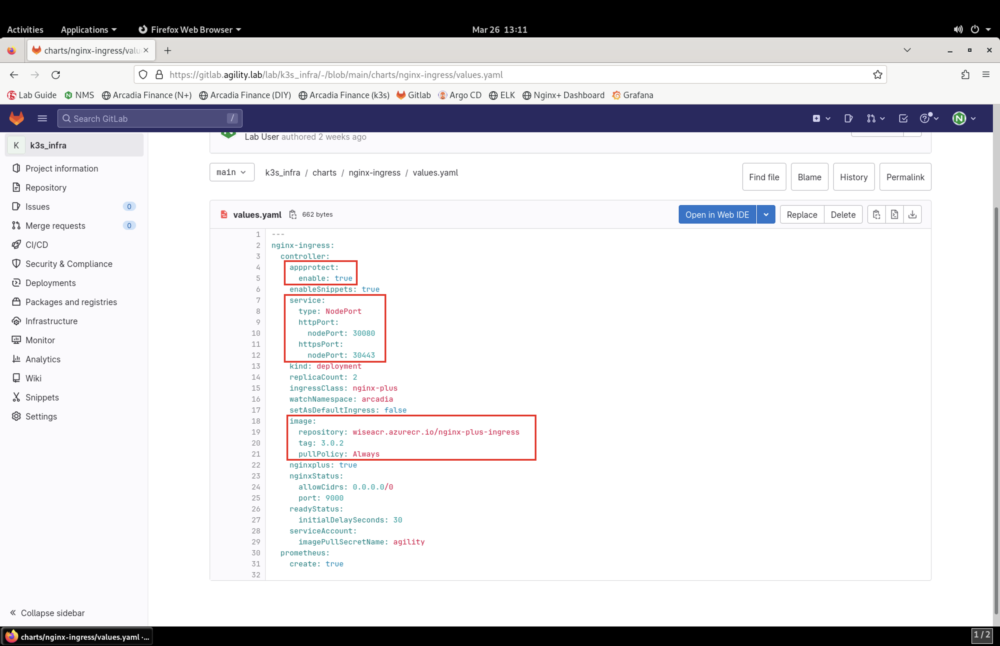

Now that you can see how we've set up Nginx Ingress Controller, let's get back to securing our Arcadia app with App Protect.

3. On the jump host, use the **Applications** menu bar to launch **Visual Studio Code**.

.. caution:: It may take several seconds for Visual Studio Code to launch for the first time.

4. In **Visual Studio Code**, navigate to **File** > **Open Folder**. 

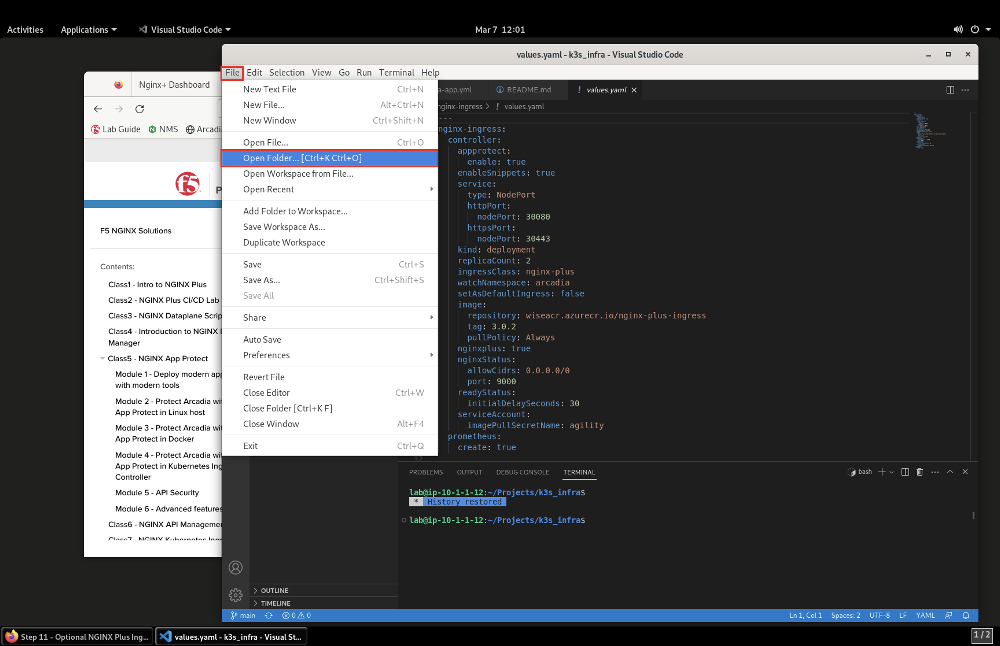

5. Select **arcadia**, then click **Open** in the top-right corner of the navigation window.

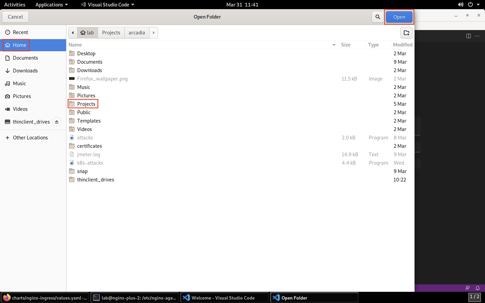

6. Now under the **manifest** directory, we can view the manifests **arcadia-deployment.yml**, **arcadia-svcs.yml**, and **arcadia-vs.yml** files. For this lab we will be focused on the **arcaida-vs.yml** manifest file.

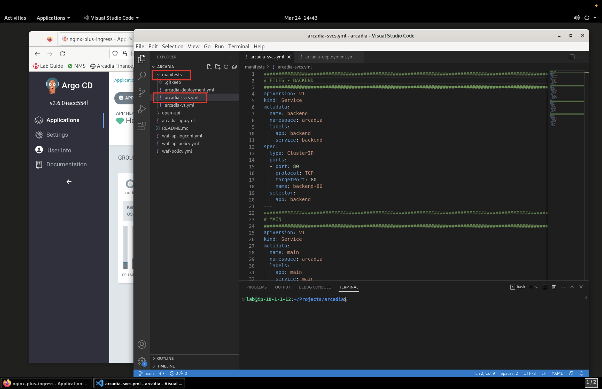

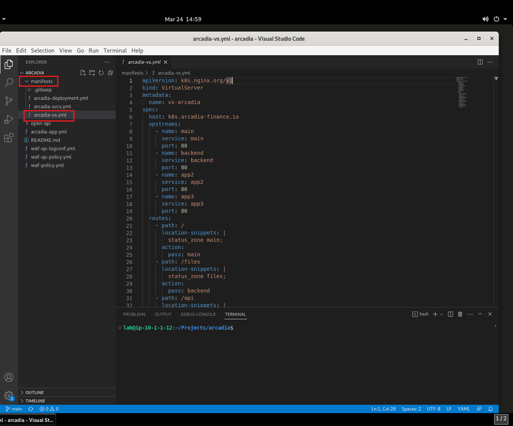

7. You'll want to investigate the three new files we'll be moving into the **manifest** directory as this is the path Argo CD is monitoring for changes.
 - waf-policy.yml (this is the policy we attach to the VistualServer manifest)
 - waf-ap-logconf.yml (this defines our logging filters)
 - waf-ap-policy.yml (this is the declarative WAF policy with all our logic)

.. code-block:: yaml
   :caption: waf-policy.yml 
   :emphasize-lines: 13
   
    ---
    apiVersion: k8s.nginx.org/v1
    kind: Policy
    metadata:
      name: waf-policy
    spec:
      waf:
        enable: true
        apPolicy: "arcadia/dataguard-blocking"
        securityLog:
          enable: true
          apLogConf: "arcadia/logconf"
          logDest: "syslog:server=logstash-logstash.default.svc.cluster.local:5144"

.. code-block:: yaml
   :caption: waf-ap-logconf.yml 

   ---
   apiVersion: appprotect.f5.com/v1beta1
   kind: APLogConf
   metadata:
     name: logconf
   spec:
     content:
       format: default
       max_message_size: 64k
       max_request_size: any
     filter:
       request_type: blocked

.. code-block:: yaml 
   :caption: waf-ap-policy.yaml 
   
   ### app-protect-policy.yaml ###
    ---
    apiVersion: appprotect.f5.com/v1beta1
    kind: APPolicy
    metadata:
      name: dataguard-blocking
    spec:
      policy:
        name: dataguard_blocking
        template:
          name: POLICY_TEMPLATE_NGINX_BASE
        applicationLanguage: utf-8
        enforcementMode: blocking
        blocking-settings:
          violations:
          - name: VIOL_DATA_GUARD
            alarm: true
            block: true
        data-guard:
          enabled: true
          maskData: true
          creditCardNumbers: true
          usSocialSecurityNumbers: true
          enforcementMode: ignore-urls-in-list

8. We'll now copy the these files over to the **manifest** directory to Nginx App Protect can enforce the policy files.

.. code-block:: bash 

    cp waf-ap-logconf.yml waf-ap-policy.yml waf-policy.yml manifests/.
    git add manifests/
    git commit -m "add waf policies"

9. Now it's time to edit the **arcadia-vs.yml** manifest to now include our App Protect policy.
    
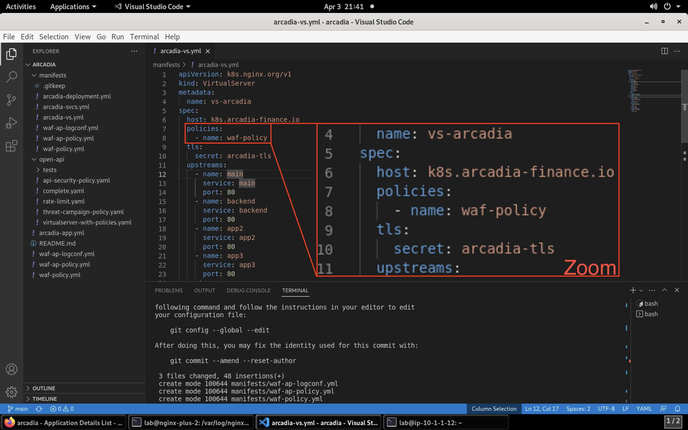

.. code-block:: bash 

   git add manifest/arcadia-vs.yml
   git commit -m "add waf policy"
   git push 

10.  To make certain our changes happen, we'll manually sync Argo with our Git repo. In your Firefox browser, Argo CD tab, click on the Arcadia application tile. Clicking on **Sync** will open a side panel to click **Synchronize**

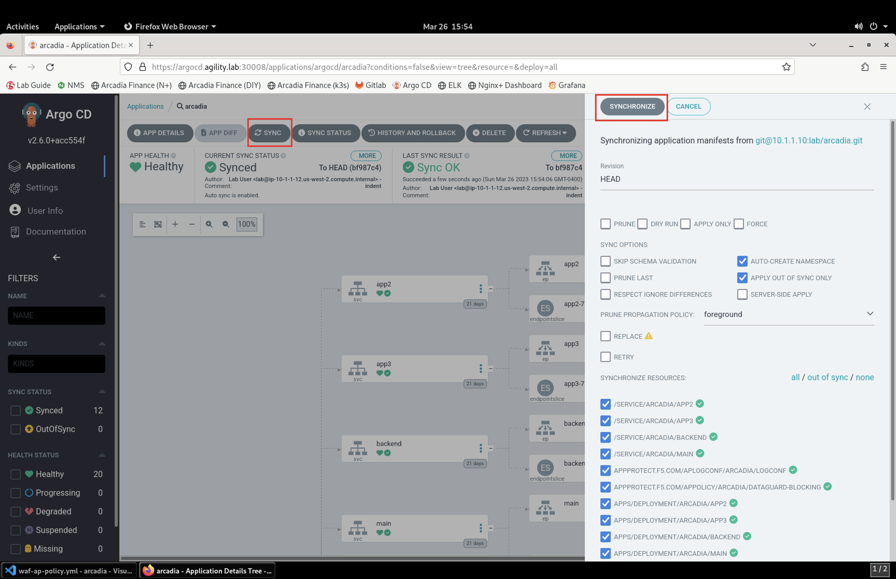

#.. image:: images/arcadia-ingress.png

11. Before you attempt sending attack data to the Arcadia site, let's open the **ELK** tab in Firefox so you can view the attacks and retrieve the Support ID 

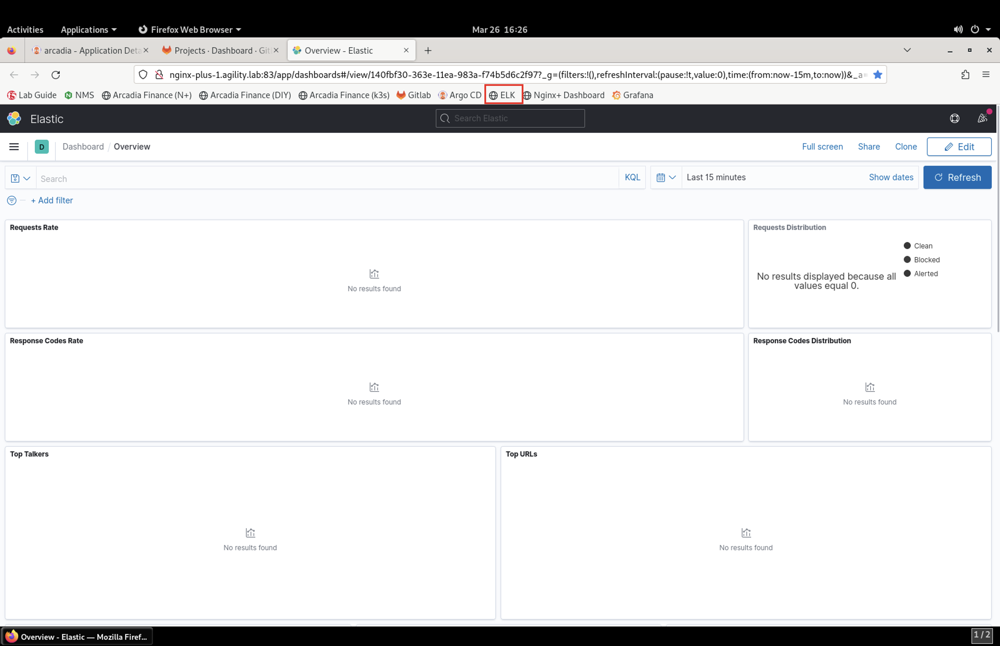

.. image:: images/grafana.png

.. image:: images/kic-nap-config.png

.. image:: images/nginx-plus-dashboard-upstreams.png

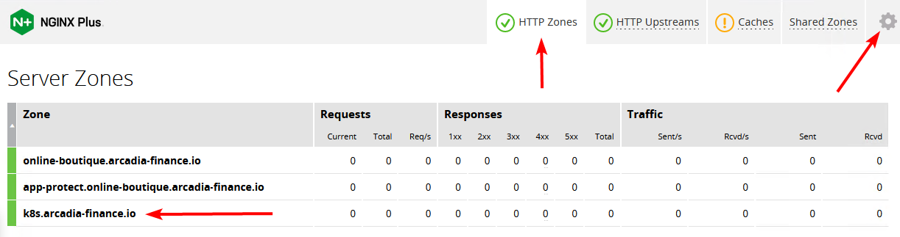

#This step is optional, the ingress controller has already been deployed to save time and focus on the items that are specific to configuring NGINX App Protect.
#
#That said, if you are interested in the topology or deploying the ingress controller, please continue on with this step. Otherwise you can skip to module 5: protecting API workloads.
#
#The previous exercises were designed to show what is possible and give examples of how to configure NAP. Using these principles, we can move our NAP configurations to Kubernetes.
#
#In this step, instead of using a VM or docker container with NGINX App Protect to proxy to a NodePort on our cluster, we will deploy the NGINX Kubernetes Ingress Controller (KIC) which will proxy to a ClusterIP of the Arcadia services. A ClusterIP is only accessible internally to the cluster. By using the ClusterIP, we force all requests to go through the KIC.
#
#Generally, we would deploy the ingress controller behind a L4/L7 load balancer to spread the load to all of the ingress controller PODs, as depicted on the right side of this image. In this lab, we will target the KIC Service NodePort directly with our browser (without the L4 LB/LTM in red).
#
#.. image:: images/arcadia-topology.png
#   :align: center
#
#At a high-level we will:
#
##. Use helm to deploy the Ingress controller that has been saved to the registry running on our docker host
##. Deploy a new "ingress configuration" using a Custom Resource Definition (CRD) specifically created by NGINX to extend the basic capability of the standard Kubernetes "Ingress" resource. This "VirtualServer" will tell the KIC pods to create the configuration necessary to access and protect our applications.
#
#**Steps**
#
#    #.  SSH to the k3s VM
#    #.  Check the existing ``ingress`` already deployed and running. It is a NGINX OSS ingress
#
#        .. code-block:: bash
#          :caption: helm removal
#
#            helm list
#
#            NAME         	NAMESPACE	REVISION	UPDATED                                	STATUS  	CHART               	APP VERSION
#            nginx-ingress	default  	8       	2022-12-05 14:01:51.734097641 +0000 UTC	deployed	nginx-ingress-0.15.2	2.4.2
#
#    #.  To remove the existing ingress controller (it is a Nginx OSS ingress):
#
#        .. code-block:: bash
#          :caption: helm removal
#
#            helm uninstall nginx-ingress
#
#    #.  Run the following commands to install the NGINX Plus KIC helm chart in a new NameSpace ``ingress``:
#
#        .. code-block:: bash
#          :caption: helm install
# 
#            helm repo add nginx-stable https://helm.nginx.com/stable
#            helm repo update
#            
#            helm install plus nginx-stable/nginx-ingress \
#            --namespace ingress \
#            --set controller.kind=deployment \
#            --set controller.replicaCount=1 \
#            --set controller.nginxplus=true \
#            --set controller.image.repository=private-registry.nginx.com/nginx-ic-nap/nginx-plus-ingress \
#            --set controller.image.tag=2.4.2 \
#            --set controller.appprotect.enable=true \
#            --set controller.serviceAccount.imagePullSecretName=regcred \
#            --set controller.service.type=NodePort \
#            --set controller.service.httpPort.nodePort=30080 \
#            --version 0.15.2
#        
#        .. note:: As you can notice, with one helm command, the Ingress Controller pod will be deployed with all the required parameters (NAP enabled, NodePort 30080)
#
#    #.  After running the command, we need to wait for the KIC pod to become available. you can use a command like:
#
#        .. code-block:: BASH
#
#           kubectl get pods --all-namespaces --watch
#
#    #.  Once it we have 1/1 ``plus-nginx-ingress`` ready. You can press ``ctrl-c`` to stop the watch.
#
#        .. image:: images/ingress-ready.png
#
#    #. Now, it is time to configure the Ingress Controller with CRD ressources (WAF policy, Log profile, Ingress routing ...)
#
#       #. Execute the following commands to deploy the different resources
#
#          .. code-block:: bash
#
#             cd /home/ubuntu/lab-files/ingress
#             
#             kubectl apply -f ap-dataguard-policy.yaml
#             kubectl apply -f ap-logconf.yaml
#             kubectl apply -f nap-waf.yaml
#             kubectl apply -f virtual-server-waf.yaml
#
#       #. The manifest ``ap-dataguard-policy.yaml`` creates the WAF policy
#
#          .. code-block:: yaml
#
#            apiVersion: appprotect.f5.com/v1beta1
#            kind: APPolicy
#            metadata:
#            name: dataguard-alarm
#            spec:
#            policy:
#                applicationLanguage: utf-8
#                blocking-settings:
#                violations:
#                - alarm: true
#                    block: false
#                    name: VIOL_DATA_GUARD
#                data-guard:
#                creditCardNumbers: true
#                enabled: true
#                enforcementMode: ignore-urls-in-list
#                enforcementUrls: []
#                lastCcnDigitsToExpose: 4
#                lastSsnDigitsToExpose: 4
#                maskData: true
#                usSocialSecurityNumbers: true
#                enforcementMode: blocking
#                name: dataguard-alarm
#                template:
#                name: POLICY_TEMPLATE_NGINX_BASE
#
#       #. The manifest ``ap-logconf.yaml`` creates the Log Profile to send logs to ELK
#
#
#          .. code-block:: yaml
#
#            apiVersion: appprotect.f5.com/v1beta1
#            kind: APLogConf
#            metadata:
#            name: logconf
#            spec:
#            content:
#                format: default
#                max_message_size: 64k
#                max_request_size: any
#            filter:
#                request_type: all
#
#       #. The manifest ``nap-waf.yaml`` creates the WAF config (policy + log)
#
#          .. code-block:: yaml
#
#            apiVersion: k8s.nginx.org/v1
#            kind: Policy
#            metadata:
#            name: waf-policy
#            spec:
#            waf:
#                enable: true
#                apPolicy: "default/dataguard-alarm"
#                securityLogs:
#                - enable: true
#                apLogConf: "default/logconf"
#                logDest: "syslog:server=10.1.1.11:5144"
#
#
#       #. The manifest ``virtual-server-waf.yaml`` creates the Ingress resource (to route the traffic and apply the WAF config)
#
#          .. code-block:: yaml
#
#            apiVersion: k8s.nginx.org/v1
#            kind: VirtualServer
#            metadata:
#            name: vs-arcadia-no-waf
#            spec:
#            host: k8s.arcadia-finance.io
#            policies:
#            - name: waf-policy
#            upstreams:
#                - name: main
#                service: main
#                port: 80
#                - name: backend
#                service: backend
#                port: 80
#                - name: app2
#                service: app2
#                port: 80
#                - name: app3
#                service: app3
#                port: 80
#            routes:
#                - path: /
#                action:
#                    pass: main
#                - path: /files
#                action:
#                    pass: backend
#                - path: /api
#                action:
#                    pass: app2
#                - path: /app3
#                action:
#                    pass: app3

    #. Test the deployment with the Win10 Jumhost
    #. In the Chrome Arcadia Link bookmark, select ``WAF NGINX Ingress``
    #. Navigate and send attacks.