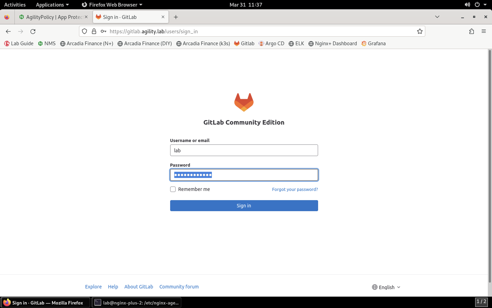
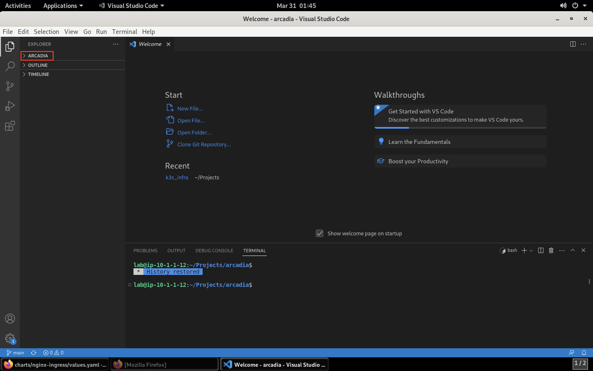
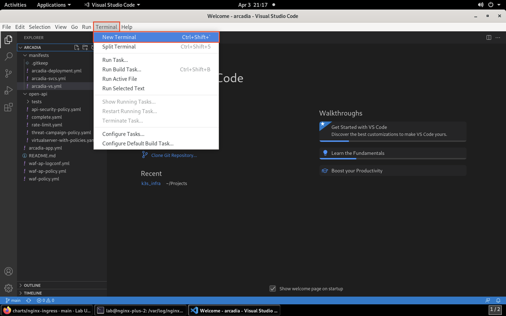
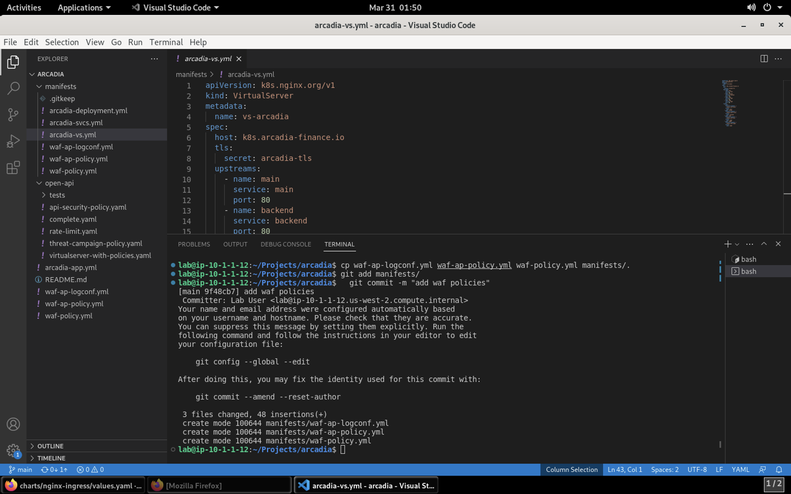
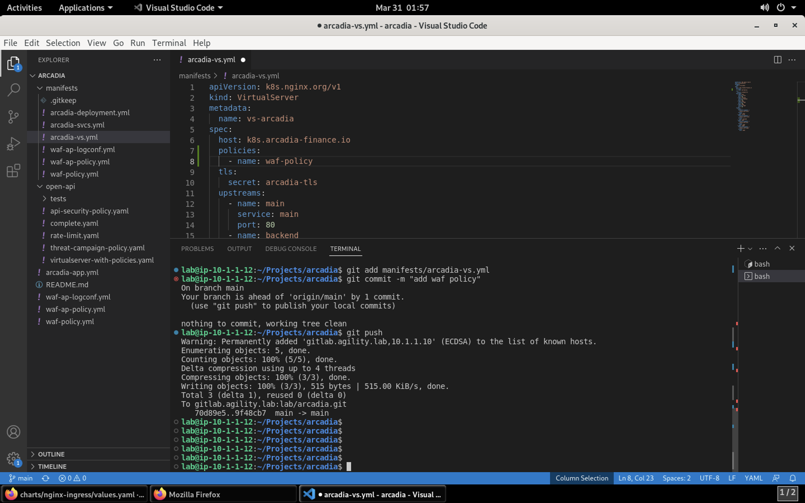
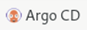
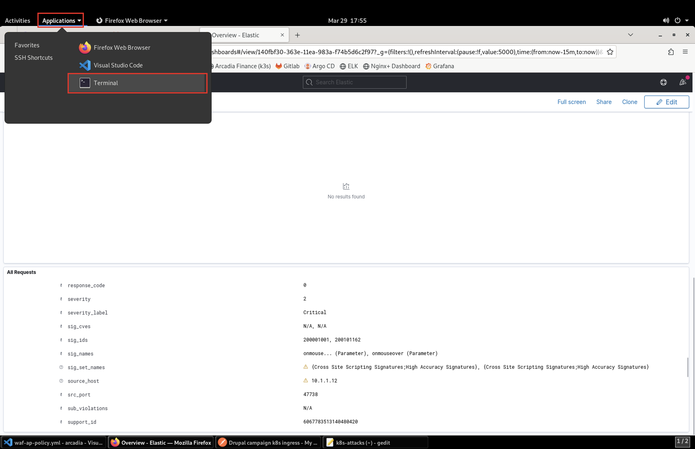
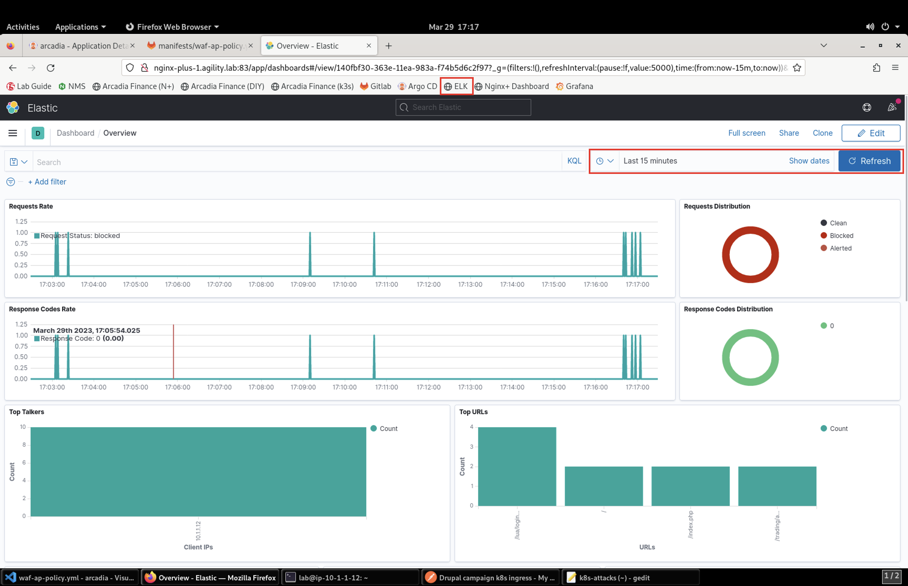
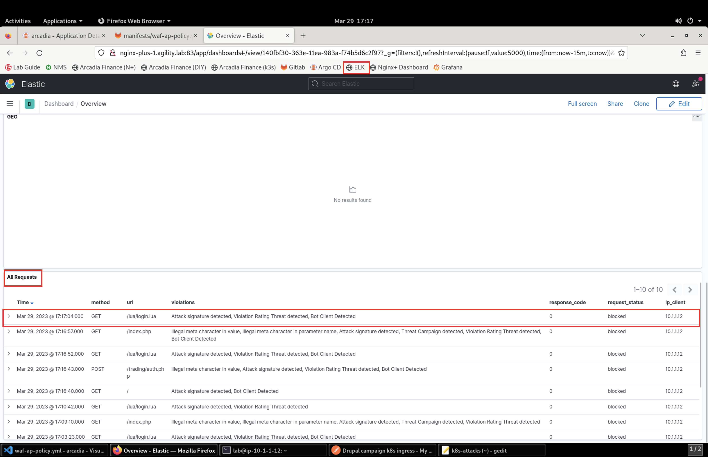
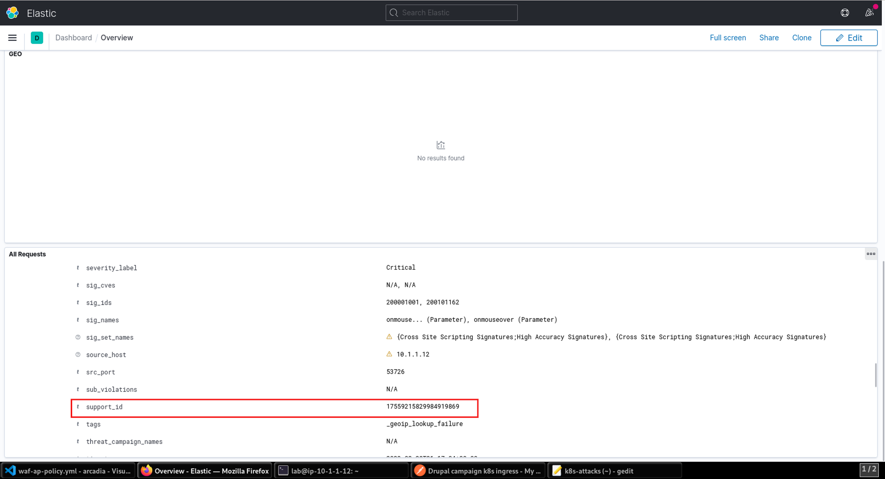

Install NGINX App Protect on the Arcadia App in Kubernetes
==========================================================

.. image:: images/kubnic.PNG
   :align: center

Now we will be deploying our App Protect policy on the Ingress Controller and exposing our service via NodePort from the ingress controller. Normally there would be a load balancer in front of our cluster. To save time, the ingress controller has already been deployed. Let's look at how we deployed our Nginx Plux Ingress Controller via Helm.
Navigating to our **Gitlab** instance under the **ks3_infra** repository, you find all the infrastructure objects deployed. 

1. On the jump host, use the **Applications** menu bar to launch **FireFox Web Browser**. From the bookmark toolbar open **Gitlab**. Log into the site using the username **lab** and  password **Agility2023!** credentials.

.. image:: images/gitlab_login.png 

2. Log into the tool using the username **lab** and password **Agility2023!** credentials.

3. Select the **ks3_infra** project repository. This repository houses all the infrastructure commponents used in this lab. All have been deployed with Helm and the help of Argo CD.

.. image:: images/gitlab_project.png 

3. Once inside the project, click on **charts** directory:

.. image:: images/k3s_infra.png 

4. Now click into the **nginx-ingress** directory:

.. image:: images/nginx_ingress_directory.png

5. Here you will find the two main files we'll discuss:

 - **Charts.yaml**
 - **values.yaml**
  
.. image:: images/k3s_infra_ls.png 

6. The **Chart.yaml** contains information on which chart version to use and upon which dependencies it relies.

.. image:: images/nic_Chart.png 

7. In the **values.yaml** file, we define what options we want our ingress controller to have (app-protect, app-dos, snippets etc.), and what registry to pull the relevant image(s).

.. image:: images/nic_values.png

Now that you can see how we've set up Nginx Ingress Controller, let's get back to securing our Arcadia app with App Protect.

8. On the jump host, use the **Applications** menu bar to launch **Visual Studio Code**.

.. caution:: It may take several seconds for Visual Studio Code to launch for the first time.

9. In **Visual Studio Code**, navigate to **File** > **Open Folder**. 

.. image:: images/VSCode_openFolder.png

10.  Click on the **Home** shortcut on the left, then double-click the **Projects** folder. Single-click on the **arcadia** folder, then click **Open** in the top-right corner of the navigation window.

.. image:: images/VSCode_selectArcadia.png

11. Expand the **arcadia** folder by clicking **arcadia** in the top-left of the screen. 

12.  Now under the **manifest** directory, we can view the manifests files.

   - **arcadia-deployment.yml**
   - **arcadia-svcs.yml**
   - **arcadia-vs.yml** 

For this lab we will be focused on the **arcadia-vs.yml** manifest file *after* we add the security policy files.

.. image:: images/arcadia-vs.png

13. You'll want to investigate the three new files we'll be moving into the **manifest** directory as this is the path Argo CD is monitoring for changes.

- waf-policy.yml (this is the policy we attach to the VirtualServer manifest)
- waf-ap-logconf.yml (this defines our logging filters)
- waf-ap-policy.yml (this is the declarative WAF policy with all our logic)

First, the policy we attach to the VirtualServer manifest:

.. code-block:: yaml
   :caption: waf-policy.yml 
   :emphasize-lines: 13

    ---
    apiVersion: k8s.nginx.org/v1
    kind: Policy
    metadata:
      name: waf-policy
    spec:
      waf:
        enable: true
        apPolicy: "arcadia/dataguard-blocking"
        securityLog:
          enable: true
          apLogConf: "arcadia/logconf"
          logDest: "syslog:server=logstash-logstash.default.svc.cluster.local:5144"

Second, the policy for logging and filtering:

.. code-block:: yaml
   :caption: waf-ap-logconf.yml 

   ---
   apiVersion: appprotect.f5.com/v1beta1
   kind: APLogConf
   metadata:
     name: logconf
   spec:
     content:
       format: default
       max_message_size: 64k
       max_request_size: any
     filter:
       request_type: blocked

Finally, our WAF policy:

.. code-block:: yaml 
   :caption: waf-ap-policy.yaml 
   
    ---
    apiVersion: appprotect.f5.com/v1beta1
    kind: APPolicy
    metadata:
      name: dataguard-blocking
    spec:
      policy:
        name: dataguard_blocking
        template:
          name: POLICY_TEMPLATE_NGINX_BASE
        applicationLanguage: utf-8
        enforcementMode: blocking
        blocking-settings:
          violations:
          - name: VIOL_DATA_GUARD
            alarm: true
            block: true
        data-guard:
          enabled: true
          maskData: true
          creditCardNumbers: true
          usSocialSecurityNumbers: true
          enforcementMode: ignore-urls-in-list

14. Open a new command prompt window by navigating to **Terminal** > **New Terminal** in the menu bar.

15. Now, copy the these files over to the **manifests** directory so Nginx App Protect can enforce the policy. Use the **Terminal** window at the bottom of VSCode to issue these commands:

.. code-block:: bash 

  cp waf-ap-logconf.yml waf-ap-policy.yml waf-policy.yml manifests/.
  git add manifests/
  git commit -m "add waf policies"

15. Now, edit the **arcadia-vs.yml** manifest to now include our App Protect policy. Open the file by selecting the filename in the left navigation pane.

.. image:: images/select_arcadia-vs_file.png

.. warning:: Please reference the image below as YAML is very strict with indention. After line 6 you'll insert the new lines.

.. code-block:: yaml

  policies:
    - name: waf-policy
    
.. image:: images/vs-policy.png

16. Now that you've updated **arcadia-vs.yml** it's time to push the updates back to Gitlab. Please run these commands in the terminal window:

.. code-block:: bash 

  git add manifests/arcadia-vs.yml
  git commit -m "add waf policy"
  git push 

**Result**

17.   To make certain our changes are deployed, let's manually sync Argo with our Git repo. In **Firefox**, open Argo CD by clicking on the Argo bookmark.

18.  Click on the Arcadia application tile. Clicking on **Sync** will open a side panel to click **Synchronize**. This will pull the changes we submitted to Gitlab and deploy into Kubernetes.

.. image:: images/sync-arcadia.png 

19. Before we launch attacks at the Arcadia site, open the **ELK** bookmark in a new tab in **Firefox** so you can view the attacks and view Support IDs. 

.. note:: Since we are not yet sending traffic to the app, the dashboard will be empty.

.. image:: images/elk.png 

20. Now, launch attacks against the Arcadia site. From the **Applications** drop-down, select **Terminal**. 

21. When the terminal opens, you'll run the below command. Please be sure to leave your terminal open as we'll reference the **Support ID** it provides later.

.. code-block:: bash

  source k8s-attacks

This is a bash file that launches various attacks at the application using CURL and well-known exploits.

.. note:: Wait for the script to complete before continuing with the lab.

22. Once the attack script completes, move to the **ELK** tab you opened earlier. You may need to click on *Refresh* for the page to update.

23.  To read details on blocked attack, scroll down to the **Events** section of the dashboard you can open the event by clicking on the **>** icon

24. Scroll down to **support_id** to match up the Support ID returned by App Protect in your terminal.

This concludes this portion of the lab. 