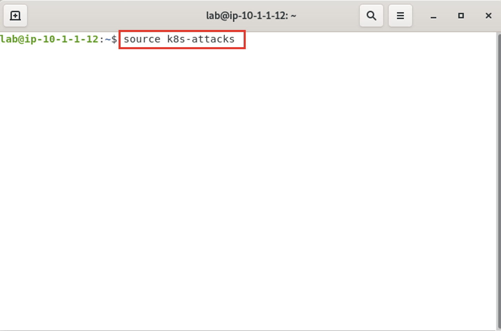

Install NGINX App Protect on the Arcadia App in Kubernetes
==========================================================

.. image:: images/kubnic.PNG
   :align: center

Now we will be deploying our App Protect policy on the Ingress Controller and exposing our service via NodePort from the ingress controller. Normally there would be a load balancer in front of our cluster. To save time, the ingress contorller has already been deployed. Let's look at how we deployed our Nginx Plux Ingress Controller via Helm.
Navigating to our **Gitlab** instance under the **ks3_infra** repository, you find all the infrastructure objects deployed. 

1. On the jump host, use the **Applications** menu bar to launch **FireFox Web Browser**. From the bookmark toolbar open **Gitlab**.

.. image:: images/gitlab_login.png 

2. Now select the **ks3_infra** project repository. This repository houses all the infrastructure commponents used in this lab. All have been deployed with Helm and the help of Argo CD.

.. image:: images/gitlab_project.png 

Once inside the project, click on **charts** directory:

.. image:: images/k3s_infra.png 

Here you will find the two main files we'll discuss:
 - **Charts.yaml**
 - **values.yaml**
  
.. image:: images/k3s_infra_ls.png 

Our **Charts.yamml** contains information on what chart version to use and depdencies it relies on.    

.. image:: images/nic_Chart.png 

In the **values.yaml** file we define what options we want our ingress controller to have (app-protect, app-dos, snippets etc.), and what registry to pull our image.

.. image:: images/nic_values.png

Now that you can see how we've set up Nginx Ingress Controller, let's get back to securing our Arcadia app with App Protect.

3. On the jump host, use the **Applications** menu bar to launch **Visual Studio Code**.

.. caution:: It may take several seconds for Visual Studio Code to launch for the first time.

4. In **Visual Studio Code**, navigate to **File** > **Open Folder**. 

.. image:: images/VSCode_openFolder.png

5. Select **arcadia**, then click **Open** in the top-right corner of the navigation window.

.. image:: images/VSCode_selectArcadia.png

6. Now under the **manifest** directory, we can view the manifests **arcadia-deployment.yml**, **arcadia-svcs.yml**, and **arcadia-vs.yml** files. For this lab we will be focused on the **arcaida-vs.yml** manifest file.

.. image:: images/arcadia_deployment.png

.. image:: images/arcadia_svc.png

.. image:: images/arcadia-vs.png

7. You'll want to investigate the three new files we'll be moving into the **manifest** directory as this is the path Argo CD is monitoring for changes.
 - waf-policy.yml (this is the policy we attach to the VistualServer manifest)
 - waf-ap-logconf.yml (this defines our logging filters)
 - waf-ap-policy.yml (this is the declarative WAF policy with all our logic)

.. code-block:: yaml
   :caption: waf-policy.yml 
   :emphasize-lines: 13
   
    ---
    apiVersion: k8s.nginx.org/v1
    kind: Policy
    metadata:
      name: waf-policy
    spec:
      waf:
        enable: true
        apPolicy: "arcadia/dataguard-blocking"
        securityLog:
          enable: true
          apLogConf: "arcadia/logconf"
          logDest: "syslog:server=logstash-logstash.default.svc.cluster.local:5144"

.. code-block:: yaml
   :caption: waf-ap-logconf.yml 

   ---
   apiVersion: appprotect.f5.com/v1beta1
   kind: APLogConf
   metadata:
     name: logconf
   spec:
     content:
       format: default
       max_message_size: 64k
       max_request_size: any
     filter:
       request_type: blocked

.. code-block:: yaml 
   :caption: waf-ap-policy.yaml 
   
   ### app-protect-policy.yaml ###
    ---
    apiVersion: appprotect.f5.com/v1beta1
    kind: APPolicy
    metadata:
      name: dataguard-blocking
    spec:
      policy:
        name: dataguard_blocking
        template:
          name: POLICY_TEMPLATE_NGINX_BASE
        applicationLanguage: utf-8
        enforcementMode: blocking
        blocking-settings:
          violations:
          - name: VIOL_DATA_GUARD
            alarm: true
            block: true
        data-guard:
          enabled: true
          maskData: true
          creditCardNumbers: true
          usSocialSecurityNumbers: true
          enforcementMode: ignore-urls-in-list

8. We'll now copy the these files over to the **manifest** directory to Nginx App Protect can enforce the policy files.

.. code-block:: bash 

    cp waf-ap-logconf.yml waf-ap-policy.yml waf-policy.yml manifests/.
    git add manifests/
    git commit -m "add waf policies"

9. Now it's time to edit the **arcadia-vs.yml** manifest to now include our App Protect policy.
    
.. image:: images/vs-policy.png 

.. code-block:: bash 

   git add manifest/arcadia-vs.yml
   git commit -m "add waf policy"
   git push 

10.  To make certain our changes happen, we'll manually sync Argo with our Git repo. In your Firefox browser, Argo CD tab, click on the Arcadia application tile. Clicking on **Sync** will open a side panel to click **Synchronize**

.. image:: images/sync-arcadia.png 

11.  Before you attempt sending attack data to the Arcadia site, let's open the **ELK** tab in Firefox so you can view the attacks and retrieve the Support ID 

.. image:: images/elk.png 

12.  Time to run some attacks against the Arcadia site. From **Applications** click the drop down and select **terminal**. 

.. image:: images/application_terminal.png 

When the terminal opens you'll run:

.. code-block:: bash

   source k8s-attack

  
.. images:: images/kibana.png 

1.  Scrolling down to the Events section of the dashboard you can open the event by clicking on the `>` icon

.. images:: images/kibana_events.png 

14. Scroll down to **support_id** to match up the Support ID provided by App Protect.

.. images:: images/kibana_supportID.png
