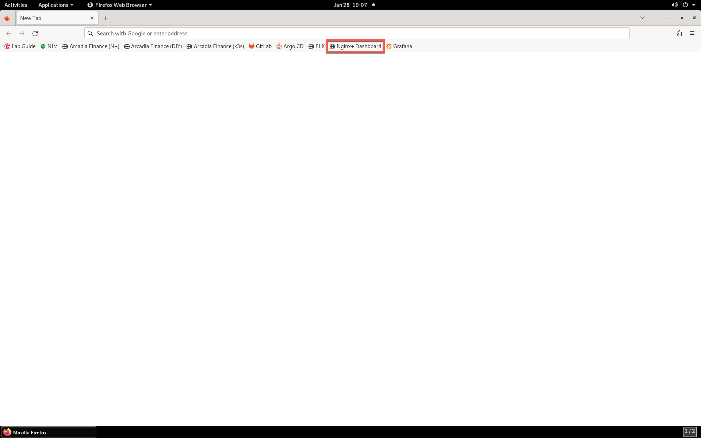
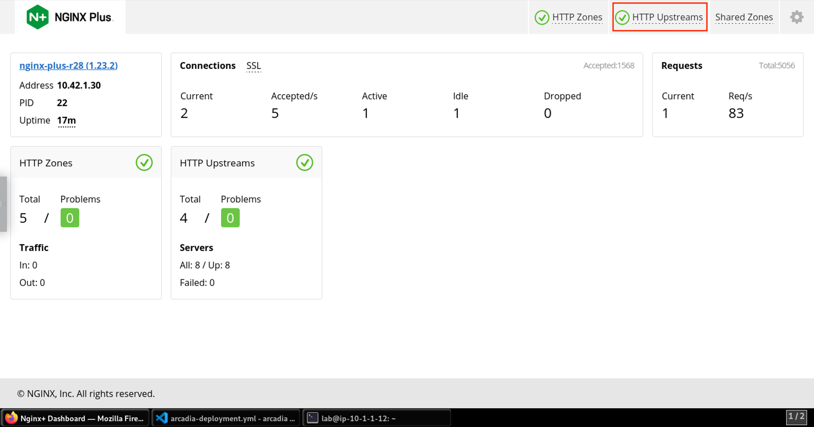
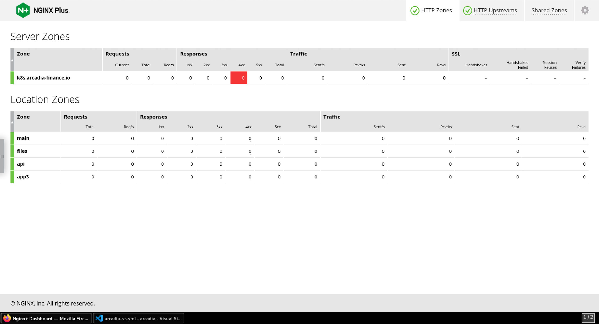
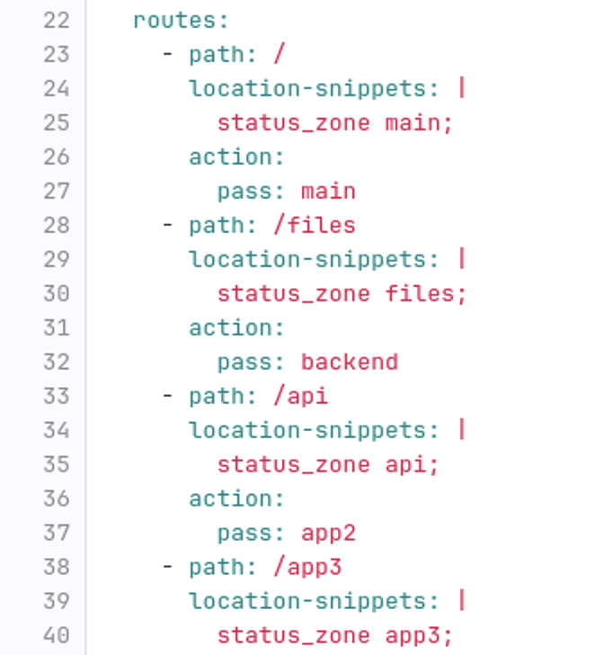
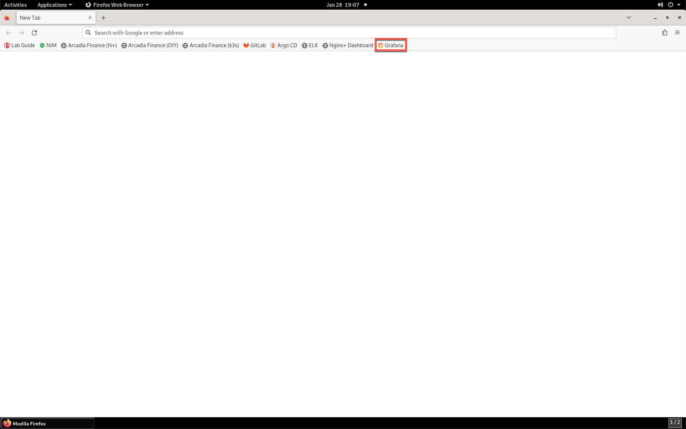
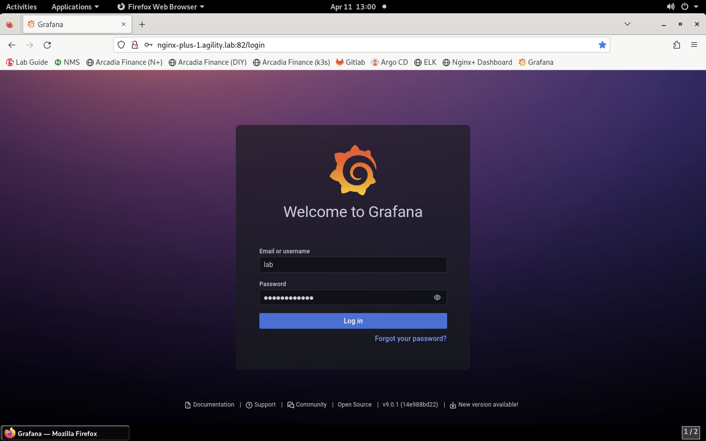
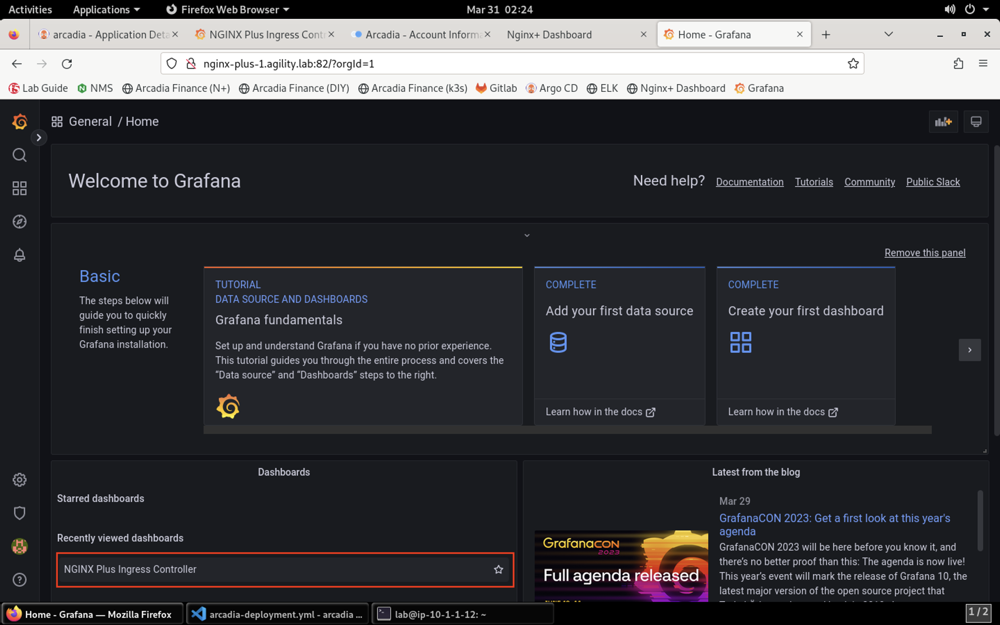
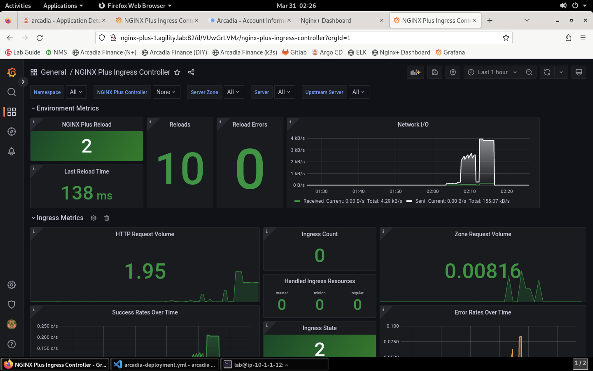

Review the Grafana Dashboard Statistics
=======================================

This section is optional and showcases the use of Nginx Dashboard (included with Nginx Plus). 

1. Open **Firefox** and open a new tab. Click the **NGINX Dashboard** bookmark.

2. The landing page gives you an overview of the current traffic statistics. Click on **HTTP Upstreams**.

2. The **HTTP UPSTREAM** section shows all your Kubernetes endpoints.

.. image:: images/nginx-plus-dashboard-upstreams.png

2. The additional detail provided in the Nginx Dashboard is provided via *Snippets* that we enabled in the **values.yaml** file and directives we called out in **arcadia-vs.yml** file.

3. Here is a small section showing how the *snippet* directive was used in **arcadia-vs.yml** file.

4. Open a new tab in **Firefox** and click the **Grafana** bookmark.

5. Log into Grafana using **admin** as the usrname and **Agility2023!** as the password.

6. Click on **NGINX Plus Ingress Controller** in the **Recently Viewed Dashboards** list.

7. This section shows Prometheus exporting Nginx Ingress Controller data to Grafana. For a full list of metrics exported please see `this <https://github.com/nginxinc/nginx-prometheus-exporter#exported-metrics>`_ link.

.. image:: images/grafana.png 

8. Expand the sections in the dashboard to see the related statistics.

