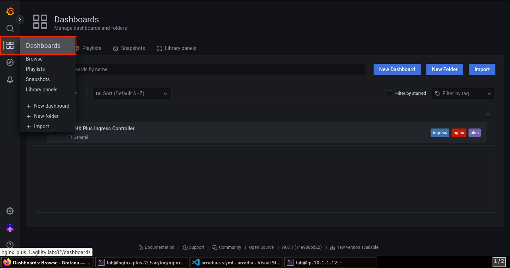
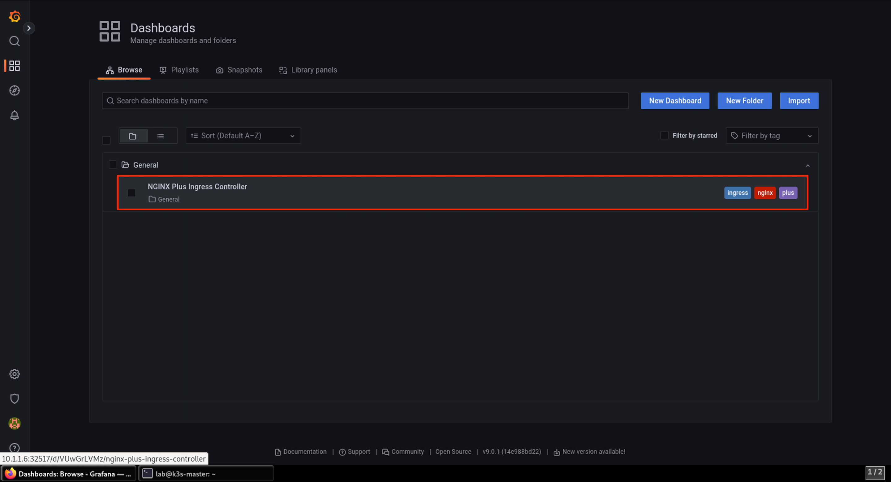

Review the NGINX Plus & Grafana Dashboard Statistics
====================================================

This section is optional and showcases the use of NGINX Dashboard (included with NGINX Plus). 

1. Return to **Firefox** and open a new tab. Click the **NGINX+ Dashboard** bookmark.

.. image:: images/nginx_dashboard_bookmark.png

2. The landing page gives you an overview of the current traffic statistics. Click on **HTTP Upstreams**.

.. image:: images/nginx_dashboard_landing.png

3. The **HTTP Upstreams** section shows all your Kubernetes endpoints.

.. image:: images/nginx-plus-dashboard-upstreams.png

4. The additional detail provided in the NGINX Dashboard is provided via *Snippets* that we enabled in the **values.yaml** file and directives we called out in **arcadia-vs.yml** file.

.. image:: images/status-zone.png

5. Here is a small section showing how the *snippet* directive was used in **arcadia-vs.yml** file.

.. image:: images/snippet.png
   :scale: 50%
   :align: center

6. Open a new tab in **Firefox** and click the **Grafana** bookmark.

.. image:: images/grafana_bookmark.png

7. Log in using the **lab** / **Agility2023!** credentials.

.. image:: images/grafana_login.png

8. Click on the **Dashboards** icon and select **Dashboards** from the left menu. 

9. Click on the **NGINX Plus Ingress Controller** dashboard in the list. 

10. This section shows Prometheus exporting NGINX Ingress Controller data to Grafana. For a full list of metrics exported please see `this <https://github.com/nginxinc/nginx-prometheus-exporter#exported-metrics>`_ link.

.. image:: images/grafana.png 

11. Expand the sections in the dashboard to see the related statistics.

.. image:: images/grafana_full_dashboard.png

This concludes the NGINX Ingress Controller deployment for NGINX App Protect.