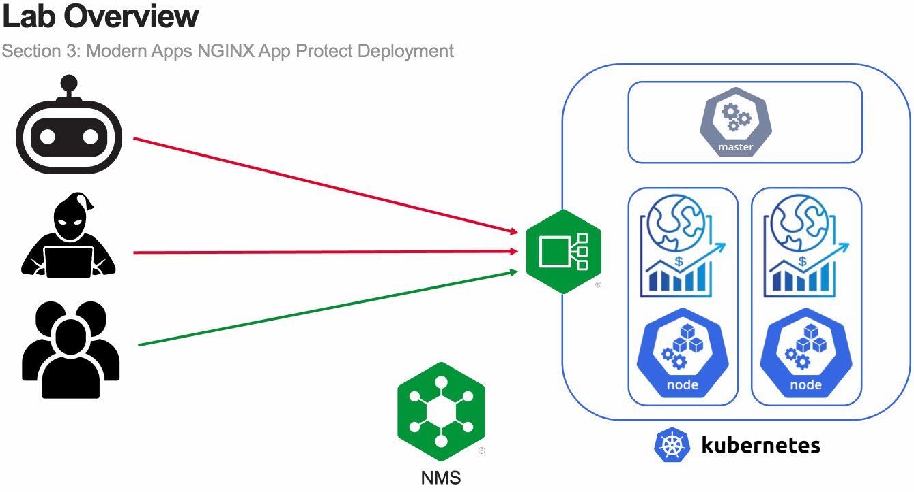

Module 3 - Modern Apps NGINX App Protect Deployment
===================================================

In this section of the lab, you will deploy NGINX App Protect to an existing NGINX Ingress Controller deployment hosting a microservices-based application.

Estimated completion time: 21 minutes

.. toctree::
   :maxdepth: 1
   :glob:
   :caption: Content:

   lab*/lab*
   recap
